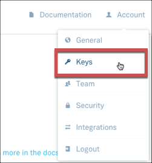
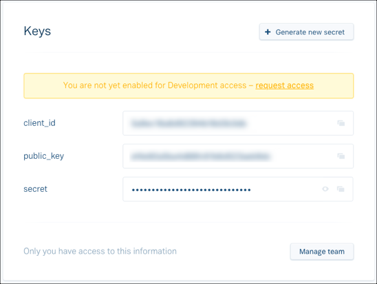

# API Provider Setup

To authenticate a {{page.heading}} element instance must provide information about your Plaid account and the user's bank account:

* Plaid information required:  The `public_key`, `secret`, `client_id`, and [API environment](https://plaid.com/docs/quickstart/#api-environments) (sandbox, production, or development)
* User's bank information required: Bank name (Institution) and bank credentials

See the latest setup instructions in the [{{page.heading}} documentation](https://plaid.com/docs/quickstart/).

To find the required Plaid information:

1. Log in to your account at [{{page.heading}}](https://plaid.com).
2. Click **Account**, and then select **Keys**.

3. Record the **client_id**, **public_key**, and **secret**.

Next [authenticate an element instance with {{page.apiProvider}}](authenticate.html).
