## Endpoint Setup

Follow these steps to setup your QuickBase App.

Via a web browser, login to your QuickBase subdomain:

1. Click "Create a new app"
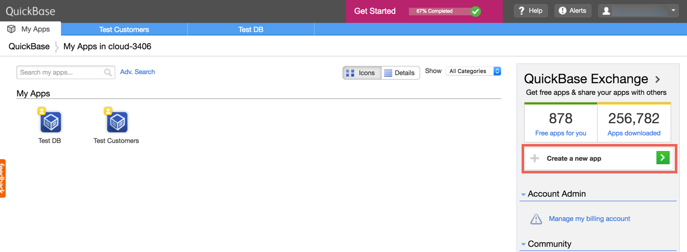

2. Click "Build a new app from scratch"
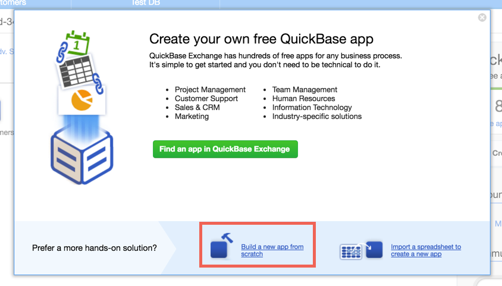

3. Click "Create"
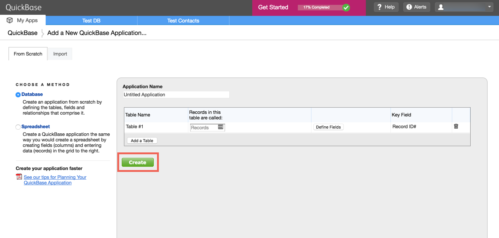

4. Click "SETTINGS"
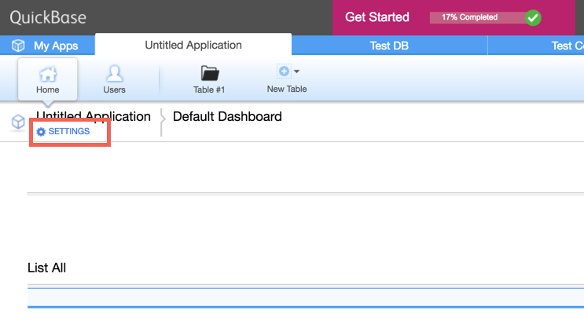

5. Click "App properties"
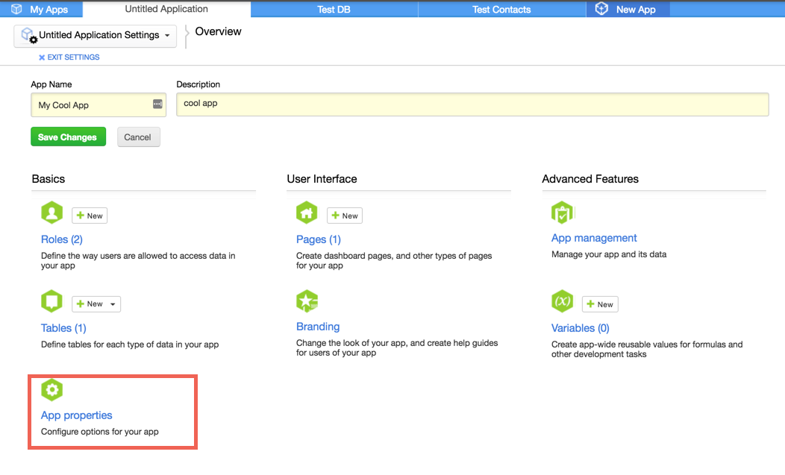

6. Scroll to Advanced Properties.  Make sure the "Require Application Tokens" is checked.  Click "Manage Application Token"
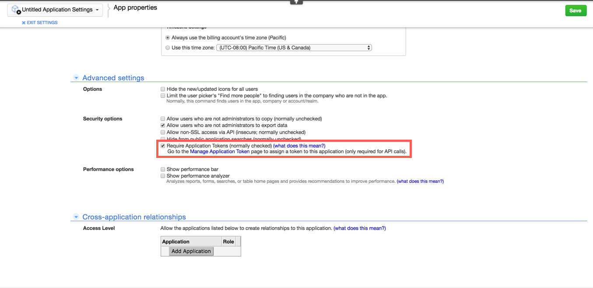

7. Click "Create New Application Token"
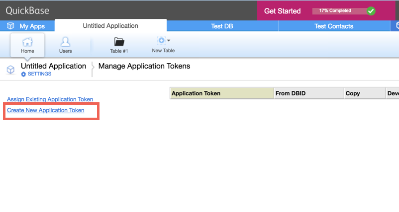

8. Input description and click "OK"
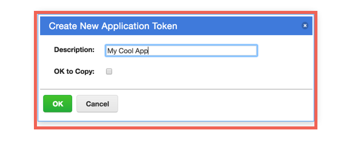

9. Make note of the "Application Token"
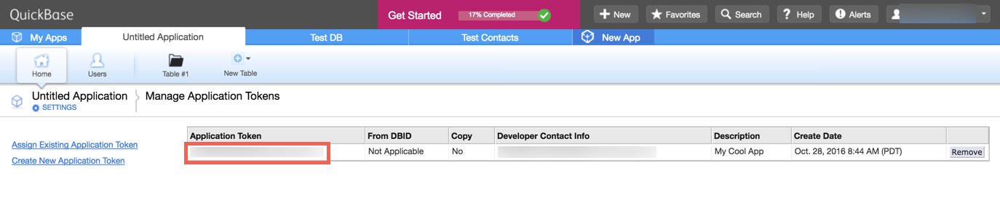

If tables already exist within your app, then please [create an instance](quickbase-create-instance.html).  If not, see below for instructions on how to create a table.

### Create a Table

1. Under Table > "From scratch"
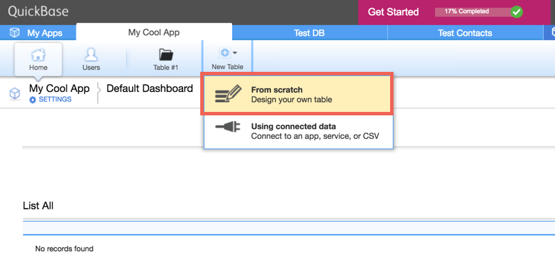

2. Input table name of the resource you would like to get, e.g. `contacts`
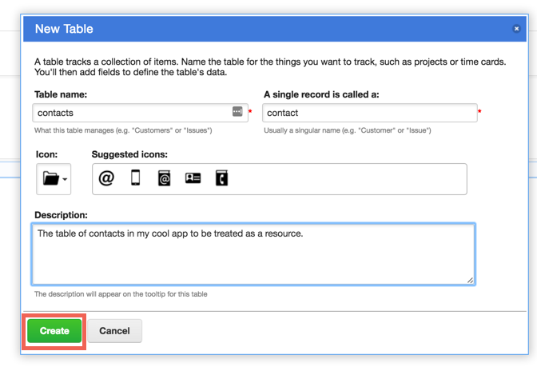

3. Add desired fields, e.g. `name` and click "Add"
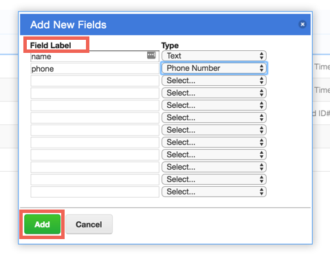

4. Click "EXIT SETTINGS"
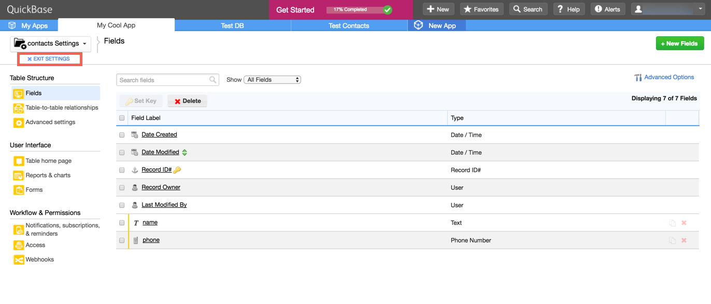

5. Click "New contact"
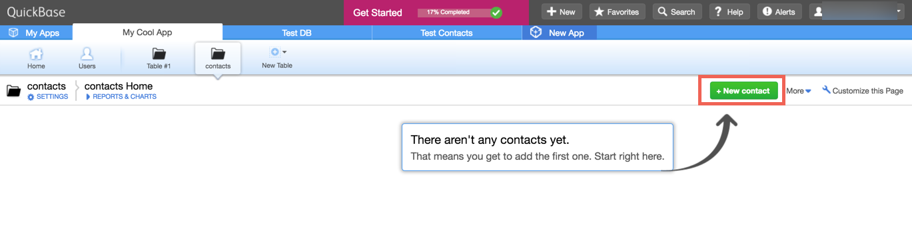

6. Input contact data and click "save"
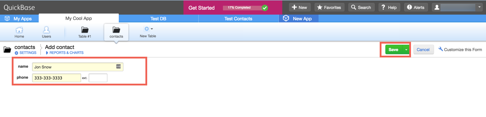

Next [create an instance](quickbase-create-instance.html).
