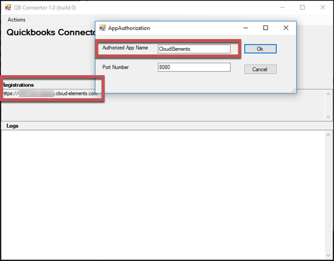
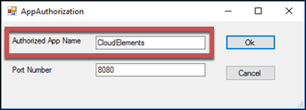

# API Provider Setup

To authenticate a {{page.heading}} instance you must first run the bundled Ground2Cloud installer for QuickBooks on the machine running QuickBooks. The bundled installer walks you through the steps to install Ground2Cloud, the Cloud Elements QuickBooks Connector (CE Connector), and the Intuit QuickBooks QBXML SDK. Ground2Cloud and the CE Connector enable the Cloud Elements servers to communicate with an on premise installation of QuickBooks Enterprise. The Intuit QuickBooks SDK facilitates communication between the connector and QuickBooks.

Your Cloud Elements CSM or Delivery Manager typically helps with the initial setup of Ground2Cloud and will provide the appropriate installer.



After you install Ground2Cloud and the CE Connector, use the **Configured Application Name** and **Host Name/IP** to authenticate an element instance. If you already installed Ground2Cloud and just need to locate your information, see [Locate Credentials for Authentication](#locate-credentials-for-authentication). If you need to install Ground2Cloud, see [Install Ground2Cloud](#install-and-set-up-ground2cloud)



## Locate Credentials for Authentication

If you already installed Ground2Cloud and the CE Connector, follow the steps below to locate the **Configured Application Name** and **Host Name/IP**.

To find authentication information:

1. Open the CE Connector.
2. Find the **Configured Application Name** under **Authorize**.
3. Find the **Host Name/IP** under Registrations.

## Install and Set Up Ground2Cloud

The bundled Ground2Cloud installer for QuickBooks (**Ground2CloudQbSetup_n.n.n.exe**) installs the Ground2Cloud client, the CE Connector, and the Intuit QuickBooks SDK. Before you begin, make sure that you are logged in as a user with administrator privileges and pause or disable your antivirus software during installation.



    The installation adds the QuickBooks QBXML SDK and prompts you to install the CE Connector application.

3. Click **Install**.

    The Quickbooks Connector starts automatically. To connect to QuickBooks, you must authorize the CE Connector as an application.

4. Click **Actions**, and then click **Authorize**.

4. In **Authorized App Name** enter a name for the connection. The name is used as the **Configured Application Name** when you authenticate an element instance.

5. Keep the default port number and click **OK**.
6. Note the url under Registrations. This is used as the **Host Name/IP** when you authenticate an element instance.
If you have not created an application, you need one to authenticate with {{page.heading}}.

Next [authenticate an element instance with {{page.heading}}](authenticate.html).
