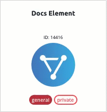
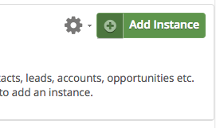

# Events

Cloud Elements supports events via polling or webhooks depending on the endpoint. If you would like to see more information on our Events framework, please see the [Event Management Guide](/docs/platform/event-management/index.html).



## Supported Events and Resources

Cloud Elements supports polling events for {{page.heading}}.

You can set up events for the following resources:

* bill-payments
* bills
* classes
* credit-memos
* credit-terms
* currencies
* customers
* employees
* invoices
* journal-entries
* ledger-accounts
* payment-methods
* payments
* products
* purchase-orders
* refund-receipts
* sales-receipts
* tax-codes
* tax-rates
* time-activities
* vendor-credits
* vendors

## Polling

You can configure polling through the UI or in the JSON body of the `/instances` API call.




### Configure Polling Through the UI

For more information about each field described here, see [Parameters](#parameters).

To authenticate an element instance with polling:

1. Sign in to Cloud Elements, and then search for the element in our Elements Catalog.

    | Latest UI | Earlier UI  |
    | :------------- | :------------- |
    |    |    |

3. Create an element instance.

    | Latest UI | Earlier UI  |
    | :------------- | :------------- |
    | Hover over the element card, and then click __Create Instance__.</br>   | Click __Add Instance__.</br>   |

5. Enter a name for the element instance.
7. Switch **Events Enabled** on.
8. Add an Event Notification Callback URL.
4. Use the __Event poller refresh interval (mins)__ slider or enter a number in minutes to specify how often Cloud Elements should poll for changes.
5. Select and configure the resources to poll.

    | Latest UI | Earlier UI  |
    | :------------- | :------------- |
    | Select the resources to poll. </br>Optionally, click the pencil icon to further configure polling. | Edit the JSON to add or remove resources and optionally change the `datesConfiguration`.  |

7. Click __Create Instance__ (latest UI) or __Next__ (earlier UI).
8. Optionally add tags in the earlier UI:
     1. On the Tag It page, enter any tags that might help further define the instance.
      * To add more than one tag, click __Add__ after each tag.
      
     1. Click __Done__.
9. Note the **Token** and **ID** and save them for all future requests using the element instance.
8. Take a look at the documentation for the element resources now available to you.

### Configure Polling Through API

Use the `/instances` endpoint to authenticate with {{page.heading}} and create an element instance with polling enabled.

In order to enable polling, add these extra configurations to your instance JSON:

```JSON
"event.notification.enabled": "true",
"event.notification.callback.url": "<INSERT_YOUR_APPS_CALLBACK_URL>",
"event.poller.refresh_interval":"<POLLER_REFRESH_INTERVAL>"
"event.poller.urls": "bill-payments|bills|classes|credit-memos|credit-terms|currencies|customers|employees|invoices|journal-entries|ledger-accounts|payment-methods|payments|products|purchase-orders|refund-receipts|sales-receipts|tax-codes|tax-rates|time-activities|vendor-credits|vendors"
```

instance JSON with polling events enabled:

### Step 1. Get Elements OAuth Token

HTTP Header: None
HTTP Verb: GET
Request URL: /elements/{keyOrId}/oauth/token
Request Body: None
Query Parameters:

* __key__ - quickbooks
* __apiKey–__ - the key obtained from registering your app with the provider
* __apiSecret__ – the secret obtained from registering your app with the provider
* __callbackUrl__ – the URL that you supplied to the provider when registering your app

Description: The result of this API invocation returns a requestToken and Secret from the endpoint, which are used to retrieve the redirect URL.  The requestToken is used in the GET /elements/{keyOrId}/oauth/url call.

Each of the OAuth API calls will be shown below.

Example cURL Command:

```bash
curl -X GET
-H 'Content-Type: application/json'
'https://api.cloud-elements.com/elements/api-v2/elements/quickbooks/oauth/token?apiKey=insert_fake_api_key&apiSecret=insert_fake_api_secret&callbackUrl=http://www.demonstrab.ly'
```

Response:

```json
{
  "token": "qyprd1Twij60MH06lKGUZTJwx7tbzpPQx6aZnvKe0xI7",
  "secret": "KKSbL0J2wLGMqhMXTEh1ERkSx9tsIbAHUevF"
}
```

QuickBooks Online expects a token and secret. These are contained in the response to the initial GET request. Please make note of the token and secret. The token is needed in the GET /elements/{keyOrId}/oauth/url call which is shown below.

### Step 2. Get Elements OAuth URL

HTTP Header: None
HTTP Verb: GET
Request URL: /elements/{keyOrId}/oauth/url
Request Body: None
Query Parameters:

* __key__ - quickbooks
* __apiKey–__ - the key obtained from registering your app with the provider
* __apiSecret__ – the secret obtained from registering your app with the provider
* __callbackUrl__ – the URL that you supplied to the provider when registering your app,
* __requestToken__ - the token obtained from the GET /elements/{keyOrId}/oauth/token call (previous step).

Description: The result of this API invocation is an OAuth redirect URL from the endpoint. Your application should now redirect to this URL, which in turn will present the OAuth authentication and authorization page to the user. When the provided callback URL is executed, a code value will be returned, which is required for the Create Instance API.

Example cURL Command:

```bash
curl -X GET
-H 'Content-Type: application/json'
'https://api.cloud-elements.com/elements/api-v2/elements/quickbooks/oauth/url?apiKey=insert_fake_api_key&apiSecret=insert_fake_api_secret&callbackUrl=http://www.demonstrab.ly&requestToken=insert_fake_request_token&state=quickbooks'
```

Response:

```json
{
    "element": "quickbooks",
    "oauthUrl": "https://appcenter.intuit.com/Connect/Begin?oauth_token=qyprdJHtIbwm3sGOoOCvXuv2Cs8fsQrZFjJWe4HEZAyb0&oauth_callback=http%3A%2F%2Fwww.cloud-elements.com%3Fstate%3Dquickbooks"
}
```

### Step 3. Create an Instance

Your application should now redirect to the oauthUrl returned in step 2, which in turn will present the OAuth authentication and authorization page to the user.

HANDLE CALLBACK FROM THE ENDPOINT

After the user successfully authenticates, the provided callback URL is executed. The callback URL will contain several parameters, listed below.  These additional parameters, along with the original API key and API secret are required for the Create Instance API.

The parameters that you will need to parse from the callback URL are listed below, along with an example of what the callback URL should look like.
__oauth_token__
__oauth_verifier__
__realmId__
__dataSource__

`http://demonstrab.ly/?state=quickbooks&oauth_token=qyprdlGChtClXwBpAw1vm1fJSC3mQqS3dGX0PPphEzNEUI9s&oauth_verifier=br6qctk&realmId=12345678910&dataSource=QBO`

These values will be used to create an Instance. An example of this process along with sample JSON will be shown in the next section.

To provision your QuickBooks Online Element, use the /instances API.

Below is an example of the provisioning API call.

* __HTTP Headers__: Authorization- User <user secret>, Organization <organization secret>
* __HTTP Verb__: POST
* __Request URL__: /instances
* __Request Body__: Required – see below
* __Query Parameters__: none

Description: An Element token is returned upon successful execution of this API. This token needs to be retained by the application for all subsequent requests involving this element instance.

A sample request illustrating the /instances API is shown below.

HTTP Headers:

```bash
Authorization: User <INSERT_USER_SECRET>, Organization <INSERT_ORGANIZATION_SECRET>

```
This instance.json file must be included with your instance request.  Please fill your information to provision.  The “key” into Cloud Elements QuickBooks Online is “quickbooks”.  This will need to be entered in the “key” field below depending on which Element you wish to instantiate.

```json
{
  "element": {
    "key": "quickbooks"
  },
  "providerData": {
    "oauth_token": "<OAUTH_TOKEN_RETURNED_IN_OAUTH_EXCHANGE>",
    "realmId": "<REALMID_RETURNED_IN_OAUTH_EXCHANGE>",
    "oauth_verifier": "<OAUTH_VERIFIER_RETURNED_IN_OAUTH_EXCHANGE>",
    "secret": "<SECRET_RETURNED_IN_OAUTH_EXCHANGE>",
    "state": "quickbooks",
    "dataSource": "<RETURNED_IN_OAUTH_EXCHANGE>"
  },
  "configuration": {
    "oauth.api.key": "<INSERT_QUICKBOOKS_API_KEY>",
    "oauth.api.secret": "<INSERT_QUICKBOOKS_API_SECRET>",
    "oauth.callback.url": "<SAME CALLBACK URL USED IN STEP 2>",
    "event.notification.enabled": "true",
    "event.notification.callback.url": "<INSERT_YOUR_APPS_CALLBACK_URL>",
    "event.poller.refresh_interval":"<POLLER_REFRESH_INTERVAL>"
    "event.poller.urls":"bill-payments|bills|classes|credit-memos|credit-terms|currencies|customers|employees|invoices|journal-entries|ledger-accounts|payment-methods|payments|products|purchase-orders|refund-receipts|sales-receipts|tax-codes|tax-rates|time-activities|vendor-credits|vendors"
  },
  "tags": [
    "<INSERT_TAGS>"
  ],
  "name": "<INSERT_INSTANCE_NAME>"
}
```

Here is an example cURL command to create an instance using /instances API.

Example Request:

```bash
curl -X POST
-H 'Authorization: User <INSERT_USER_SECRET>, Organization <INSERT_ORGANIZATION_SECRET>'
-H 'Content-Type: application/json'
-d @instance.json
'https://api.cloud-elements.com/elements/api-v2/instances'
```

If the user does not specify a required config entry, an error will result notifying her of which entries she is missing.

Below is a successful JSON response:

```json
{
    "id": 1234,
    "name": "test",
    "token": "3sU/S/kZC46BaABPS7EAuhT+ukiEHkI=",
    "element": {
        "id": 1234,
        "name": "QuickBooks",
        "key": "quickbooks",
        "description": "Run your entire business with QuickBooks. Track your sales and expenses, get paid faster, and even run payroll with it.",
        "active": true,
        "deleted": false,
        "typeOauth": true,
        "trialAccount": false,
        "configDescription": "If you do not have an QuickBooks account, you can create one at QuickBooks Signup",
        "signupURL": "http://quickbooks.intuit.com/signup"
    },
    "provisionInteractions": [],
    "valid": true,
    "disabled": false,
    "maxCacheSize": 0,
    "cacheTimeToLive": 0,
    "cachingEnabled": false
}
```

Note:  Make sure you have straight quotes in your JSON files and cURL commands.  Please use plain text formatting in your code.  Make sure you do not have spaces after the in the cURL command.

## Parameters

API parameters not shown in {{site.console}} are in `code formatting`.

| Parameter | Description   | Data Type |
| :------------- | :------------- | :------------- |
| 'key' | The element key.<br>{{page.elementKey}}  | string  |
|  Name</br>`name` |  The name for the element instance created during authentication.   | Body  |
| `oauth_verifier` | A verification code generated by Intuit that an App is supposed to pass back during the get_access_token step. |
| `oauth_token` | The token retrieved in the OAuth 1.0 workflow. |
| `secret` | A secret to establish the ownership of the token. |
| `realmId` | The unique Identifier for the authorized quickbooks company, which is returned after authentication in Quickbooks Online. |
| `state` | This should always be {{page.elementKey}} |
| `dataSource` | This value determines what data source should be used for the connection. It is returned after authentication. |
| `oauth.callback.url` | The Callback URL from Quickbooks. This is the Callback URL that you noted at the end of the [Endpoint Setup section](setup.html).  |
| `oauth.api.key` | The Consumer Key from Quickbooks. This is the Consumer Key that you noted at the end of the [Endpoint Setup section](setup.html) |  string |
| `oauth.api.secret` | The Consumer Secret from Quickbooks. This is the Consumer Secret that you noted at the end of the [Endpoint Setup section](setup.html)| string |
| Filter null values from the response </br>`filter.response.nulls` | *Optional*. Determines if null values in the response JSON should be filtered from the response. Yes or `true` indicates that Cloud Elements will filter null values. </br>Default: `true`.  | boolean |
| tags | *Optional*. User-defined tags to further identify the instance. | string |
| Events Enabled </br>`event.notification.enabled` | *Optional*. Identifies that events are enabled for the element instance.</br>Default: `false`.  | boolean |
| Event Notification Callback URL</br>`event.notification.callback.url` |  The URL where you want Cloud Elements to send the events. | string |
| Event poller refresh interval (mins)</br>`event.poller.refresh_interval`  | A number in minutes to identify how often the poller should check for changes. |  number|
| `event.poller.urls`  | The objects that should be polled. |
| tags | *Optional*. User-defined tags to further identify the instance. | string |
