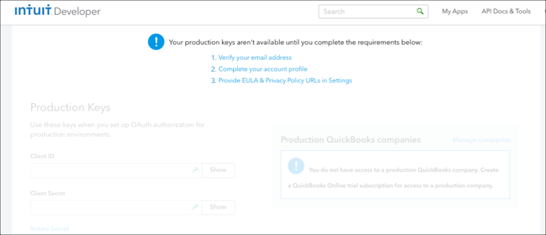

# API Provider Setup

To authenticate a {{page.heading}} element instance, complete the setup steps described in this section.

Before authenticating be sure that you know whether you should use the OAuth 2.0 flow or OAuth 1.0 flow. OAuth 2.0 is available for new apps created after July 2017, while OAuth 1.0 is available for apps created before then. Each app page on the Intuit Developer website include a note at the top indicating what type of authentication to use.



## Locate Credentials for Authentication

If you already created an application, follow the steps below to locate the OAuth 2.0 **{{page.apiKey}}**, **{{page.apiSecret}}**, and **{{page.callbackURL}}** or OAuth 1.0 **App Token**, **OAuth Consumer Key**, and **OAuth Consumer Secret**. If you have not created an app, see [Create an Application](#create-an-application).

To find your OAuth 2.0 credentials:

1. Log in to your account at [{{page.heading}}](https://developer.intuit.com/us).
2. In the menu on the top, click **My Apps**.
3. Click the app that you want to get credentials for.
3. Click **Keys**.
2. Click the application that you want to connect.
3. Confirm that the note at the top of the page indicates that the app integrates with OAuth 2.0 and OpenID Connect.
3. Scroll down to the Production Keys section.
3. Record the **{{page.apiKey}}** and **{{page.apiSecret}}**.
3. Record the **{{page.callbackURL}}** for your app.

To find your 1.0 OAuth credentials:

1. Log in to your account at [{{page.heading}}](https://developer.intuit.com/us).
2. In the menu on the top, click **My Apps**.
3. Click the app that you want to get credentials for.
3. Click **Keys**.
2. Click the application that you want to connect.
3. Confirm that the note at the top of the page indicates that the app integrates with OAuth 1.0a and OpenID 2.0.
3. Scroll down to the Production Keys section and record the **App Token**, **OAuth Consumer Key**, and **OAuth Consumer Secret**.

## Create an Application

If you have not created an application, you need one to authenticate with {{page.heading}}.

To create an application:

1. Log in to your account at [{{page.heading}}](https://developer.intuit.com/us).
2. In the menu on the top, click **My Apps**.
2. Click **Create New App**.
3. In **Just start coding**, click **Select APIs**.
4. Select **Accounting** and **Payments**, and then click **Create app**.
3. Complete the required information.
4. Click **Create**.
2. Click **Keys**.
3. Because you need Production Keys to make requests through Cloud Elements, follow the steps needed to receive production keys.

4. After you receive Production Keys, set up at least one **{{page.callbackURL}}** for your app.
3. Record the **{{page.apiKey}}**, **{{page.apiSecret}}**, and **{{page.callbackURL}}**.

Next [authenticate an element instance with {{page.heading}}](authenticate.html).
