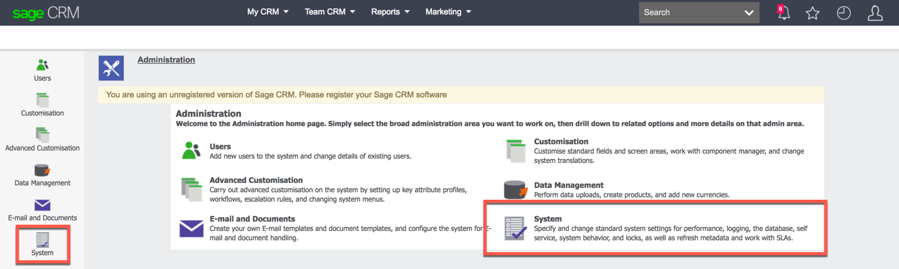

# Service Provider Setup

To authenticate a {{page.heading}} element instance you must know your Sage CRM subdomain and use an existing user in your system.

If you plan to implement event polling, make sure that the Sage CRM server time zone, system administrator time zone, and polling configuration match. The following steps use UTC+00:00 as the matching time zone because the default poller configuration is set to `GMT`, but you can choose any time zone.

1. Log on to Sage CRM.
2. Set the **Server Time Zone** in System Behavior to `UTC+00:00`.
  3. Click your profile icon, and then click **Administration**.
  4. Click **System**.
  
  5. Click **System Behavior**.
  6. Click **Change**, and then update the value of **Server Time Zone**.
3. Set the time zone of the System Administrator's Date/Time Preferences to `UTC+00:00`.
  4. Click your profile icon, and then click **Preferences**.
  5. Click **Change**, and then update **Time Zone** in the Date/Time Preferences section.

Next [authenticate an element instance with {{page.heading}}](authenticate.html).
