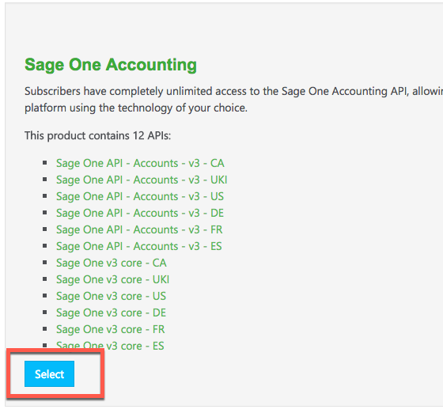
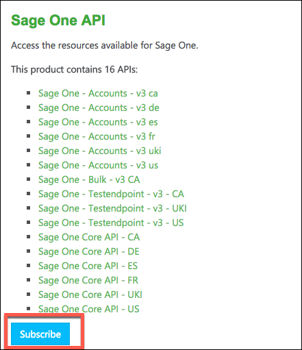
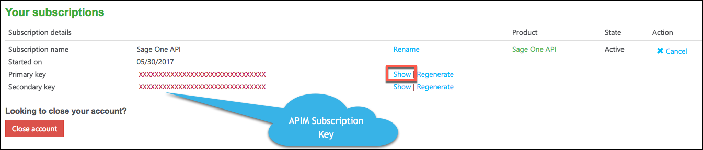
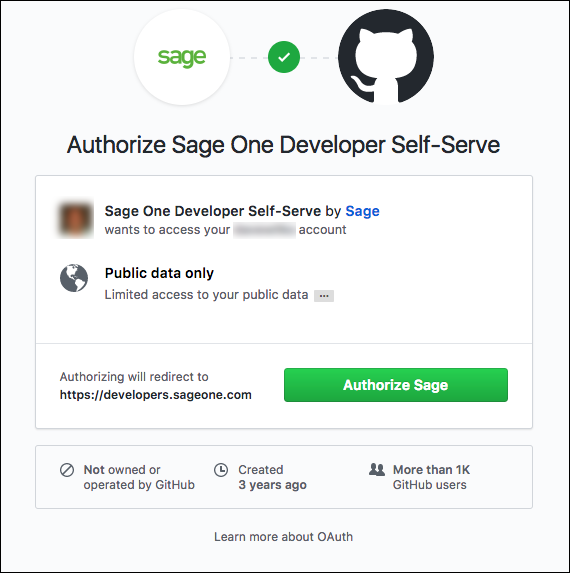
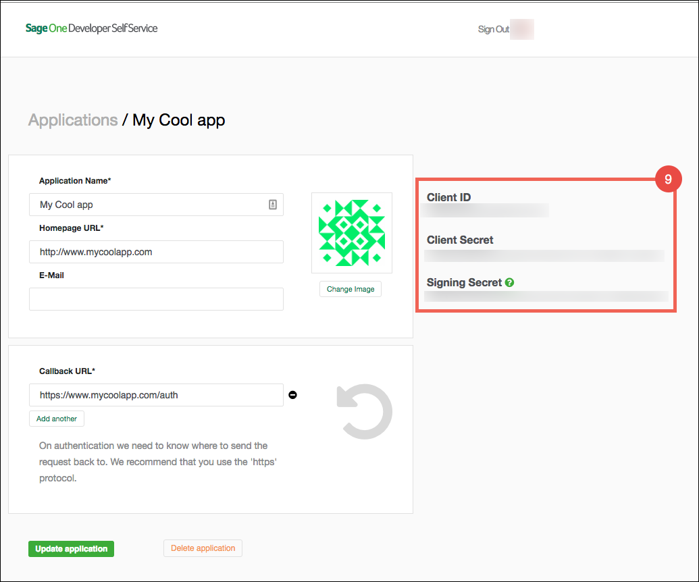

# Service Provider Setup

To authenticate a {{page.heading}} element instance you must have a developer account with Sage and a GitHub account. You need to provide the following Sage information during the authentication process:

* APIM Subscription Key or Subscription Primary Key
* Client ID
* Client Secret
* Signing Secret

Sage assigns the key, id, and secrets after you subscribe to the Sage One API and register your app.



## Subscribe to the Sage One API

To subscribe to the Sage One API and receive an APIM Subscription Key:

1. Navigate  to [https://developers.sageone.com/](https://developers.sageone.com/).
2. On the main page, scroll to the "4 easy steps".
3. Click **Subscribe Now** in step 2.

    Sage One shows a list of APIs that are also clickable links. Do not click them unless you want to read more about each step.

4. Click **Select**.

    Sage One shows another list of APIs that are also clickable links. Do not click them unless you want to read more about each step.

4. Click **Subscribe**.

5. Agree to the terms, and then click **Confirm**.
6. In the **Your Subscriptions** section, click **Show** for the **Primary Key** to reveal your APIM Subscription Key.

7. Save this as your APIM Subscription Key that you need to use to authenticate an element instance.

## Register Your App

To register your app and receive ids and secrets:

1. Navigate  to [https://developers.sageone.com/](https://developers.sageone.com/).
3. Click **View Account** at the top of the page, and the select **My Applications**, or click the **Register your app** link in the body of the page.
4. Sign in with your GitHub account and authorize the app.

3. Accept the terms, and then click **Continue**.
5. Enter your application information, and then click **Register Application**.
8. Click the newly created app.
9. Copy the **Client ID**, **Client Secret**, and **Signing Secret**.

Next [authenticate an element instance with {{page.heading}}](authenticate.html).
