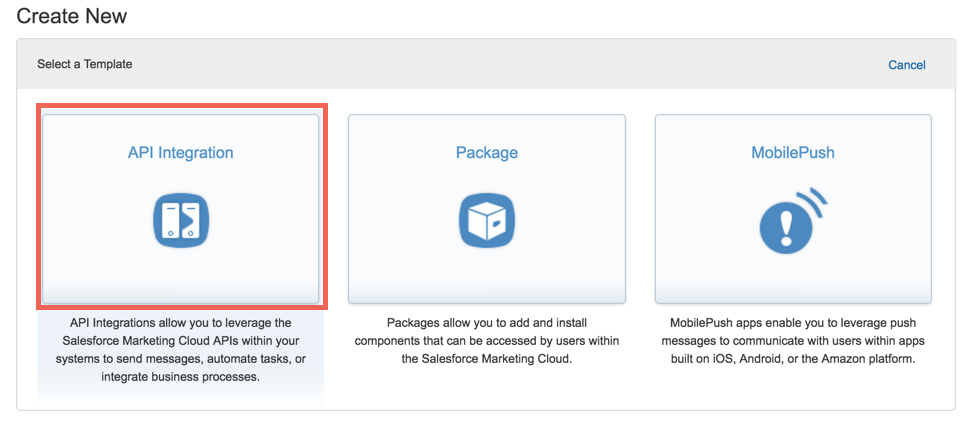
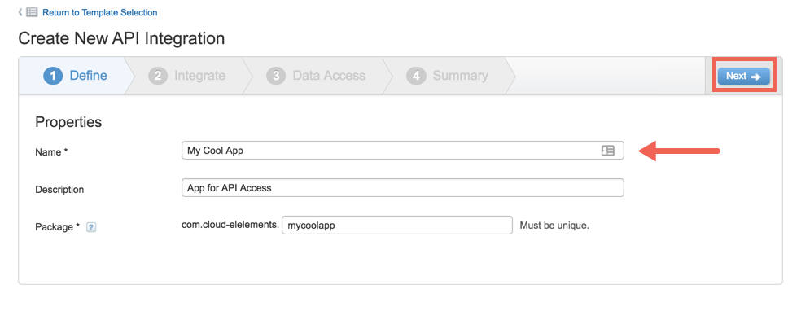
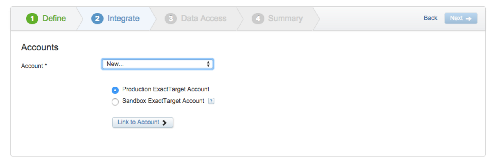
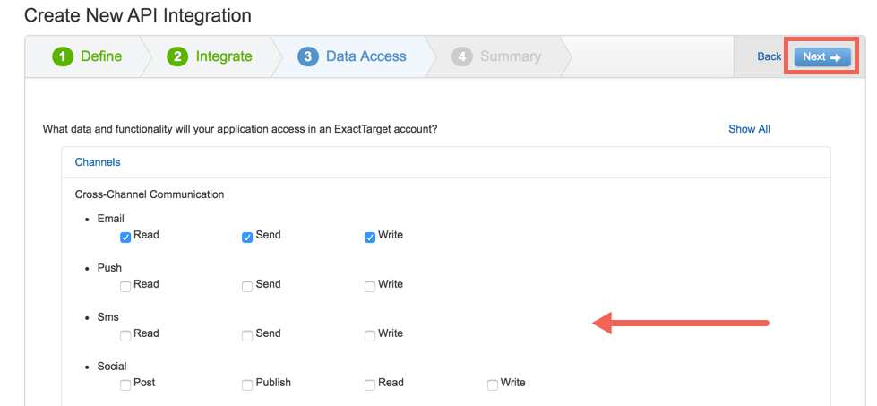
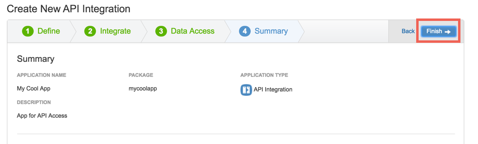
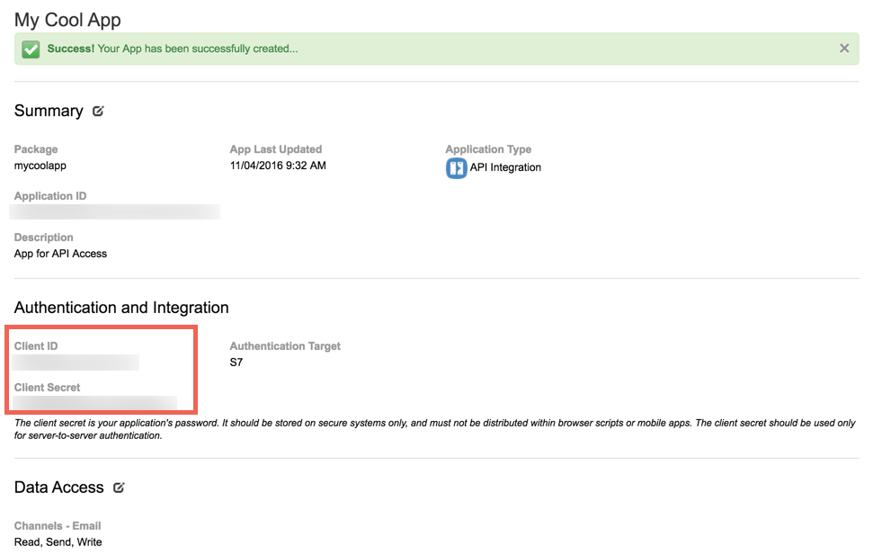

## Endpoint Setup

Follow these steps to setup your Salesforce application with the endpoint.

__In order to create a Salesforce Element Instance you must have the Enterprise edition or Professional edition with API support is required. Also, to set up a new application in Salesforce, you must have Administrator privileges. Please contact your system administrator if you do not have those privileges.__

This documentation will provide the minimum steps needed to get started.  Please refer to the [Salesforce Developer Documentation](https://developer.salesforce.com/docs/atlas.en-us.mc-getting-started.meta/mc-getting-started/app-center.htm) for more detailed information.

Via a web browser, log in to the App Center:
[https://appcenter-auth.s1.marketingcloudapps.com/](https://appcenter-auth.s1.marketingcloudapps.com/)

### Create an App

Each app in the App Center represents a connection to the Marketing Cloud API Platform. If you are familiar with connected apps in Force.com, you will find the concept of connected apps in the Marketing Cloud API familiar. App Center currently manages four types of connections:

1. On the App Center Overview page, click Create New App.

2. Select the API Integration template.



### Define Your App Properties

Fill in the app properties. The Package value is required and must be unique across Marketing Cloud apps, but it is not actually used by the app. It will be deprecated in a future release. If you receive an error message that your value is not unique, try adding a number or symbol to make it unique.


### Connect Your App to an Account

* Production Account is the only valid option when creating an app from within the production environment--selected at the top of the page. To create a sandbox app, start over and select Sandbox from the dropdown at the top of the page.

* Click Link to Account and log in to the appropriate Marketing Cloud account. You may need to ask your account administrator to create a user for you if you do not have existing credentials.

__Don't confuse the username and password you used to log into App Center with Marketing Cloud credentials. These entities use separate credentials.__



### Give Your App Access to Account Features

After connecting your app to your Marketing Cloud account, tell App Center what Marketing Cloud features you need to access. Your app or integration will only be able to access the account features you specify here. For example, to use the API to create and modify emails, lists, subscribers, and data extensions, as well as send email and retrieving tracking event data, give your app access to the following account features and operations:

```bash
Channels - Email
Read, Write, Send

Contacts - List and Subscribers
Read, Write

Data - Data Extensions
Read, Write

Data - Tracking Events
Read
```

Users of your app must have access to the same data in Marketing Cloud via the corresponding permissions in Marketing Cloud.



### Get Your App's OAuth Client Credentials
The summary step recaps everything in a friendly format for your review.

Click Back if you need to make any changes.
If everything looks good, click Finish to complete the creation and registration of your app.
Among other things, the finished summary screen shows you the connected app’s client credentials, which will be used with the API’s authentication service to get OAuth access tokens that will authenticate your app with other Marketing Cloud APIs.





Next [create an instance](salesforce-marketing-cloud-create-instance.html).
