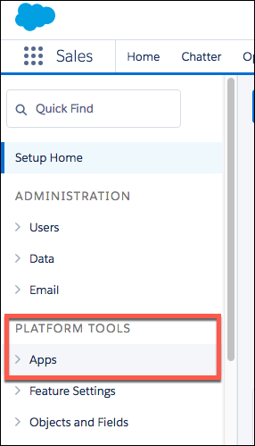

## Enpoint Setup

Follow these steps to setup your Salesforce application with the endpoint.

__In order to create a Salesforce Element Instance you must have the Enterprise edition or Professional edition with API support is required. Also, to set up a new application in Salesforce, you must have Administrator privileges. Please contact your system administrator if you do not have those privileges.__

Via a web browser, login to your Salesforce account:
[https://login.salesforce.com/](https://login.salesforce.com/)


Select "Setup" if not taken there by default:

1. In left hand nav menu, under create, select "Apps"
2. Click "New" 
3. Fill out the basic information about the app
4. Make sure to select "Enable OAuth Settings"
5. You’ll be required to enter a callback URL from the endpoint. This URL will be in your application’s address space, and you will be required to retrieve some information returned on this URL by the endpoint. For our example,we’ll use a callback URL of https://mycoolapp.com/auth
6. Choose from the "Selected OAuth Scopes". "Full Access" and "Perform requests on your behalf at any time (refresh_token_, offline_access)" are the minimum needed scopes.
7. Add the selected scopes
8. Click "Save" at the bottom of the window 
9. Please make a note of the "Consumer Key"
10. Please make a note of the "Consumer Secret" 

---

## Create Instance

Salesforce is a Customer Success Platform. When you provision an instance, your app will have access to the different functionality offered by the Salesforce platform.

Optionally, you may provision an instance to specific features like Marketing Cloud, Service Cloud and Salesforce Documents. Below are examples of each method.

Get Elements OAuth Information

HTTP Header: None
HTTP Verb: GET
Request URL: /elements/{key}/oauth/url
Request Body: None
Query Parameters:

apiKey– the key obtained from registering your app with the provider
apiSecret – the secret obtained from registering your app with the provider
callbackUrl – the URL that you supplied to the provider when registering your app, state – any custom value that you want passed to the callback handler listening at the provided callback URL.
Description: The result of this API invocation is an OAuth redirect URL from the endpoint. Your application should now redirect to this URL, which in turn will present the OAuth authentication and authorization page to the user. When the provided callback URL is executed, a code value will be returned, which is required for the Create Instance API.

Example cURL Command:

```javascript
{
  "element": {
    "key": "sfdc"
  },
  "providerData": {
    "code": "<Code_On_The_Return_URL>"
  },
  "configuration": {
    "oauth.callback.url": "https://www.demonstrab.ly/home",
    "oauth.api.key": "<Insert_Client_ID>",
    "oauth.api.secret": "<Insert_Client_Secret>"
  },
  "tags": [
    "<Add_Your_Tag>"
  ],
  "name": "<Insert_Instance_Name>"
}
```

---

## Events


---
__Represented as a tree-like structure:__

```
|-- hykes
  |-- Command-line Layer
  |-- Ansible Layer
  |-- Server Layer
```

---


## Command-line Layer

Highest-order layer which provides means to perform all regular cloud operations via a simple CLI.
__Zero Ansible or Server layer knowledge required.__

__[Read the docs &raquo;](command-line.html)__

## Ansible Layer

Composes Server layer operations into higher-order cloud operations and concerns. __Deep knowledge
of Ansible; zero knowledge of Server layer required.__

__[Read the docs &raquo;](ansible.html)__

## Server Layer

Lowest-order layer which does all heavy lifting, including kernels, custom compilation, daemons,
CLIs, lifecycle systems, deployers, and other low-level concerns. __Deep knowledge of Linux, the
Cloud Elements platform, hardware, software, and more required.__

__[Read the docs &raquo;](server.html)__

## Hardware Requirements

All servers are assumed to have Ubuntu 14.04 LTS freshly installed, a static IP assigned, desired
hostname configured, and at least one non-root admin account to perform all operations. A single
virtual IP is needed for a high-availability load balancer setup.

#### Minimum:

```
|-- all
  |-- 1x app (2 vCPU, 8GB RAM, 32GB HDD)
  |-- 1x cache (1 vCPU, 4GB RAM, 32GB HDD)
  |-- 1x database (2 vCPU, 8GB RAM, 64GB SSD)
  |-- 1x eib (1 vCPU, 2GB RAM, 32GB SSD)
  |-- 1x loadbalance (1 vCPU, 1GB RAM, 32GB HDD)
  |-- 1x logpipe (1 vCPU, 2GB RAM, 32GB HDD)
  |-- 1x logsearch (1 vCPU, 4GB RAM, 64GB HDD)
```

---

#### Recommended:

```
|-- all
  |-- 3x app (4 vCPU, 8GB RAM, 64GB SSD)
  |-- 2x cache (1 vCPU, 4GB RAM, 64GB SSD)
  |-- 2x database (4 vCPU, 16GB RAM, 96GB SSD)
  |-- 2x eib (1 vCPU, 4GB RAM, 64GB SSD)
  |-- 2x loadbalance (1 vCPU, 2GB RAM, 64GB SSD)
  |-- 2x logpipe (2 vCPU, 4GB RAM, 32GB SSD)
  |-- 3x logsearch (2 vCPU, 8GB RAM, 96GB SSD)
```

---

## Firewall Requirements

Software firewalls (i.e. iptables) are used to provide baseline protection. Hardware firewalls
can be used in addition to, or in lieu of, software firewalls, providing the following rules
are met:

#### Inbound:

```
|-- all (22 open to public)
  |-- app (8080 open to app/loadbalance)
  |-- cache (6379/11211 open to app/cache)
  |-- database (5432 open to app/database)
  |-- eib (2181/9092 open to app/eib)
  |-- loadbalance (80/443 open to public, 9200 open to app/loadbalance)
  |-- logpipe (none)
  |-- logsearch (9200/9300 open to logpipe/logsearch/loadbalance)
```

---

## DNS Requirements

#### Public endpoints:

| Record                  | Required | Example             | Purpose
| ----------------------- | -------- | ------------------- | -------
| `{{base_fqdn}}`         | No       | example.com         | Redirect `{{base_fqdn}}` traffic to `console.{{base_fqdn}}`
| `api.{{base_fqdn}}`     | Yes      | api.example.com     | REST endpoint
| `console.{{base_fqdn}}` | Yes      | console.example.com | UI endpoint

> __NOTE:__ All public endpoint records should point to the IP of `loadbalance[0]`

---

#### Server lookup:

| Record                         | Required | Example
| ------------------------------ | -------- | ------------------------
| `app[n].{{base_fqdn}}`         | Yes      | app0.example.com
| `cache[n].{{base_fqdn}}`       | Yes      | cache0.example.com
| `database[n].{{base_fqdn}}`    | Yes      | database0.example.com
| `eib[n].{{base_fqdn}}`         | Yes      | eib0.example.com
| `loadbalance[n].{{base_fqdn}}` | Yes      | loadbalance0.example.com
| `logpipe[n].{{base_fqdn}}`     | Yes      | logpipe0.example.com
| `logsearch[n].{{base_fqdn}}`   | Yes      | logsearch0.example.com

> __NOTE:__ All server lookup records should point to the IP of the server the record refers to

---

## Certificate Requirements

TLS/SSL certificates are required to protect all [public endpoints](#public-endpoints). This can be
accomplished via one of three approaches:

#### Via Wildcard Certificate

* Wildcard certificate for `{{base_fqdn}}`

#### Via SAN Certificate

* SAN certificate for `api.{{base_fqdn}}`, `console.{{base_fqdn}}`, and optionally `{{base_fqdn}}`
(see [public endpoints](#public-endpoints) for details)

#### Via Single Certificates

* Single certificate for `api.{{base_fqdn}}`
* Single certificate for `console.{{base_fqdn}}`
* Optionally, single certificate for `{{base_fqdn}}` (see [public endpoints](#public-endpoints)
for details)
