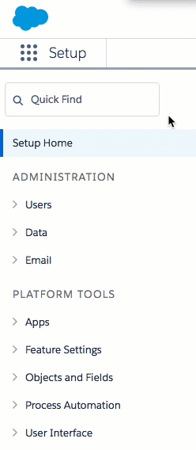

# API Provider Setup

To authenticate a {{page.heading}} element instance you must have the {{page.heading}} Enterprise edition or Professional edition with API support. Also, to set up a new application in {{page.heading}}, you must have Administrator privileges. Contact your system administrator if you do not have those privileges.



To set up the endpoint:

1. Via a web browser, log in to your Salesforce account:
  * Sandbox: [https://test.salesforce.com/](https://test.salesforce.com/)
  * Production: [https://login.salesforce.com/](https://login.salesforce.com/)
1. If not already on the Setup page, [navigate to it](https://help.salesforce.com/articleView?id=basics_nav_setup.htm&type=0).
2. In the menu on the left, click __Apps__, and then click __App Manager__.

2. Click __New Connected App__.
3. Complete the Basic Information section.
4. In the API (Enable OAuth Settings) section, select __Enable OAuth Settings__.
5. Enter a Callback URL to redirect the user to after authentication. This URL will be in your application’s address space, and you will be required to retrieve some information returned on this URL by the endpoint.
6. In __Selected OAuth Scopes__, add the scopes needed from Available to Selected.
      
8. Complete the remaining settings as needed for your app.
8. Click __Save__ at the bottom of the window.
9. Click __Continue__.
9. Note the following in the API (Enable OAuth Settings) section, which you will need to authenticate a Cloud Elements Salesforce element instance with Salesforce.
 * Consumer Key
 * Consumer Secret
 * Callback URL

Next [authenticate an element instance with Salesforce](salesforce-create-instance.html).
