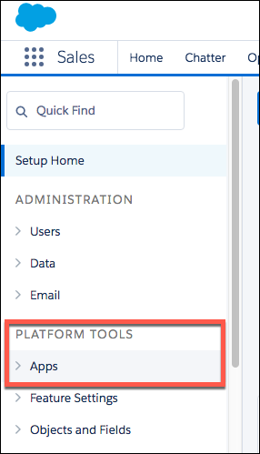
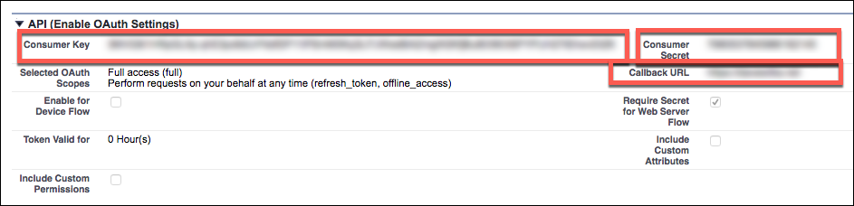

## Endpoint Setup

Follow these steps to setup your Salesforce application with the endpoint.

__In order to create a Salesforce Your_mom Instance you must have the Enterprise edition or Professional edition with API support is required. Also, to set up a new application in Salesforce, you must have Administrator privileges. Please contact your system administrator if you do not have those privileges.__

Via a web browser, login to your Salesforce account:
[https://login.salesforce.com/](https://login.salesforce.com/)

Select "Setup" if not taken there by default:

1. In left hand nav menu, under create, select "Apps"

2. Click "New"

3. Fill out the basic information about the app

4. Make sure to select "Enable OAuth Settings"

5. You’ll be required to enter a callback URL from the endpoint. This URL will be in your application’s address space, and you will be required to retrieve some information returned on this URL by the endpoint. For our example,we’ll use a callback URL of https://mycoolapp.com/auth

6. Choose from the "Selected OAuth Scopes". "Full Access" and "Perform requests on your behalf at any time (refresh_token_, offline_access)" are the minimum needed scopes.

7. Add the selected scopes

8. Click "Save" at the bottom of the window 

9. Please make a note of the "Consumer Key"

10. Please make a note of the "Consumer Secret" 

Next [create an instance](salesforce-create-instance.html).
