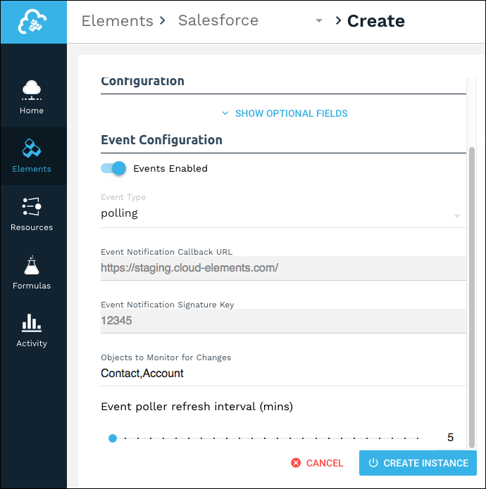
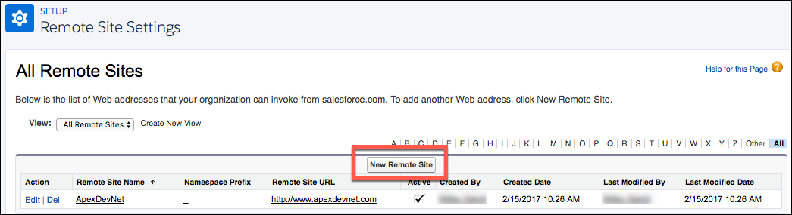

# Events

Cloud Elements supports events via polling or webhooks depending on the endpoint. If you would like to see more information on our Events framework, please see the [Event Management Guide](/docs/platform/event-management/index.html).





## Supported Events and Resources

Cloud Elements supports both webhooks and polling events for Salesforce.

You can set up events for the following resources:

* Account
* Lead
* Contact
* Opportunity
* Other objects that include `created`, `updated`, and `deleted` data.

## Polling

You can configure polling through the UI or in the JSON body of the `/instances` API call.

### Configure Polling Through the UI

For more information about each field described here, see [Parameters](#parameters).

2. To enable hash verification in the headers of event callbacks, click **Show Optional Fields**, and then add a key to **Callback Notification Signature Key**.
1. Switch on __Events Enabled__.
2. Select **polling** from **Event Type**.
2. Add an **Event Notification Callback URL**.
4. Use the __Event poller refresh interval (mins)__ slider or enter a number in minutes to specify how often Cloud Elements should poll for changes.
5. Enter each object that you want to poll for changes separated by commas.

When finished adding your polling configuration, the Event Configuration section should look like this:
 

### Configure Polling Through API

To add polling when authenticating through the `/instances` API call, add the following to the `configuration` object in the JSON body. For more information about each parameter described here, see [Parameters](#parameters).

```json
{
"event.notification.enabled": true,
"event.vendor.type": "polling",
"event.notification.callback.url": "<INSERT_YOUR_APPS_CALLBACK_URL>",
"event.notification.signature.key": "<INSERT_KEY>",
"event.objects": "<COMMA_SEPARATED_LIST>",
"event.poller.refresh_interval": "<TIME_IN_MINUTES>"
}
```


### Example JSON with Polling

instance JSON with polling events enabled:

```json
{
  "element": {
    "key": "sfdc"
  },
  "providerData": {
    "code": "<Code_On_The_Return_URL>"
  },
  "configuration": {
    "oauth.callback.url": "https://www.mycoolapp.com/auth",
    "oauth.api.key": "<Insert_Client_ID>",
    "oauth.api.secret": "<Insert_Client_Secret>",
    "event.notification.enabled": true,
    "event.vendor.type": "polling",
    "event.notification.callback.url": "https://staging.cloud-elements.com/elements/api-v2/instances/events",
    "event.notification.signature.key": "12345",
    "event.objects": "Contact,Account",
    "event.poller.refresh_interval": "5"
  },
  "tags": [
    "forDocs"
  ],
  "name": "mySFDCInstance"
}
```

## Webhooks

When implementing webhooks for Salesforce, Cloud Elements creates APEX classes and triggers in order to send webhooks.  This can only be done in a Salesforce sandbox account.  If you want to support webhooks in a production Salesforce account, you'll have to make some modifications and migrate those classes to production according to the Salesforce specification. View more information regarding the [Salesforce specification](https://developer.salesforce.com/docs/atlas.en-us.apexcode.meta/apexcode/apex_qs_deploy.htm).

You can configure webhooks [through the UI](#configure-webhooks-through-the-ui) or [through API](#configure-webhooks-through-api) in the JSON body of the `/instances` API call. First, you must [set up webhooks in Salesforce](#set-up-webhooks).

### Set Up Webhooks

Follow these steps to set up your Salesforce application with the endpoint.

1. Via a web browser, log in to your Salesforce account:
1. In the Quick Find box, type `Remote Site Settings`.
2. Click __New Remote Site__.

3. Create a remote site for each of the following URLs:

  * https://api.cloud-elements.com
  * https://console.cloud-elements.com



### Configure Webhooks Through the UI

For more information about each field described here, see [Parameters](#parameters).

1. Switch on __Events Enabled__.
2. Select **webhooks** from **Event Type**.
2. Add an **Event Notification Callback URL**.
3. Optionally include a Callback Notification Signature Key.
5. Enter each object that you want to poll for changes separated by commas.

When finished adding your polling configuration, the Event Configuration section should look like this:


### Configure Webhooks Through API

To add webhooks when authenticating through the `/instances` API call, add the following to the `configuration` object in the JSON body. For more information about each parameter described here, see [Parameters](#parameters).

```json
{
"event.notification.enabled": true,
"event.vendor.type": "polling",
"event.notification.callback.url": "<INSERT_YOUR_APPS_CALLBACK_URL>",
"event.notification.signature.key": "<INSERT_KEY>",
"event.objects": "<COMMA_SEPARATED_LIST>"
}
```


### Example JSON with Webhooks

Instance JSON with webhooks events enabled:

```json
{
  "element": {
    "key": "sfdc"
  },
  "providerData": {
    "code": "<Code_On_The_Return_URL>"
  },
  "configuration": {
    "oauth.callback.url": "https://www.mycoolapp.com/auth",
    "oauth.api.key": "<Insert_Client_ID>",
    "oauth.api.secret": "<Insert_Client_Secret>",
    "event.notification.enabled": true,
    "event.vendor.type": "webhooks",
    "event.notification.callback.url": "https://mycoolapp.com",
    "event.notification.signature.key": "12345",
    "event.objects": "Contact,Account"
  },
  "tags": [
    "forDocs"
  ],
  "name": "mySFDCInstance"
}
```

## Parameters

API parameters are in `code formatting`.

| Parameter | Description   | Data Type |
| :------------- | :------------- | :------------- |
| 'key' | The element key.<br>sfdc  | string  |
|  Name</br>`name` |  The name for the element instance created during authentication.   | Body  |
| `oauth.api.key` | The Consumer Key from Salesforce. |  string |
| `oauth.api.secret` | The Consumer Secret from Salesforce. | string |
| Filter null values from the response </br>`filter.response.nulls` | *Optional*. Determines if null values in the response JSON should be filtered from the response. Yes or `true` indicates that Cloud Elements will filter null values. </br>Default: `true`.  | boolean |
| Events Enabled </br>`event.notification.enabled` | *Optional*. Identifies that events are enabled for the element instance.</br>Default: `false`  | boolean |
| Event Type </br>`event.vendor.type` | *Optional*. Identifies the type of events enabled for the instance, either `webhook` or `polling`. | string |
| Event Notification Callback URL</br>`event.notification.callback.url` |  *For webhooks and polling.*</br>The URL where your app can receive events.   | string |
| Callback Notification Signature Key </br>`event.notification.signature.key` | *For webhooks and polling.*</br>*Optional*</br>A user-defined key for added security to show that events have not been tampered with. This can be any custom value that you want passed to the callback handler listening at the provided Event Notification Callback URL.| string |
| Objects to Monitor for Changes</br>`event.objects`|  *For webhooks and polling.*</br>*Optional*</br>Comma separated list of objects to monitor for changes. | string |
| Event poller refresh interval (mins)</br>`event.poller.refresh_interval`  | *For polling only.*</br>A number in minutes to identify how often the poller should check for changes. |  number|
| tags | *Optional*. User-defined tags to further identify the instance. | string |
