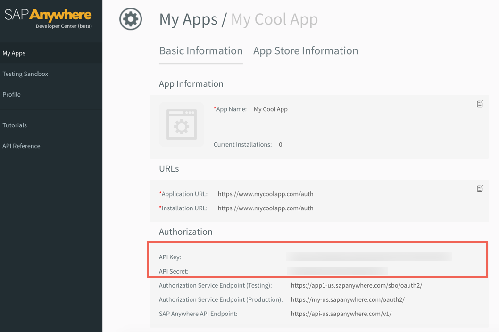

## Endpoint Setup

Follow these steps to setup your SAP Anywhere application with the endpoint.

The screen shots below assume you have signed up with SAP Anywhere as a developer.
Information this process is in the next section and includes a link to the [SAP Anywhere Documentation](https://doc-eu.sapanywhere.com/api/app/public_app).

### Register Developer Account and Create Your Test Tenant

To start developing your app for SAP Anywhere, you need a developer account to become an SAP Anywhere developer. So far the developer account registration is not opened to all users. You can contact us and then we will send you an invitation email. You can follow the instructions in this invitation email and register your developer account.

As a developer, you are able to access SAP Anywhere developer center dashboard and you can create your own testing tenant. Testing tenant is an area for app development where you can create data to test out the functionality of your app.

To create a testing tenant, you need to navigate to the Testing sandbox tab and click Create button to create your own testing tenant.

[Get a developer account](https://doc-eu.sapanywhere.com/api/app/public_app#register)

Via a web browser, log in to your SAP Anywhere account:
[https://dev-us.sapanywhere.com/portal/apps?locale=en_US](https://dev-us.sapanywhere.com/portal/apps?locale=en_US)

1. My Apps > Add a new App

2. Input app info and click "Create"

3. Make note of the API Key and Secret

Next [create an instance](sapanywhere-create-instance.html).
