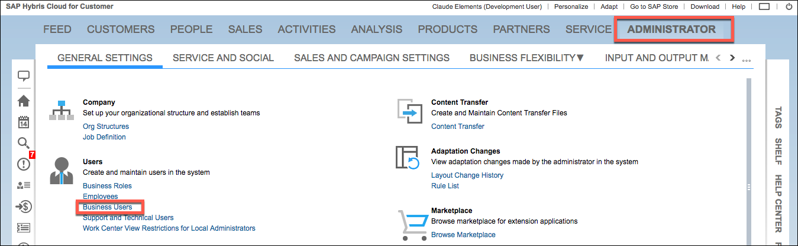
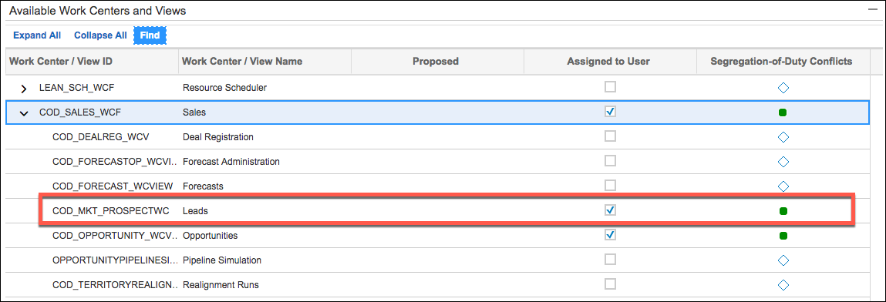

# Endpoint Setup

To authenticate an element instance, use credentials associated with a Development User. The user credentials associated with an authenticated element instance must have access to any resources that you access.

To confirm or change access to resources:

1. Go to your SAP C4C application.
2. Click **Administrator** in the main menu, and then click **Business Users**.

2. Select your user in the list, and then click **Edit>Access Rights**.
3. Review the Work Center / View Name column for resources that you need access to.
4. Select **Assigned to User** for each resource, as shown for the Leads resource below.

    

6. Refresh your session by closing and logging back in.

Next [authenticate an element instance](authenticate.html).
