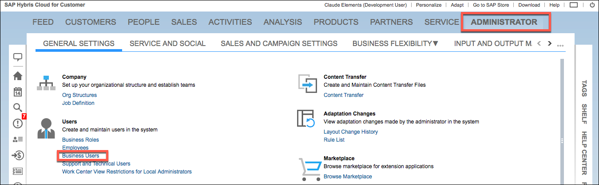
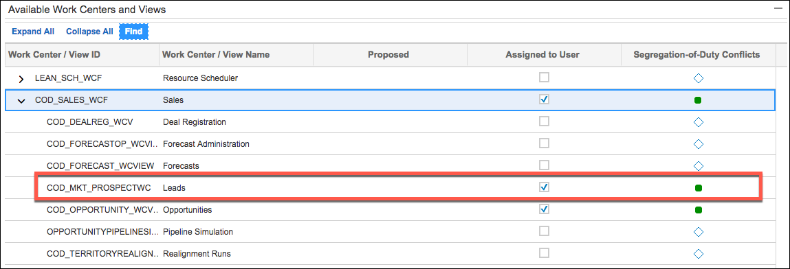

# Tips

The Tips section includes more information about the element including FAQs, endpoint limitations, and general tips.



## Leads

If you do not see leads on the Sales > Leads page, you must update your Work Center views.

To update your Work Center Views:

1. Click **Administrator** in the main menu, and then click **Business Users**.

2. Select your user in the list, and then click **Edit>Access Rights**.
3. Expand the Work Center / View Name called **Sales**.
4. Select **Assigned to User** for the **Leads**  Work Center / View Name, as shown below.


    

6. Refresh your session by closing and logging back in.
7. Confirm that you see leads on the Sales > Leads page.

## leads Endpoint

To ensure that you receive results for the GET /leads endpoint, include a CEQL expression. For example, use CreationDateTime > ‘2016-04-28T03:49:32Z’.

## Deferred Content

The GET APIs conserve resources by returning deferred content for some objects. The deferred data is available from a URI specified in the response. Alternatively, you can request that normally deferred data is returned with the response. You can include an `expand` query parameter that allows you to return more information about the object.



You can use the `expand` query parameter for any deferred object. For example, when you make a `GET /accounts` API call, the response includes several objects structured like the `AccountRole` object in the example below:

```json
[
  {
    "AccountRole": {
      "__deferred": {
      "uri": "https://my328080.Helpdesk.ondemand.com/sap/c4c/odata/v1/c4codata/AccountCollection('00163E038C2E1EE299C1BB0BE9398F9B')/AccountRole"
      }
    }
  }
]
```
To see the entire object in the response, include the object name in the `expand` parameter.

For example, `GET /accounts?expand=AccountRole` returns the `AccountRole` as:

```json
[
  {
    "AccountRole": [
      {
        "Account": {
          "__deferred": {
            "uri": "https://my328080.Helpdesk.ondemand.com/sap/c4c/odata/v1/c4codata/AccountRoleCollection('00163E038C2E1EE299C1C3CD297CCFA0')/Account"
          }
        },
        "ObjectID": "00163E038C2E1EE299C1C3CD297CCFA0",
        "ETag": "1390880972384",
        "BusinessCharacterCodeText": "Customer",
        "RoleCodeText": "Customer",
        "__metadata": {
          "etag": "W/\"datetimeoffset'2014-01-28T03%3A49%3A32.3845460Z'\"",
          "type": "c4codata.AccountRole",
          "uri": "https://my328080.Helpdesk.ondemand.com/sap/c4c/odata/v1/c4codata/AccountRoleCollection('00163E038C2E1EE299C1C3CD297CCFA0')"
        },
        "RoleCode": "Helpdesk000",
        "ParentObjectID": "00163E038C2E1EE299C1BB0BE9398F9B",
        "BusinessCharacterCode": "Helpdesk000"
      }
    ],
  }
]
```

## Object Discovery

Use `GET /objects` to retrieve a list of the normalized Cloud Elements resources and all of the other resources at SAP Hybris Cloud for Customer. You can utilize these resources in calls to the endpoints that utilize `{objectName}`. Be sure that you can access the resource included in `{objectName}` at SAP Hybris Cloud for Customer. See [Endpoint Setup](endpoint-setup.html) for setup instructions.

## LeadCollection

The `LeadCollection` object has been privately deprecated in SAP Hybris Cloud for Customer. If you're using the API directly, call `LeanLeadCollection` instead.

## vendorNativeType

If you use `GET /objects/{objectName}/metadata` to returns the metadata for an object, you will see `vendorNativeType` properties. In some cases, the API name of a field is appended with a " - ". You can find the enumerated values with the `GET /{objectName}` endpoint.

For example, to find enumerated values of this field in the LeanLeadCollection resource, call `GET /LeanLeadConsistencyStatusCodeCollection`.

```json
{
  "vendorReadOnly": true,
  "updateable": "false",
  "filterable": "true",
  "createable": "false",
  "vendorNativeType": "Edm.String - LeanLeadConsistencyStatusCodeCollection",
  "type": "string",
  "vendorPath": "ConsistencyStatusCode"
}
```

## Upload Files

If you want to upload a file or attachment using the generic APIs, use `POST /{objectName}/{objectId}/{childObjectName}/attachments`.
