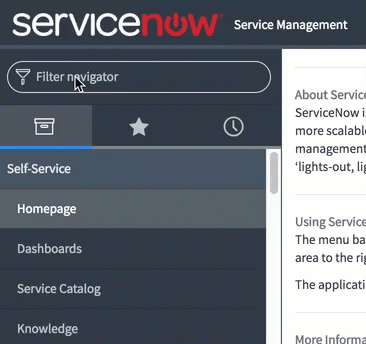
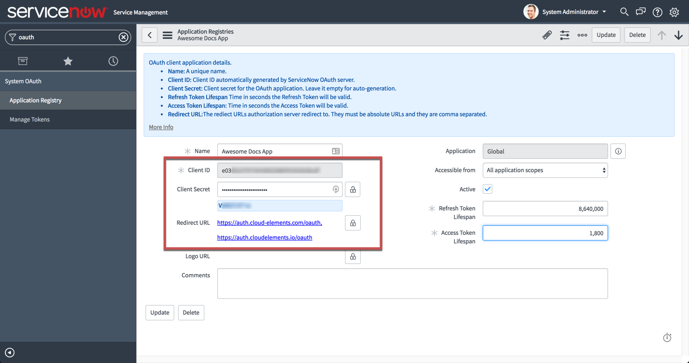

# API Provider Setup

To authenticate a {{page.heading}} element instance you must register an app with {{page.heading}}. When you authenticate, use the **{{page.apiKey}}**, **{{page.apiSecret}}**, and **{{page.callbackURL}}** as the **OAuth API Key**, **OAuth API Secret**, and **Callback URL**.

See the latest setup instructions in the [{{page.heading}} documentation](https://docs.servicenow.com/bundle/jakarta-servicenow-platform/page/administer/security/task/t_SettingUpOAuth.html).



## Locate Credentials for Authentication

If you already created an application, see below to locate the **{{page.apiKey}}**, **{{page.apiSecret}}**, and **{{page.callbackURL}}**. If you have not created an app, see [Create an Application](#create-an-application).

To find your OAuth 2.0 credentials:

1. Log in to your system administrator account at your ServiceNow URL, such as `https://subdomain.service-now.com/`.
2. In Filter Navigation, type **OAuth**, and then click **Application Registry**.

2. Click the application that you want to connect.
3. Record the **{{page.apiKey}}** as the OAuth API Key needed to authenticate an element instance.
4. Show the **{{page.apiSecret}}** and record it as the OAuth API Secret needed to authenticate an element instance.
5. Record the URL or URLs in the **{{page.callbackURL}}** as the Callback URL needed to authenticate an element instance.

## Create an Application

If you have not created an application, you need one to authenticate with {{page.heading}}.

1. Log in to your system administrator account at your ServiceNow URL, such as `https://subdomain.service-now.com/`.
2. In Filter Navigation, type **OAuth**, and then click **Application Registry**.

3. Click **New**, and then click **Create an OAuth API endpoint for external clients**.
4. Complete the form, and then click **Submit**.
2. Click the application that you want to connect.
3. Record the **{{page.apiKey}}** as the OAuth API Key needed to authenticate an element instance.
4. Show the **{{page.apiSecret}}** and record it as the OAuth API Secret needed to authenticate an element instance.
5. Record the URL or URLs in the **{{page.callbackURL}}** as the Callback URL needed to authenticate an element instance.

Next [authenticate an element instance with {{page.heading}}](authenticate.html).
