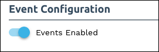
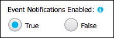
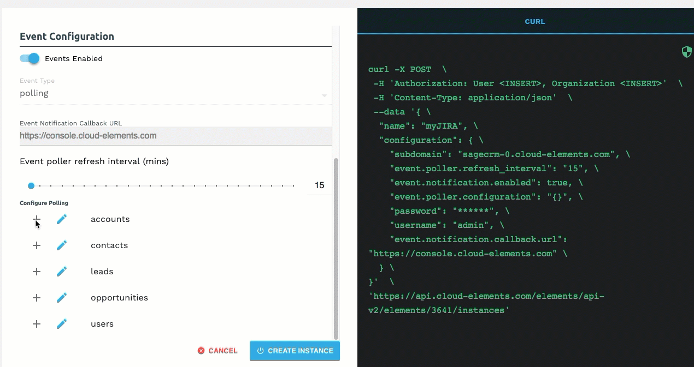
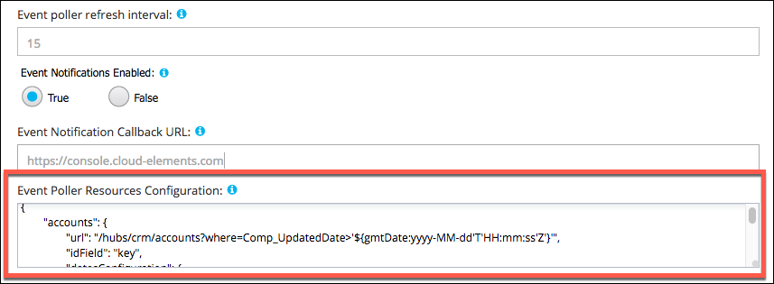



### Configure Polling Through the UI

For more information about each field described here, see [Parameters](#parameters).

To authenticate an element instance with polling:

1. Enter the basic information required to authenticate an element instance as described in [Authenticate with {{page.heading}}](authenticate.html) .
2. Enable events: Switch **Events Enabled** on.

    | Latest UI | Earlier UI  |
    | :------------- | :------------- |
    | Switch **Events Enabled** on. </br>|  In **Event Notifications Enabled**, select **True**.</br> |

8. Add an **Event Notification Callback URL**.
5. Optionally include an **Event Notification Signature Key** to identify if events have been tampered with.
4. Use the **Event poller refresh interval (mins)** slider or enter a number in minutes to specify how often Cloud Elements should poll for changes.
5. Select and configure the resources to poll.

    | Cloud Elements 2.0 | Earlier UI  |
    | :------------- | :------------- |
    | Select the resources to poll. </br>Optionally, click the pencil icon to further configure polling.</br> | Edit the JSON to add or remove resources and optionally change the Event Poller Resources Configuration . </br> |

9. In Cloud Elements 2.0, optionally type or select one or more tags to add to the authenticated element instance.
7. Click **Create Instance** (Cloud Elements 2.0) or **Next** (earlier UI).
8. Provide your {{page.heading}} credentials, and then allow the connection.

    After you authenticate with the API Provider, the authentication flow returns you to {{site.console}}.

8. If using the earlier UI, optionally add tags to the authenticated element instance.
9. Note the **Token** and **ID** and save them for all future requests using the element instance.

    | Cloud Elements 2.0 | Earlier UI  |
    | :------------- | :------------- |
    |  |   |

### Configure Polling Through API

Use the `/instances` endpoint to authenticate with {{page.heading}} and create an element instance with polling enabled.



To authenticate an element instance with polling:

1. Construct a JSON body as shown below (see [Parameters](#parameters)):

    ```json
    {
      "element":{
        "key":"{{page.elementKey}}"
      },
      "providerData":{
        "code": "<AUTHORIZATION_GRANT_CODE>"
      },
      "configuration":{
        "username": "<USERNAME>",
        "password": "<PASSWORD>",
      	"servicenow.subdomain": "<SUBDOMAIN>",
        "event.notification.enabled": true,
        "event.notification.callback.url": "http://mycoolapp.com",
        "event.poller.refresh_interval": "<minutes>",
        "event.poller.configuration":{
          "accounts":{
            "url": "/hubs/helpdesk/accounts?where=sys_updated_on>'${gmtDate:yyyy-MM-dd'T'HH:mm:ss}'",
        		"idField": "sys_id",
        		"datesConfiguration": {
        			"updatedDateField": "sys_updated_on",
        			"updatedDateFormat": "yyyy-MM-dd HH:mm:ss",
        			"createdDateField": "sys_created_on",
        			"createdDateFormat": "yyyy-MM-dd HH:mm:ss"
        		}
          }
        }
      },
      "tags":[
        "<Add_Your_Tag>"
      ],
      "name":"<INSTANCE_NAME>"
    }
    ```

1. Call the following, including the JSON body you constructed in the previous step:

        POST /instances

    

1. Locate the `token` and `id` in the response and save them for all future requests using the element instance.

### Example JSON with Polling

instance JSON with polling events enabled:

```json
{
  "element":{
    "key":"sageone"
  },
  "providerData":{
    "code":"1c6ff4089d58d80e86482ab7d5b97f15dd7b041d"
  },
  "configuration":{
    "username": "username",
    "password": "******",
    "servicenow.subdomain": "dev12345" ,
    "event.notification.enabled":true,
    "event.notification.callback.url":"http://mycoolapp.com",
    "event.poller.refresh_interval":"15",
    "event.poller.configuration":{
      "customers":{
        "url":"/hubs/finance/customers?where=lastModifiedDate>='${date:yyyy-MM-dd'T'HH:mm:ss'Z'}' and attributes='created_at,updated_at",
        "idField":"id",
        "datesConfiguration":{
          "updatedDateField":"updated_at",
          "updatedDateFormat":"yyyy-MM-dd'T'HH:mm:ss'Z'",
          "updatedDateTimezone":"GMT",
          "createdDateField":"created_at",
          "createdDateFormat":"yyyy-MM-dd'T'HH:mm:ss'Z'",
          "createdDateTimezone":"GMT"
        }
      }
    }
  },
  "tags":[
    "Test"
  ],
  "name":"API_Polling"
}
```

## Parameters

API parameters not shown in {{site.console}} are in `code formatting`.

| Parameter | Description   | Data Type |
| :------------- | :------------- | :------------- |
| `key` | The element key.<br>{{page.elementKey}}  | string  |
|  Name</br>`name` |  The name for the element instance created during authentication.   | string  |
| Username</br>`username` | Your ServiceNow user name.  |
| Password</br>`password` | Your ServiceNow password. |  string |
| The ServiceNow Subdomain</br>`servicenow.subdomain` | This is the part of your URL that is specific to your organization, for example in `https://domain12345.service-now.com/` `domain12345` is the subdomain | string |
| Events Enabled </br>`event.notification.enabled` | *Optional*. Identifies that events are enabled for the element instance.</br>Default: `false`.  | boolean |
| Event Notification Callback URL</br>`event.notification.callback.url` |  The URL where you want Cloud Elements to send the events. | string |
| Event poller refresh interval (mins)</br>`event.poller.refresh_interval`  | A number in minutes to identify how often the poller should check for changes. |  number|
| Configure Polling</br>`event.poller.configuration`  | Optional*. Configuration parameters for polling. | JSON object |
| accounts  | The configuration of the customers resource. | JSON object |
| URL</br>`url` | The url to query for updates to the resource.  | String |
| ID Field</br>`idField` | The field in the resource that is used to uniquely identify it.  | String |
| Advanced Filtering</br>`datesConfiguration` | Configuration parameters for dates in polling | JSON Object |
| Updated Date Field</br>`updatedDateField` | The field that identifies an updated object. | String |
| Updated Date Format</br>`updatedDateFormat` | The date format of the field that identifies an updated object.  | String |
| Created Date Field</br>`createdDateField` | The field that identifies an created object. | String |
| Created Date Format</br>`createdDateFormat` | The date format of the field that identifies an created object.  | String |
| tags | *Optional*. User-defined tags to further identify the instance. | string |
