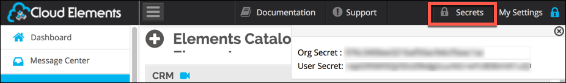

# Welcome to the {{page.heading}} Element

{{page.heading}} provides hosting, online storage, and a general platform for IT service management.





## Element Details

| Element Information | Details     |
| :------------- | :------------- |
| API Documentation | [{{page.heading}} API documentation](https://developer.servicenow.com/app.do#!/rest_api_doc?v=helsinki&id=c_TableAPI) |
| Authentication | Basic  |
| Events | Polling |
| Bulk | Supported for both upload and download. |
| Transformations | Supported. See [Define Common Resources and Transformations](/docs/guides/common-resources/index.html) for more information about transforming your {{page.heading}} data.|

## Base URL

The Cloud Element Base URL for all API calls is `https://api.cloud-elements.com/elements/api-v2`.

HTTP requests to the REST API are protected with HTTP Custom authentication with your Organization and User secret and an Element Instance token. We use many standard HTTP features, like HTTP verbs, understood by most HTTP clients. JSON is returned in all responses from the API, including errors. The APIs have predictable, straightforward URLs and use HTTP response codes to indicate API errors.

## Authenticating with Cloud Elements

To authenticate with Cloud Elements, you need to know your Organization Secret and User Secret. When making some calls, you also need to know the Element Instance token.

When you create an account with us, we assign you an Organization Secret and a User Secret. An Organization is a customer of Cloud Elements (`/organizations`). The User and Organization secrets represent your account with Cloud Elements.

To find your Organization and User Secret:

| Latest UI | Earlier UI  |
| :------------- | :------------- |
| Open the profile menu.    | Click __Secrets__ in the header.    |

When you create a new connection to an endpoint, you will receive an Element Instance token. After you create an instance, Cloud Elements automatically refreshes the token behind the scenes so that you won't need to connect your application again.

To find your Element instance token:

        GET /instances/<INSTANCE_ID>

An Element Instance token and a User secret are required to execute one of our Hub API calls (e.g. `/hubs/documents/files` or `/hubs/crm/contacts`). For more information about Hubs, see [Hub API Docs](../../hubs/hub-docs)

Pass tokens and secrets as basic HTTP Header values.

* To make a Platform or API call, include the following in the header:

        Authorization: User <INSERT_USER_SECRET>, Organization <INSERT_USER_SECRET>

* To make a Hub API call, include the following in the header:

        User <INSERT_USER_SECRET>, Element <INSERT_ELEMENT_INSTANCE_TOKEN>



Get started by [setting up the service provider](setup.html).

## Welcome to the ServiceNow Element

The ServiceNow element uses `Basic` authentication, i.e., authentication with a username, password and your ServiceNow sub-domain URL.

### At a Glance

In order to create a connection to ServiceNow the following steps are required:

1. Retrieve your ServiceNow Username, Password, and Subdomain URL
2. Call the `POST /instances` API to instantiate your ServiceNow connected app

### In Depth

The ServiceNow Element is a collection of resources providing a pre-built integration into a service endpoint. RESTful methods (POST, GET, PUT, PATCH, DELETE) are used to interact with these resources (accounts, contacts, files) regardless of the type of APIs (SOAP or REST) provided by the endpoint. Elements leverage Cloud Elements API Manager platform services including authentication, data transformation, and event management.  The API is built to allow you to create a functional application or integration quickly and easily.

All API calls to Cloud Elements should be made to the `https://api.cloud-elements.com/elements/api-v2` base domain. Requests are authorized with an Organization and User secret, as well as, an Element token.  We use many standard HTTP features, like HTTP verbs, which can be understood by many HTTP clients. JSON will be returned in all responses from the API, including errors. The APIs are designed to have predictable, straightforward URLs and to use HTTP response codes to indicate API errors.

Get started by [creating an instance](servicenow-create-instance.html).
