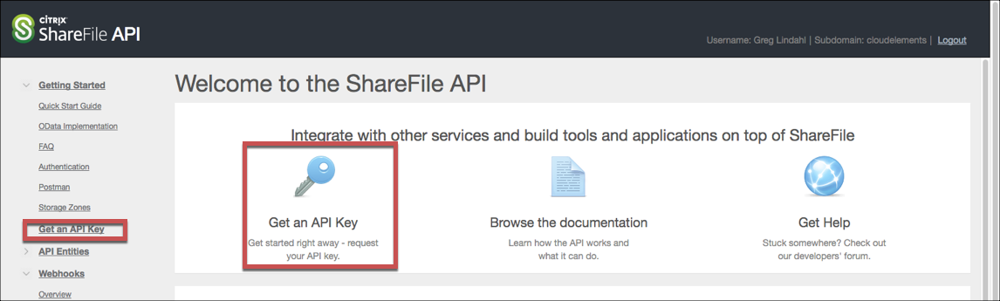
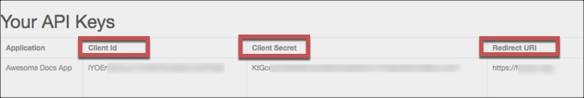

# API Provider Setup

To authenticate a {{page.heading}} element instance you must register an app with {{page.heading}}. When you authenticate, use the **{{page.apiKey}}**, **{{page.apiSecret}}**, and **{{page.callbackURL}}** as the **Sharefile API Key**, **Sharefile API Secret**, and **Callback URL**.

See the latest setup instructions in the [{{page.heading}} documentation](https://api.sharefile.com/rest/).



## Locate Credentials for Authentication

If you already created an application, follow the steps below to locate the **{{page.apiKey}}**, **{{page.apiSecret}}**, and **{{page.callbackURL}}**. If you have not created an app, see [Create an Application](#create-an-application).

To find your OAuth 2.0 credentials:

1. Log in to your account at [{{page.heading}}](https://api.sharefile.com/rest/).
2. Click **Get an API Key**.

2. In Your API Keys, record the **{{page.apiKey}}**, **{{page.apiSecret}}**, and  **{{page.callbackURL}}** for your app.

## Create an Application

If you have not created an application, you need one to authenticate with {{page.heading}}.

To create an application:

1. Log in to your account at [{{page.heading}}](https://api.sharefile.com/rest/).
2. Click **Get an API Key**.

3. In API Key Generator enter an Application Name and Description.
4. In **Redirect URI** enter the OAuth redirect URL for your application. You will need this when you authenticate an element instance.
4. Click **Generate API Key**.
3. Record the **{{page.apiKey}}** **{{page.apiSecret}}**, and  **{{page.callbackURL}}** for your app.

Next [authenticate an element instance with {{page.heading}}](authenticate.html).
