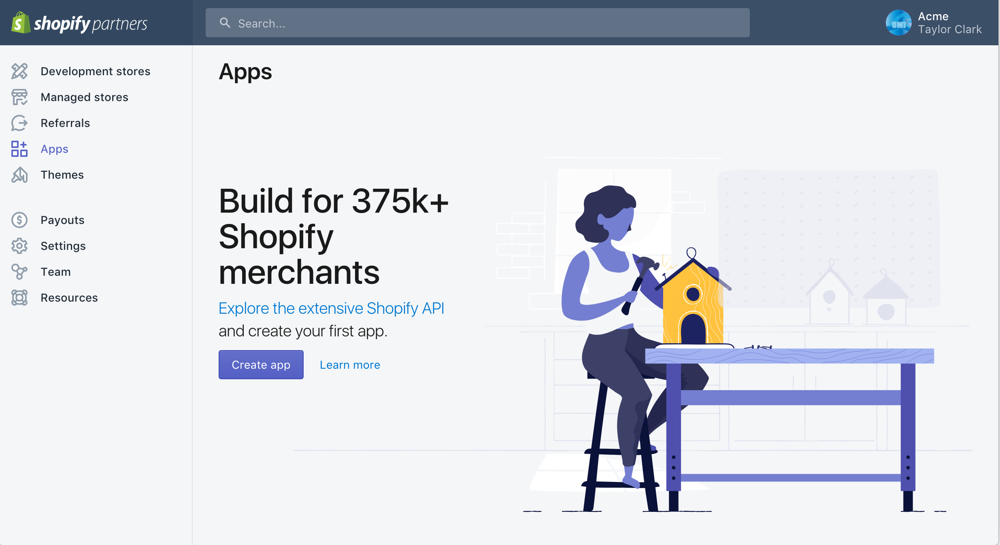
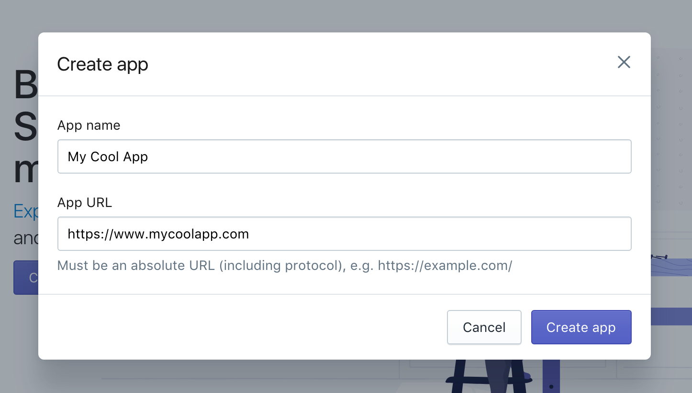
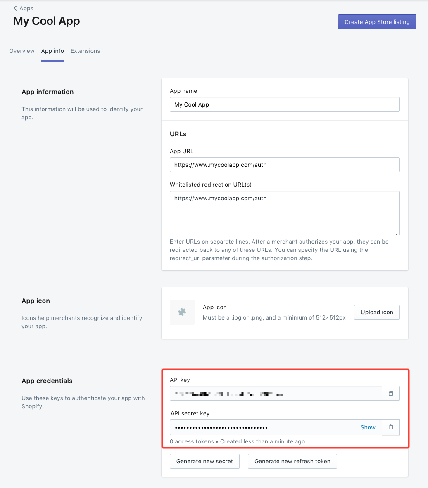

# Service Provider Setup

Follow these steps to set up a Shopify application with the endpoint. Via a web browser, go to: [http://www.shopify.com/](http://www.shopify.com/)and sign up for a store. Your store name will be needed to provision the Shopify Element. If you are a developer building a store for a client, then you will need to acquire the shop name from your client.

Next go to: [https://accounts.shopify.com/signup](https://accounts.shopify.com/signup) to become a Shopify Partner.  It's free to sign up.

1. Once signed up, from the Dashboard > Apps, click "Create App".

2. Fill out the App Information.  The the `App URL` input your application callback URL and click "Create App".

3. Under `App Info` > `App Credentials`, copy the API key and Secret

Next [authenticate and element instance with Shopify](authenticate.html).
