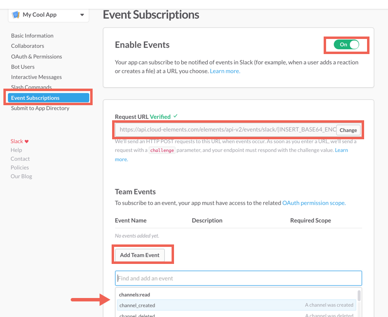

## Events



### Webhooks

Slack requires an extra specification to be entered once an Element instance has been created. The Slack Instance ID must be 64 base encoded, then included in the webhook callback URL. This document will walk you through the entire workflow:

* create an instance
* retrieve the instance ID
* 64base Encode Instance ID
* webhook setup

### Step 1. Get Elements OAuth Information

* HTTP Header: None
* HTTP Verb: GET
* Request URL: /elements/{keyOrId}/oauth/url
* Request Body: None
* Query Parameters:

* __apiKey–__ the key obtained from registering your app with the provider
* __apiSecret__ – the secret obtained from registering your app with the provider
* __callbackUrl__ – the URL that you supplied to the provider when registering your app, state – any custom value that you want passed to the callback handler listening at the provided callback URL.

Description: The result of this API invocation is an OAuth redirect URL from the endpoint. Your application should now redirect to this URL, which in turn will present the OAuth authentication and authorization page to the user. When the provided callback URL is executed, a code value will be returned, which is required for the Create Instance API.

Example cURL Command:

```bash
curl -X GET
-H 'Content-Type: application/json'
'https://api.cloud-elements.com/elements/api-v2/elements/slack/oauth/url?apiKey=slack_client_id&apiSecret=slack_client_secret&callbackUrl=https%3A%2F%2Fwww.mycoolapp.com%2Fauth&scope=scope=users%3Awrite%2C+users%3Aread%2C+users.profile%3Aread%2C+users.profile%3Awrite%2C+search%3Aread%2C+files%3Aread%2C+files%3Awrite%3Auser%2C+channels%3Aread%2C+groups%3Aread&response_type'
```

Response:

```javascript
{
  "oauthUrl": "https://slack.com/oauth/authorize?scope=users%3Awrite%2C+users%3Aread%2C+users.profile%3Aread%2C+users.profile%3Awrite%2C+search%3Aread%2C+files%3Aread%2C+files%3Awrite%3Auser&response_type=code&redirect_uri=https%3A%2F%2Fwww.mycoolapp.com%2Fauth&state=slack&client_id=slack_client_id",
  "element": "slack"
}
```

Handle Callback from the Endpoint:
Upon successful authentication and authorization by the user, the endpoint will redirect to the callback URL you provided when you setup your application with the endpoint, in our example, https://www.mycoolapp.com/auth. The endpoint will also provide two query string parameters: “state” and “code”. The value for the “state” parameter will be the name of the endpoint, e.g., "slack" in our example, and the value for the “code” parameter is the code required by Cloud Elements to retrieve the OAuth access and refresh tokens from the endpoint. If the user denies authentication and/or authorization, there will be a query string parameter called “error” instead of the “code” parameter. In this case, your application can handle the error gracefully.

### Step 2. Create an Instance

To provision your Slack Element, use the /instances API.

Below is an example of the provisioning API call.

* __HTTP Headers__: Authorization- User <user secret>, Organization <organization secret>
* __HTTP Verb__: POST
* __Request URL__: /instances
* __Request Body__: Required – see below
* __Query Parameters__: none

Description: An Element token is returned upon successful execution of this API. This token needs to be retained by the application for all subsequent requests involving this element instance.

A sample request illustrating the /instances API is shown below.

HTTP Headers:

```bash
Authorization: User <INSERT_USER_SECRET>, Organization <INSERT_ORGANIZATION_SECRET>

```
This instance.json file must be included with your instance request.  Please fill your information to provision.  The “key” into Cloud Elements Slack is "slack".  This will need to be entered in the “key” field below depending on which Element you wish to instantiate.

```json
{
  "element": {
    "key": "slack"
  },
  "providerData": {
    "code": "<CODE_ON_THE_RETURN_URL>"
  },
  "configuration": {
    "oauth.api.key": "<INSERT_CLIENT_ID>",
    "oauth.api.secret": "<INSERT_CLIENT_SECRET>",
    "oauth.callback.url": "<INSERT_CALLBACK_URL>",
    "oauth.scope": "users:write, users:read, users.profile:read, users.profile:write, search:read, files:read, files:write:user, channels:read, groups:read",
    "event.notification.enabled": "true",
    "event.notification.callback.url": "<INSERT_YOUR_APPS_CALLBACK_URL>"
  },
  "tags": [
    "<ADD_YOUR_TAG>"
  ],
  "name": "<INSERT_INSTANCE_NAME>"
}
```

Here is an example cURL command to create an instance using /instances API.

Example Request:

```bash
curl -X POST
-H 'Authorization: User <INSERT_USER_SECRET>, Organization <INSERT_ORGANIZATION_SECRET>'
-H 'Content-Type: application/json'
-d @instance.json
'https://api.cloud-elements.com/elements/api-v2/instances'
```

If the user does not specify a required config entry, an error will result notifying her of which entries she is missing.

Below is a successful JSON response:

```json
{
  "id": 123,
  "name": "Test",
  "token": "5MOr3Sl/E4kww6mTjmjBYV/hAUAzz1g=",
  "element": {
    "id": 2103,
    "name": "Slack",
    "key": "slack",
    "description": "Slack brings all your communication together in one place. It's real-time messaging, archiving and search for modern teams.",
    "image": "https://a.slack-edge.com/0180/img/icons/app-256.png",
    "active": true,
    "deleted": false,
    "typeOauth": false,
    "trialAccount": false,
    "resources": [],
    "transformationsEnabled": true,
    "bulkDownloadEnabled": false,
    "bulkUploadEnabled": false,
    "cloneable": true,
    "authentication": {
      "type": "oauth2"
    },
    "hub": "collaboration",
    "protocolType": "http",
    "private": false
  },
  "provisionInteractions": [],
  "valid": true,
  "disabled": false,
  "maxCacheSize": 0,
  "cacheTimeToLive": 0,
  "configuration": {
    "base.url": "https://slack.com/api",
    "oauth.api.secret": "CLIENT_SECRET",
    "event.notification.subscription.id": null,
    "oauth.token.url": "https://slack.com/api/oauth.access",
    "pagination.max": "100",
    "event.vendor.type": "webhooks",
    "oauth.scope": "users:write, users:read, users.profile:read, users.profile:write, search:read, files:read, files:write:user",
    "oauth.user.token": "99845548065-3df640f4b74a86416895b3f9af42bc2b",
    "oauth.authorization.url": "https://slack.com/oauth/authorize",
    "event.notification.instance.finder": "",
    "pagination.type": "page",
    "event.notification.callback.url": "false",
    "oauth.callback.url": "https://www.mycoolapp.com/auth",
    "scope": "users:write, users:read, users.profile:read, users.profile:write, search:read, files:read, files:write:user",
    "oauth.user.refresh_token": null,
    "oauth.token.revoke_url": "https://slack.com/api/auth.revoke",
    "oauth.user.refresh_interval": "3600",
    "oauth.api.key": "CLIENT_ID",
    "oauth.user.refresh_time": null,
    "oauth.basic.header": "true",
    "pagination.page.startindex": "1",
    "event.notification.enabled": "false"
  },
  "eventsEnabled": false,
  "eventsNotificationCallbackUrl": "false",
  "traceLoggingEnabled": false,
  "cachingEnabled": false,
  "externalAuthentication": "none",
  "user": {
    "id": 372
  }
}
```

Note:  Make sure you have straight quotes in your JSON files and cURL commands.  Please use plain text formatting in your code.  Make sure you do not have spaces after the in the cURL command.

Retrieve Instance ID from the create instance response:

```JSON
{
//////////////
//"id": 123,//
//////////////
  "name": "Test",
  "token": "5MOr3Sl/E4kww6mTjmjBYV/hAUAzz1g=",
  "element": {
    "id": 2103,
    "name": "Slack",
    "key": "slack"
  }
}
...
```

Copy the Instance ID and go to a 64Base Encoding website.

Here is a sample site that will 64 base encode your instance ID: [https://www.base64encode.org/](https://www.base64encode.org/).

Copy the ID, encode it, then copy the encoded ID.

Place the ID in the following URL:

`https://api.cloud-elements.com/elements/api-v2/events/slack/{INSERT_64BASE_ENCODED_INSTANCE_ID}`

An example of the URL once the Instance ID has been encoded:

`https://api.cloud-elements.com/elements/api-v2/events/slack/MjA5MzE=`

Log in to your [Slack profile](https://api.slack.com/apps).
Select the app from "Your Apps"

Under Event Subscriptions:

* Toggle Events On

* Insert the following URL with the base64 encoded Instance ID: `https://api.cloud-elements.com/elements/api-v2/events/slack/{INSERT_BASE64_ENCODED_INSTANCE_ID}`

* Add Team Event > select which events to enable

* Save Changes



Events are now implemented for Slack.
