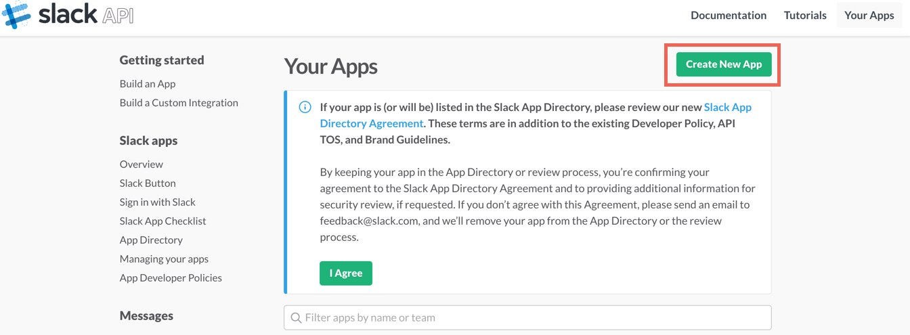
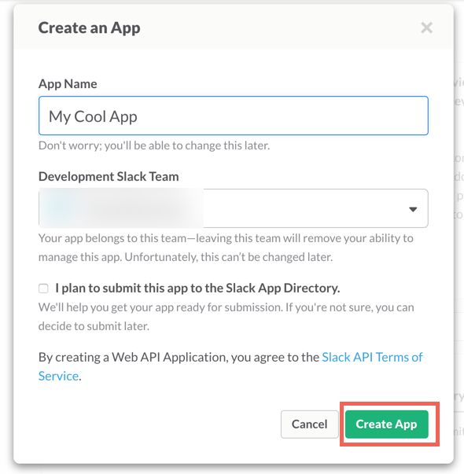
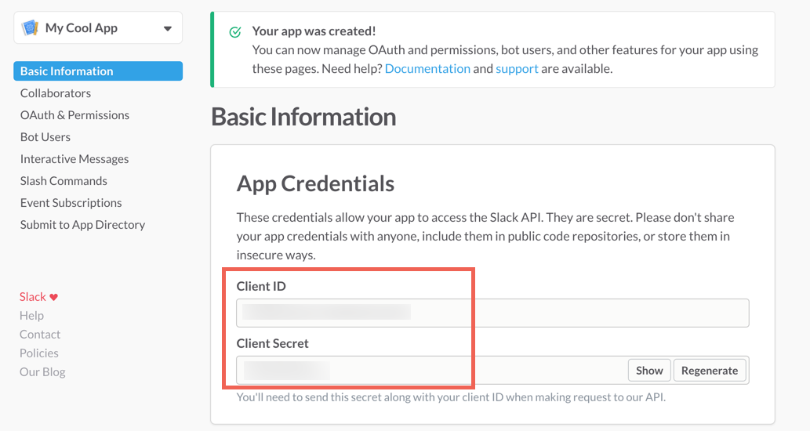
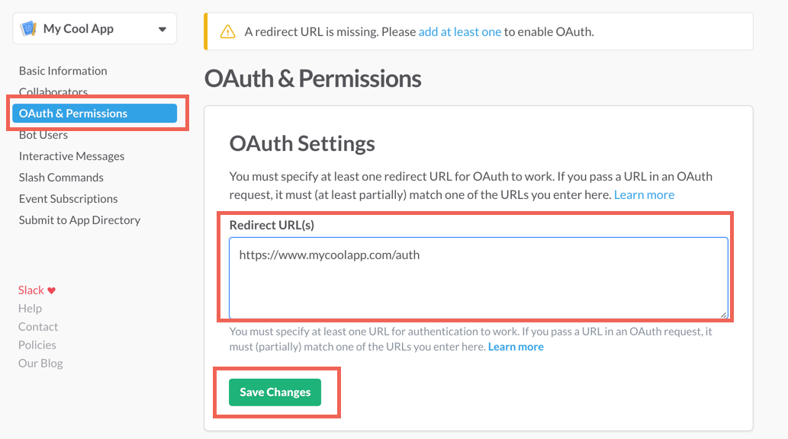

## Endpoint Setup

Follow these instructions to create a new Slack Connected App.

NOTE: these are the minimum number of steps to create a connected app needed to create an instance.

Visit the [Slack API Documentation](https://api.slack.com/apps) for more detailed information regarding their API.

* Log in to your Slack profile [https://api.slack.com/apps](https://api.slack.com/apps)

* Create an App

* Copy the Client ID and Secret

* Under OAuth & Permissions > input the OAuth Redirect URL and Save

Cloud Elements recommends visiting the Slack API Documentation and reviewing the information posted regarding the [OAuth Scope and Permissions](https://api.slack.com/docs/oauth-scopes).

Next [create an instance](slack-create-instance.html).
