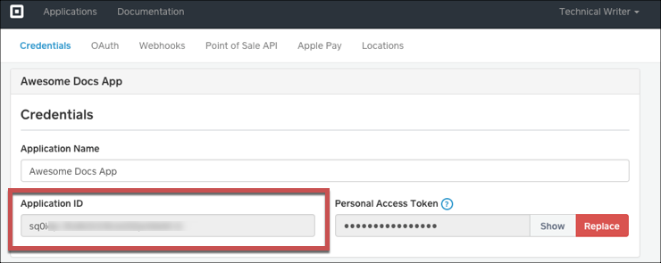
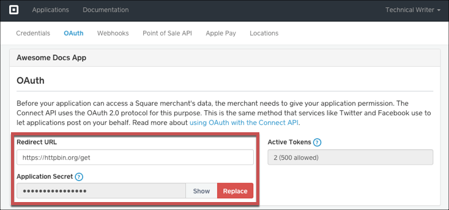
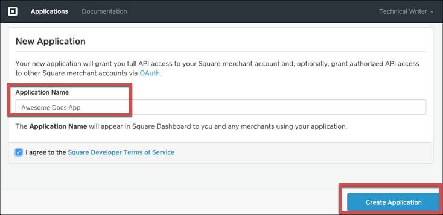

# API Provider Setup

To authenticate a {{page.heading}} element instance you must register an app with {{page.heading}}. When you authenticate, use the **{{page.apiKey}}**, **{{page.apiSecret}}**, and **{{page.callbackURL}}** as the **API Key**, **API Secret**, and **Callback URL**.  If you plan to monitor events, also configure the **Webhook URL**.

See the latest setup instructions in the [{{page.heading}} documentation](https://docs.connect.squareup.com/articles/getting-started).



## Locate Credentials for Authentication

If you already created an application, follow the steps below to locate the **{{page.apiKey}}**, **{{page.apiSecret}}**, and **{{page.callbackURL}}**. If you have not created an app, see [Create an Application](#create-an-application).

To find your OAuth 2.0 credentials:

1. Log in to your account at [{{page.heading}}](https://connect.squareup.com/apps).
2. Click the application that you want to connect.
3. Record the **{{page.apiKey}}**.

4. Click the **OAuth** tab, and then record the **{{page.apiSecret}}** and **{{page.callbackURL}}**.

## Create an Application

If you have not created an application, you need one to authenticate with {{page.heading}}.

To create an application:

1. Log in to your account at [{{page.heading}}](https://connect.squareup.com/apps).
2. Click the application that you want to connect.
2. On the Application Dashboard, click **New Application**.
3. Enter a name, agree to the terms of service, and then click **Create Application**.

3. Record the **{{page.apiKey}}**.

2. Click the **OAuth** tab, and then enter your OAuth callback URL in **{{page.callbackURL}}**.
3. Record the **{{page.apiSecret}}** and **{{page.callbackURL}}**.

Next [authenticate an element instance with {{page.heading}}](authenticate.html).
