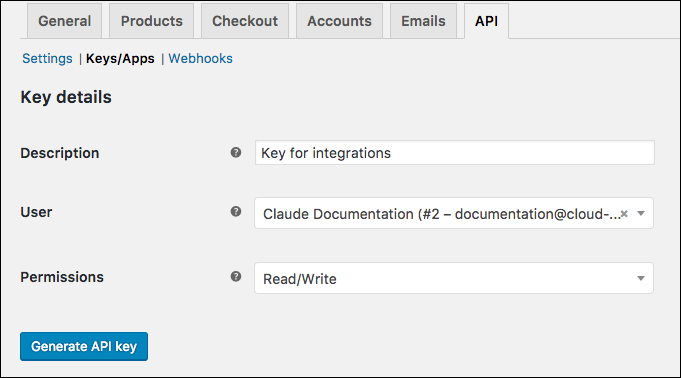

# API Provider Setup

To authenticate a {{page.heading}} element instance you must use a Legacy API account from {{page.heading}}. When you authenticate, use the **Username**, **API Token**, and **API Path** from your Legacy API account.

To authenticate a {{page.heading}} element instance you must create a {{page.heading}} Consumer Key. When you authenticate, use the **{{page.apiKey}}** and **{{page.apiSecret}}** as the **OAuth API Key** and **OAuth  API Secret**.  If you plan to monitor events, also configure the **Webhook URL**.

See the latest setup instructions in the [{{page.heading}} documentation](https://apiprovider.com).

To create your credentials:

1. Log in to your Wordpress site.
2. Go to **WooCommerce > Settings**.

3. Click the **API** tab.
5. Click **Keys/Apps**.
6. Click __Add key__.
7. Enter a description, and then select the User you would like to generate a key for.
8. In Permissions, select __Read/Write__.

    Your setup should look like this:
    

9. Click __Generate API Key__.
3. Record the **{{page.apiKey}}** and **{{page.apiSecret}}**.

Next [authenticate an element instance with {{page.heading}}](authenticate.html).
