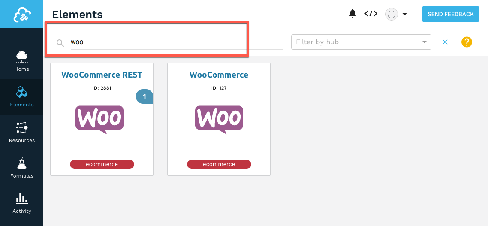
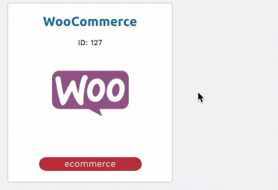

# Authenticate with {{page.heading}}

You can authenticate with {{page.heading}} to create your own instance of the {{page.heading}} element through {{site.console}} or through APIs. Once authenticated, you can use the element instance to access the different functionality offered by the {{page.heading}} platform.

__On this page__

[Authenticate Through the UI](#authenticate-through-the-ui)

[Authenticate Through API](#authenticate-through-api)

[Parameters](#parameters)

[Sample Request](#sample-request)


## Authenticate Through the UI

Use {{site.console}} to authenticate with {{page.heading}} and create an element instance.

1. Sign in, and then search for the element in our Elements Catalog.

3. Hover over the element card, and then click __Create Instance__.

5. Complete the Instance Configuration parameters. See [Parameters](#parameters) for information about each parameter.
6. Click __Create Instance__.
7. Take a look at the documentation for the element resources now available to you.

## Authenticate Through API

Use the `/instances` endpoint to authenticate with {{page.heading}} and create an element instance.



The `/instances` API call includes:

* __HTTP Headers__: Authorization- User <user secret>, Organization <organization secret>
* __HTTP Verb__: POST
* __Request URL__: /instances
* __Request Body__: Required – see below
* __Query Parameters__: none

### Request Body

You must include a JSON body with your `/instances` request.  See [Parameters](#parameters) for information about each parameter. The Boolean parameters show default values.

__Note__: If you don't specify a required parameter, your response results in an error.

__Note__: The following example JSON show webhooks enabled. You can also enable polling which requires a more detailed configuration. See [Events](events.html) for more information.

```json
{
  "element": {
    "key": "woocommercerest"
  },
  "configuration": {
	"store.url": "<http://mycoolstore.com>",
	"oauth.api.key": "<CONSUMER_KEY>",
	"oauth.api.secret": "<CONSUMER_SECRET>",
	"filter.response.nulls": true,
	"event.vendor.type": "webhook",
	"event.notification.callback.url": "http://mycoolstore.com",
  "event.notification.signature.key": "123456"
  },
  "tags": [
	"Docs"
  ],
  "name": "WooCommerceForDocs"
}
```

## Parameters

API parameters are in `code formatting`.

| Heading | Heading   | Data Type |
| :------------- | :------------- | :------------- |
| 'key' | The element key.<br>woocommercerest  | string  |
|  Name</br>`name` |  The name for the element instance created during authentication.   | Body  |
| The Store URL</br>`store.url` | The url of your WooCommerce Storefront. | string |
| OAuth API Key</br>`oauth.api.key` | The Consumer Key from WooCommerce. |  string |
| OAuth API Secret</br>`oauth.api.secret` |  The Consumer Secret from WooCommerce.| string |
| Filter null values from the response </br>`filter.response.nulls` | *Optional*. Determines if null values in the response JSON should be filtered from the response. Yes or `true` indicates that Cloud Elements will filter null values. </br>Default: `true`  | boolean |
| Events Enabled </br>`event.notification.enabled` | *Optional*. Identifies that events are enabled for the element instance.</br>Default: `false`  | boolean |
| Event Type </br>`event.vendor.type` | *Optional*. identifies the type of events enabled for the instance, either `webhook` or `polling`. | string |
| Event Notification Callback URL</br>`event.notification.callback.url` |  *For webhooks and polling.*</br>The URL that you supplied to the provider when registering your app, state – any custom value that you want passed to the callback handler listening at the provided callback URL. | string |
| Event Notification Signature Key </br>`event.notification.signature.key` | *For webhooks and polling.*</br>*Optional*</br>A user-defined key for added security to show that events have not been tampered with. | string |
| Event poller refresh interval (mins)</br>`event.poller.refresh_interval`  | *For polling only.*</br>A number in minutes to identify how often the poller should check for changes. |  number|
| customers</br>`"event.poller.configuration": "{\"customers\"...}"` (see [Events](events.html))| *For polling only.*</br>*Optional*</br>The WooCommerce `customers` resource available for polling. |JSON object |
| discounts</br>`"event.poller.configuration": "{\"discounts\"...}"` (see [Events](events.html)) | *For polling only.*</br>*Optional*</br>The WooCommerce `discounts` resource available for polling.  |JSON object |
| orders</br>`"event.poller.configuration": "{\"orders\"...}"` (see [Events](events.html)) | *For polling only.*</br>*Optional*</br>The WooCommerce `orders` resource available for polling.  |JSON object |
| products</br>`"event.poller.configuration": "{\"products\"...}"` (see [Events](events.html)) | *For polling only.*</br>*Optional*</br>The WooCommerce `products` resource available for polling.  |JSON object |
| tags | *Optional*. User-defined tags to further identify the instance. | string |

## Sample Request

Below is an example cURL request:

```
curl -X POST  \
 -H 'Authorization: User <INSERT>, Organization <INSERT>'  \
 -H 'Content-Type: application/json'  \
 --data '{ \
  "name": "<ELEMENT_INSTANCE_NAME>", \
  "configuration": { \
    "filter.response.nulls": "true", \
    "event.vendor.type": "webhook", \
    "event.notification.enabled": true, \
    "store.url": "http://<URL>", \
    "oauth.api.key": "<CONSUMER_KEY>", \
    "oauth.api.secret": "<CONSUMER_SECRET>", \
    "event.notification.callback.url": ""<INSERT_YOUR_APPS_CALLBACK_URL>", \
    "event.notification.signature.key": "12345" \
  } \
}'  \
'https://api.cloud-elements.com/elements/api-v2/elements/2881/instances'
```
