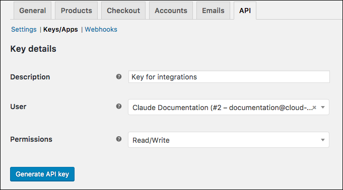

## Endpoint Setup

To set up the WooCommerce endpoint, you need to have an account and create or already have store.

__Note__: WooCommerce provides the most up-to-date and detailed setup instructions at [https://docs.woocommerce.com/document/woocommerce-rest-api/](https://docs.woocommerce.com/document/woocommerce-rest-api/).

To set up the endpoint:

1. Log in to your Wordpress site.
2. Go to __WooCommerce > Settings__.

3. Click the __API__ tab.
4. Makes sure that __Enable the REST API__ is already selected. If not, select it.
5. Click __Keys/Apps__.
6. Click __Add key__.
7. Enter a description, and then select the User you would like to generate a key for.
8. In Permissions, select __Read/Write__.

    Your setup should look like this:
    

9. Click __Generate API Key__.
10. Copy your Consumer Key and Consumer Secret. These will be used to authenticate your element with WooCommerce.

Next [authenticate with WooCommerce to create an element instance](woocommerce-rest-create-instance.html).
