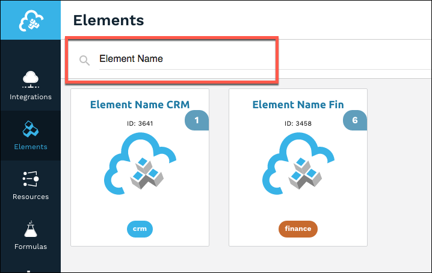
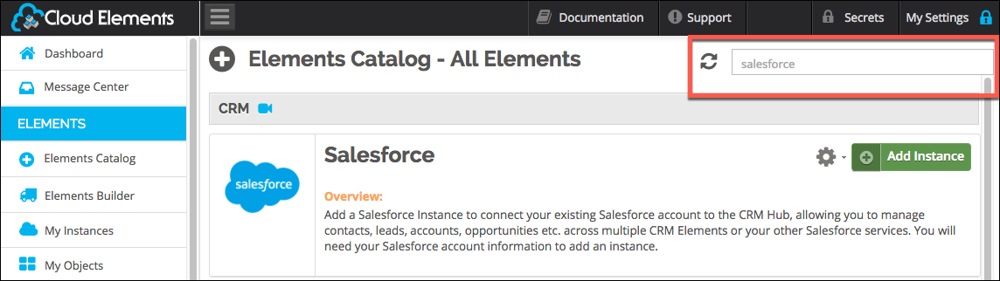
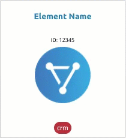
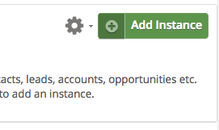
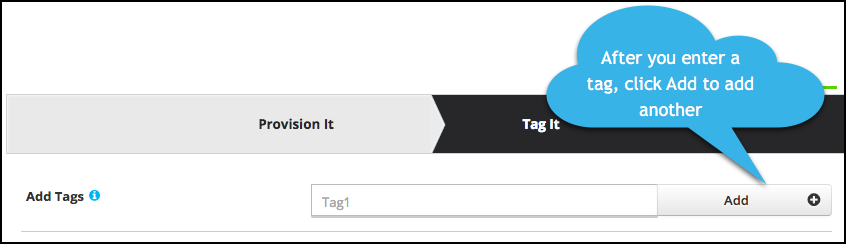

# Authenticate with {{page.heading}}

You can authenticate with {{page.heading}} to create your own instance of the {{page.heading}} element through the UI or through APIs. Once authenticated, you can use the element instance to access the different functionality offered by the {{page.heading}} platform.



## Authenticate Through the UI

Use the UI to authenticate with {{page.heading}} and create an element instance. {{page.heading}} authentication follows the typical OAuth 2 framework and you will need to sign in to {{page.heading}} as part of the process.

If you are configuring events, see the [Events section](events.html).

To authenticate an element instance:

1. Sign in to Cloud Elements, and then search for the element in our Elements Catalog.

    | Latest UI | Earlier UI  |
    | :------------- | :------------- |
    |    |    |

3. Create an element instance.

    | Latest UI | Earlier UI  |
    | :------------- | :------------- |
    | Hover over the element card, and then click __Create Instance__.</br>   | Click __Add Instance__.</br>   |

5. Enter a name for the element instance.
6. In **Subdomain** enter your unique Zendesk subdomain, such as `https://{subdomain}.zendesk.com`.
7. Click __Create Instance__ (latest UI) or __Next__ (earlier UI).
8. Optionally add tags in the earlier UI:
     1. On the Tag It page, enter any tags that might help further define the instance.
      * To add more than one tag, click __Add__ after each tag.
      
     1. Click __Done__.
8. Provide your Zendesk credentials, and then allow the connection.
9. Note the **Token** and **ID** and save them for all future requests using the element instance.
8. Take a look at the documentation for the element resources now available to you.

## Authenticate Through API

Authenticating through API is a multi-step process that involves:

* [Getting a redirect URL](#getting-a-redirect-url). This URL sends users to the vendor to log in to their account.
* [Authenticating users and receiving the authorization grant code](#authenticating-users-and-receiving-the-authorization-grant-code). After the user logs in, the vendor makes a callback to the specified url with an authorization grant code.
* [Authenticating the element instance](#authenticating-the-element-instance). Using the authorization code from the vendor, authenticate with the vendor to create an element instance at Cloud Elements.

### Getting a Redirect URL

Use the following API call to request a redirect URL where the user can authenticate with the service provider. Replace `{keyOrId}` with the element key, `{{page.elementKey}}`.

```bash
curl -X GET /elements/{keyOrId}/oauth/url?apiKey=<api_key>&apiSecret=<api_secret>&callbackUrl=<url>&siteAddress=<zendesk_subdomain>
```

#### Query Parameters

| Query Parameter | Description   |
| :------------- | :------------- |
| apiKey | The key obtained from registering your app with the provider. This is the **Unique Identifier** that you noted at the end of the [Service Provider Setup section](setup.html).  |
| apiSecret |  The secret obtained from registering your app with the provider.  This is the **Secret** that you noted at the end of the [Service Provider Setup section](setup.html).   |
| callbackUrl | The URL that will receive the code from the vendor to be used to create an element instance. This is the **Callback URL** that you noted at the end of the [Service Provider Setup section](setup.html).  |
| siteAddress | Your unique Zendesk subdomain (i.e. - https://{subdomain}.zendesk.com) |

#### Example cURL

```bash
curl -X GET "https://api.cloud-elements.com/elements/api-v2/elements/{{page.elementKey}}/oauth/url?apiKey=fake_zendesk_unique_identifier&apiSecret=fake_api_secret&callbackUrl=https://www.mycoolapp.com/auth&siteAddress=zendesk_subdomain" -H  "accept: application/json" -H  "content-type: application/json"
```

#### Example Response

Use the `oauthUrl` in the response to allow users to authenticate with the vendor.

```json
{
"element": "{{page.elementKey}}",
"oauthUrl": "https://zendesk_subdomain.zendesk.com/oauth/authorizations/new?scope=read+write&response_type=code&redirect_uri=https://www.mycool.app.com/auth&state=zendesk&client_id=zendesk_unique_identifier"
}
```

### Authenticating Users and Receiving the Authorization Grant Code

Provide the response from the previous step to the users. After they authenticate, {{page.heading}} provides the following information in the response:

* code
* state

| Response Parameter | Description   |
| :------------- | :------------- |
| code | The Authorization Grant Code required by Cloud Elements to retrieve the OAuth access and refresh tokens from the endpoint.|
| state | A customizable identifier, typically the element key (`{{page.elementKey}}`) . |



### Authenticating the Element Instance

Use the `/instances` endpoint to authenticate with {{page.heading}} and create an element instance. If you are configuring events, see the [Events section](events.html).



To create an element instance:

1. Construct a JSON body as shown below (see [Parameters](#parameters)):

    ```json
    {
      "name": "<INSTANCE_NAME>",
      "element": {
        "key": "{{page.elementKey}}"
      },
      "providerData": {
        "code": "<AUTHORIZATION_GRANT_CODE>"
      },
      "configuration": {
        "oauth.callback.url": "<CALLBACK_URL>",
        "oauth.api.key": "<CONSUMER_KEY>",
      	"oauth.api.secret": "<CONSUMER_SECRET>",
        "zendesk.subdomain": "zendesk_subdomain"
      },
      "tags": [
        "<Add_Your_Tag>"
      ]
    }
    ```

1. Call the following, including the JSON body you constructed in the previous step:

        POST /instances

    

1. Locate the `token` and `id` in the response and save them for all future requests using the element instance.

#### Example cURL

```bash
curl -X POST \
  https://api.cloud-elements.com/elements/api-v2/instances \
  -H 'authorization: User <USER_SECRET>, Organization <ORGANIZATION_SECRET>' \
  -H 'content-type: application/json' \
  -d '{
  "name": "Zendesk_Instance"
  "element": {
    "key": "{{page.elementKey}}"
  },
  "providerData": {
    "code": "xoz8AFqScK2ngM04kSSM"
  },
  "configuration": {
    "oauth.callback.url": "https://www.mycoolapp.com/auth",
    "oauth.api.key": "zendesk_unique_identifier",
    "oauth.api.secret": "fake_api_secret",
    "zendesk.subdomain": "mycoolapp"
  },
  "tags": [
    "For Docs"
  ]
}'
```
## Parameters

API parameters not shown in {{site.console}} are in `code formatting`.



| Parameter | Description   | Data Type |
| :------------- | :------------- | :------------- |
| `key` | The element key.<br>{{page.elementKey}}  | string  |
|  `name` |  The name for the element instance created during authentication.   | Body  |
| `oauth.callback.url` | The Callback URL from Zendesk. This is the Callback URL that you noted at the end of the [Endpoint Setup section](setup.html).  |
| `oauth.api.key` | The Unique Identifier from Zendesk. This is the Unique Identifier that you noted at the end of the [Endpoint Setup section](setup.html) |  string |
| `oauth.api.secret` | The Secret from Zendesk. This is the Secret that you noted at the end of the [Endpoint Setup section](setup.html)| string |
| `zendesk.subdomain` | Your unique Zendesk subdomain | string |
| `tags` | *Optional*. User-defined tags to further identify the instance. | string |

## Example Response

```json
{
    "id": 123,
    "name": "test",
    "token": "3sU/S/kZD36BaABPS7EAuSGHF+1wsthT+mvoukiE",
    "element": {
        "id": 41,
        "name": "Zendesk",
        "key": "zendesk",
        "description": "",
        "active": true,
        "deleted": false
    },
    "valid": true,
    "disabled": false
}
```
