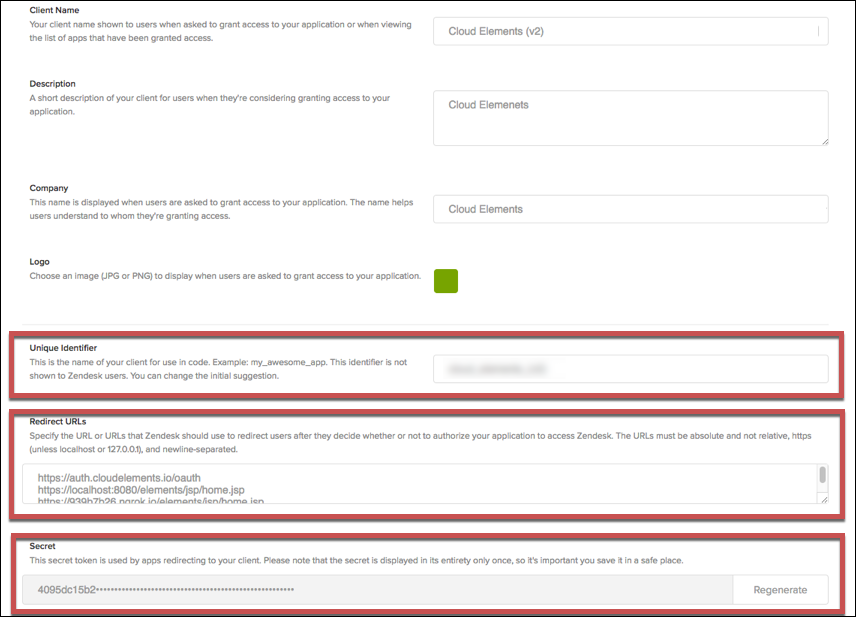

# API Provider Setup

To authenticate a {{page.heading}} element instance you must register an app with {{page.heading}}. When you authenticate, use the **{{page.apiKey}}**, **{{page.apiSecret}}**, and **{{page.callbackURL}}** as the **API Key**, **API Secret**, and **Callback URL**.

See the latest setup instructions in the [{{page.heading}} documentation](https://support.zendesk.com/hc/en-us/articles/203663836-Using-OAuth-authentication-with-your-application).



## Locate Credentials for Authentication

If you already created an application, see below to locate the **{{page.apiKey}}**, **{{page.apiSecret}}**, and **{{page.callbackURL}}**. If you have not created an app, see [Create an Application](#create-an-application).

To find your OAuth 2.0 credentials:

1. Log in to Zendesk unique web address.
2. On sidebar, click **Admin**.

2. Scroll down to Channels, and then click **API**.

4. Click **OAuth Clients**, and then click the application that you want to connect.
3. Record the **{{page.apiKey}}** and **{{page.apiSecret}}**.
3. Record the **{{page.callbackURL}}** for your app.

## Create an Application

If you have not created an application, you need one to authenticate with {{page.heading}}.

To create an application:

1. Log in to Zendesk unique web address.
2. On sidebar, click **Admin**.

2. Scroll down to Channels, and then click **API**.

4. Click **OAuth Clients**, and then click the + button.

3. Complete the required information.
3. Record the **{{page.apiKey}}**  and the **{{page.callbackURL}}s** for your app.
4. Click **Save**.
5. Record the **{{page.apiSecret}}**.
6. Click **Save**.

Next [authenticate an element instance with {{page.heading}}](authenticate.html).
