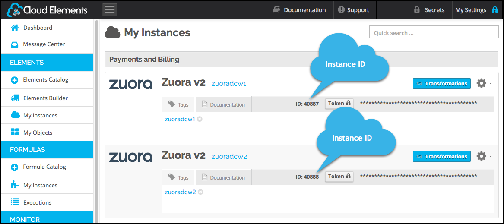

## Events



### Set Up Events for Zuora

The Zuora element supports webhooks. For Zuora events to work with Cloud Elements, you must configure each element instance and set up the endpoint.

### Set up the Cloud Elements instance

To enable events, add these extra configurations to your instance JSON:

```JSON
"event.notification.enabled": "true",
"event.notification.callback.url": "<INSERT_YOUR_APPS_CALLBACK_URL>"
```
instance JSON with polling events enabled:

```json
{
  "element": {
    "key": "zuorav2"
  },
  "configuration": {
    "zuorav2.sandbox": false,
    "username": "zuora_user",
    "password": "password",
    "event.notification.enabled": true,
    "event.notification.callback.url": "<INSERT_YOUR_APPS_CALLBACK_URL>"
  },
  "tags": [
    "<Add_Your_Tag>"
  ],
  "name": "<Insert_Instance_Name>"
}
```

__Note:__ To instantiate a sandbox account, set `zuorav2.sandbox` to false.

### Record your Instance ID

To set up the event in Zuora, you need the instance ID associated with your event.

* To find the Instance ID via API, call GET elements/zuorav2/instances:

    ```bash
    curl -X POST
    -H 'Authorization: User <INSERT_USER_SECRET>, Organization <INSERT_ORGANIZATION_SECRET>'
    -H 'Content-Type: application/json'
    'https://staging.cloud-elements.com/elements/api-v2/elements/zuorav2/instances'
    ```

* To find the Instance ID in the user interface, go to Elements > My Instances:
    


### Set Up the Endpoint

Zuora refers to webhooks as callout notifications. When setting up events, refer to the Zuora documentation: [Configure Callout Notifications] (https://knowledgecenter.zuora.com/BB_Introducing_Z_Business/Notifications/E_Configure_Callout_Notifications).

To set up the Zuora endpoint:

1. Log in to Zuora and navigate to the Billing, Payments, or Finance settings.
1. Click the __Setup Profiles, Notifications, and Email Templates__ link.
1. Notifications should appear by default, but if not, click __Notifications__ at the top.
1. Locate the callout notifications that you want to use as an event, and then click the __Edit__ link associated with it.
1. Select the Active check box to activate the event.
1. In __Base URL__, add the URL to the Cloud Elements events API, and append your Instance ID.
    For example, 'https://cloud-elements.com/elements/api-v2/events/zuorav2/<INSERT_INSTANCE_ID>'
1. Click __add parameter__ to add the following required parameters:
 * Event.Category
 * Event.Date
1. Click __Save__.
