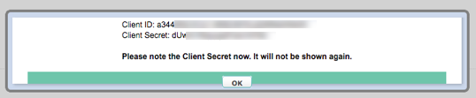

# API Provider Setup

You can authenticate a {{page.heading}} element instance in one of two ways:

* Basic authentication where you supply the user name and password of the Zuora user.
* Custom where you provide the **{{page.apiKey}}** and **{{page.apiSecret}}** of the OAuth client associated with the user. See the instructions below to create an OAuth client.

## Create an OAuth Client

To use the Custom authentication workflow, you must create an OAuth Client for a user and record the **{{page.apiKey}}** and **{{page.apiSecret}}**.

To create an OAuth client:

1. Log in to your account at [{{page.apiProvider}}](https://zuora.com).
2. Click your username at the top right and navigate to **Administration Manage Users**.
3. In the OAuth Clients section, enter a name for the OAuth client.
4. Click **Create**.
3. Record the **{{page.apiKey}}** and **{{page.apiSecret}}**.

    

5. Click **OK**.

Next [authenticate an element instance with {{page.apiProvider}}](authenticate.html).
