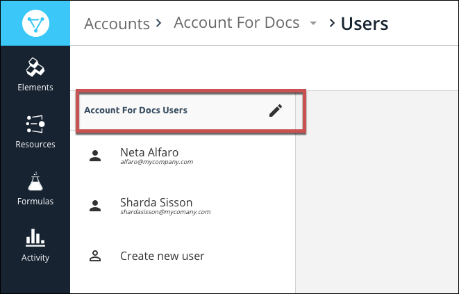
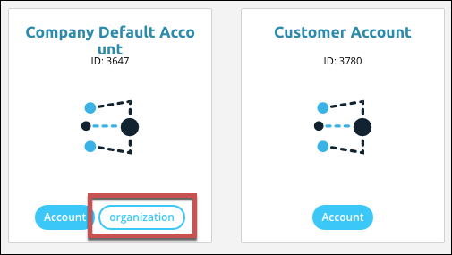
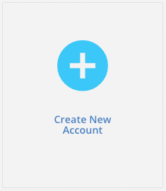

# Manage Accounts

If you are the user who created the organization, you are the organization administrator and you can manage the accounts related to it. You can create, retrieve, update, delete, and search accounts. To manage accounts, you must log in as the organization administrator. Even a user that you add to the default account cannot access the account management pages.



## Find Accounts

You can access your accounts from **Manage Accounts** in the User Profile menu at the top of the page.

To see more account details:

1. Hover over the account card, and then click **Open**.
2. Click the pencil icon next to the **_Account Name_ Users** list.

### Account Attributes

Organization-level accounts appear with an **organization** label on the account card. Only organization-level users can see organization accounts.



## Add an Account

As an organization administrator, you can add an account to your organization.

To add an account:

1. On the Accounts page, click **Create New Account**.

2. Enter a name for the account, and then click **Create**.

Cloud Elements creates a new account. The new account has no users, so your next step is to create a user for the new account.

## Add Users to Accounts

As the organization-level user, you can add users to any accounts that you create.

To create a user for an account:

1. Access the account page, either by creating a new account or hover over the Account Card, and then click **Open**.
2. Click **Create new user**.
3. Complete the required fields.
4. Click **Create**.

After you create a user, they do not receive any notification. This is because many users do not need to access Cloud Elements directly. If the new user needs to access Cloud Elements, either provide them with the password that you entered or encourage them to reset their password.

## Change an Account Name or Description

You can update the name or description of any account.

To update an account:

1. Access the account page. Hover over the Account Card, and then click **Open**.
2. Click the pencil icon next to the **_Account Name_ Users** list.
3. Add a new name or description.
4. Click **Update**.

## Deactivate and Reactivate an Account

You can deactivate an account, making it unavailable for use. If you need to reactivate an account, you must use the [Cloud Elements APIs](account-managementAPI.html#deactivate-and-reactivate-an-account). Deactivating an account essentially performs the same action as [deleting an account](#delete-an-account). After you deactivate an account, you can not view it in Cloud Elements 2.0. You can still find the account using the Cloud Elements APIs. Use the account `id` with `/accounts` endpoints that use the `{id}` variable.

## Delete an Account

You can delete an account, which also deactivates any users associated with the account. Deleting an account essentially performs the same action as [deactivating an account](#deactivate-and-reactivate-an-account). You can recover a deleted account by reactivating it with the Cloud Elements APIs. After you delete an account, you can not view it in Cloud Elements 2.0. You can still find the account using the Cloud Elements APIs. Use the account `id` with `/accounts` endpoints that use the `{id}` variable.



If you delete an account that also has users associated with it, the account deletion deactivates the users. If you reactivate the account and want to keep the same users, you must reactivate them separately.

To delete an account:

1. Access the account page. Hover over the Account Card, and then click **Open**.
2. Click the pencil icon next to the **_Account Name_ Users** list.
3. Click **Delete**, and the confirm the deletion.
