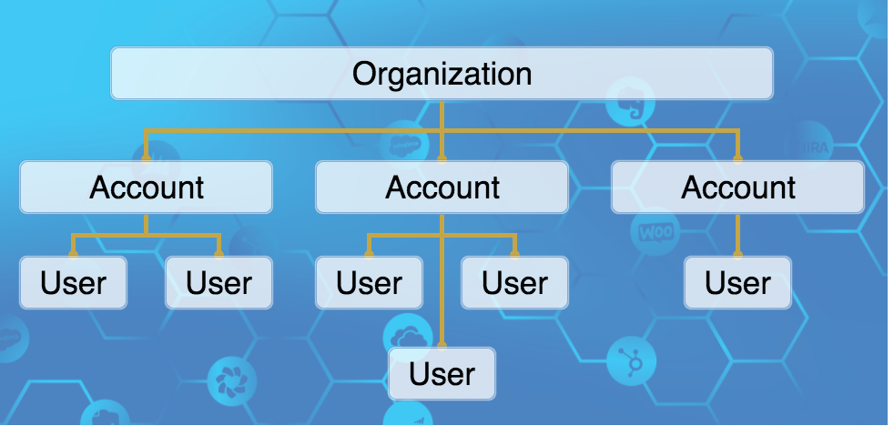



# Overview

When a user signs up for a new account in Cloud Elements, we create an <a href="#" data-toggle="tooltip" data-original-title="{{site.data.glossary.organization}}">organization</a> as well.  That organization has an associated Organization Secret.  The new user is the default user of the organization and they are an <a href="#" data-toggle="tooltip" data-original-title="{{site.data.glossary.organization-administrator}}">organization administrator</a>. The organization administrator can create and manage the accounts within the organization and the users associated with those accounts. You can [add additional organization administrators](user-management.html) any time.

Accounts that are created within an organization can contain one or more users and are isolated from all other accounts. Cloud Elements assigns each user a User Secret. With the Organization Secret representing the organization and the User Secret representing a discrete user associated with an account, users can make requests to the Cloud Elements APIs.

Organizations and accounts can hold <a href="#" data-toggle="tooltip" data-original-title="{{site.data.glossary.element}}">elements</a>, <a href="#" data-toggle="tooltip" data-original-title="{{site.data.glossary.formula-template}}">formula templates</a>, <a href="#" data-toggle="tooltip" data-original-title="{{site.data.glossary.common_resource}}">common resources</a>, and <a href="#" data-toggle="tooltip" data-original-title="{{site.data.glossary.transformation}}">default transformations</a>.  Users within an account create individual instances of these, specific to their own account.  Those users then use their Organization Secret and User Secret to make API calls.

When creating transformations, any transformation created at the Organization level applies to all users of the organization. This includes every user of every account in it. Currently, account level transformation applies to all accounts.

## Security

The organization administrator is the only user with access to the security section of Cloud Elements. In the Security section, an organization administrator can:
* [Manage security settings](security-settings.html) like the password policy and two-factor authentication.
* Add, update, and delete [Accounts](account-management.html) and [users](user-management.html).
* Manage the [privileges assigned to roles](roles.html) in Cloud Elements.

## Definitions

<dl>

<dt id="organization">organization</dt>
<dd>{{site.data.glossary.organization}}</dd>

<dt id="account">account</dt>
<dd>{{site.data.glossary.account}} </dd>

<dt id="user">user</dt>
<dd>{{site.data.glossary.user}}</dd>

<dt id="organization-administrator">organization administrator</dt>
<dd>{{site.data.glossary.organization-administrator}}</dd>

</dl>
