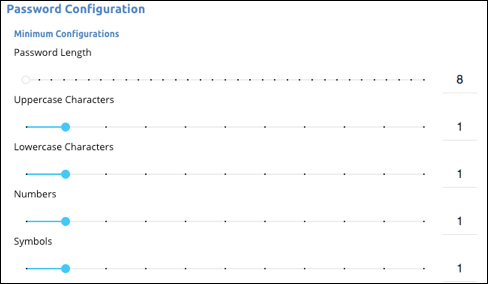

# Manage Security Settings

Use the Security Settings page to manage organization information, reset your organization secret, configure passwords, and set up two-factor authentication.

Who can see this tab.



## Configure Passwords

Configure the password policy for the users in your organization on the Security Settings page. Cloud Elements supports the security needs of a variety of organizations by allowing you to specify password length, complexity, how often user can reuse passwords, and how long before passwords expire. The password requirements apply only to users who log in with user name and password, not through Google or Github.

The password configurations for length and complexity identify the minimum required. For example, the following length and complexity requirements mean that user passwords must be at least eight characters, and include at least one uppercase and lowercase character, one number, and one symbol.

The Symbol Character Set defines the allowed symbols. So if you require symbols as part of your password policy, you can define which specific symbols.

If you make a mistake or just want to return to the original default password policy, click **Reset**.

01W@$hingt0n

To configure passwords:

1. Click  to open the the Security Settings page.
2. In **Password Configuration**:
 * Use the sliders or enter numbers to define the password length and complexity requirements.
 * Delete any special characters that you do not want to allow, or enter any additional character that you do want to allow.
 * Use the sliders or enter numbers to define how often user can reuse passwords and how long before passwords expire
5. Click **Update**.

## Set up Two-Factor Authentication

Cloud Elements supports two-factor authentication through SMS and Google Authenticator. Both methods require users to enter authentication codes after the successfully enter their user name and password. They can resend the code repeatedly, but if they enter the code incorrectly three times, Cloud Elements locks them out.

### SMS

If you set up two-factor authentication with SMS, users receive an authentication code sent to their phone. After you set up two-factor authentication with SMS, the next time that users in your organization log in, they will be prompted to enter their phone number. The number entered must be able to receive texts. Users can resend the code as often as they want, but they'll get locked out for 24 hours if they enter an incorrect code three times.

## Google Authenticator

Google Authenticator is an app that generates two-factor authentication codes. Before you set up two-factor authentication with Google Authenticator, make sure that your users have the Google Authenticator app for [Android](https://play.google.com/store/apps/details?id=com.google.android.apps.authenticator2&hl=en) or [iOS](https://itunes.apple.com/us/app/google-authenticator/id388497605?mt=8).

After you set up two-factor authentication with Google Authenticator, the next time that users in your organization log in, they will be prompted to scan a QR code with the Google Authenticator app. After scanning the code, the app displays an authentication code. After the first login, users just enter a code and do not need to scan another QR code.

To set up two-factor authentication:

1. Click  to open the the Security Settings page.
2. In **Two-Factor Authentication** select a two-factor authentication method.
5. Click **Update**.

## Reset Organization Token

Cloud Elements requires the organization token &mdash; or organization secret &mdash; along with each individual user secret for every call to our Platform APIs like `/instances`, `/organizations`, or `/formulas`. You can reset your organization token, creating a new random string, at any time. Remember to update all of your API request headers to use the new organization token.

To reset an organization token:

1. Click  to open the the Security Settings page.
2. In the **Profile** section, click **Reset Organization Token**, and then confirm.
