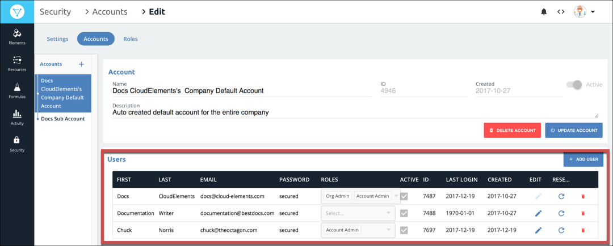

# Manage Users

As the organization administrator you can manage the users related to the accounts in your organization. You can create, retrieve, update, delete, and search users. To manage users, you must log in as the organization administrator. Even a user that you add to the default account cannot access the account management pages.



## Access User Management

User management happens at the account level, so you must first access an account to add or update users within it.

To see the users associated with an account:

1. Click  to open the the Security Settings page.
2. Click the **Accounts** tab.

The users associated with an account appear in the User section. Because you add users as part of the account creation process, see [Add Users to Accounts](account-management.html#add-users-to-accounts) for the steps to create a new user.

## Update a User

You can change the first and last name of a user or their email address in Cloud Elements 2.0. If you need to change their password, you need to [use the APIs](user-managementAPI.html#update-a-user).

To update a user:

1. Click  to open the the Security Settings page.
2. Click the **Accounts** tab.
2. Click .
2. Make your changes.
3. Click **Update**.

## Deactivate and Reactivate a User

You can use Cloud Elements 2.0 to deactivate a user or activate an already deactivated user. After you deactivate a user, they still appear in Cloud Elements 2.0, but can no longer access the Cloud Elements APIs.

To deactivate or activate a user:

1. Click  to open the the Security Settings page.
2. Click the **Accounts** tab.
2. Clear or select the **Active** checkbox.
3. Click **Update**.

## Delete a User

Deleting users removes them from Cloud Elements entirely. You cannot recover deleted users. If you think that you might need to access the user later, consider deactivating the user instead.

To delete a user:

1. Click  to open the the Security Settings page.
2. Click the **Accounts** tab.
3. Click **Delete**, and the confirm the deletion.
