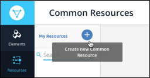
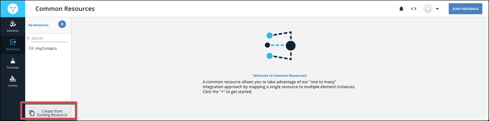
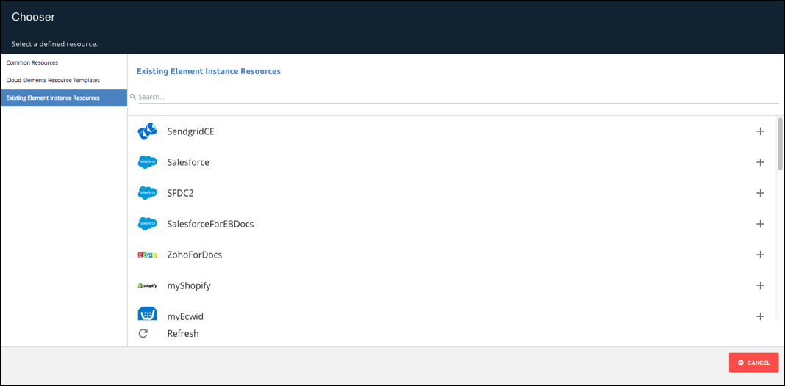
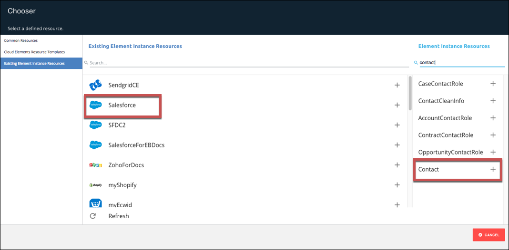
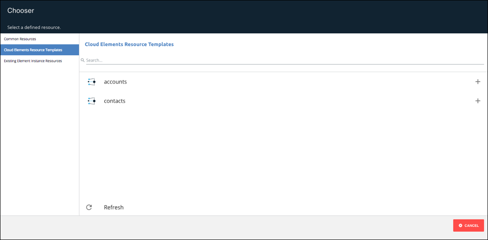

# Creating Common Resources





To create a common resource, go to the steps that match how you plan to create the resource:

* [Create a New Common Resource](#create-a-new-common-resource) for steps to create an entirely new common resource.
* [Create a Common Resource Based on Another Common Resource](#create-a-common-resource-based-on-another-common-resource) for steps to create a common resource based on an existing resource. You might create copies of resources to provide different common resources for different accounts.
* [Create a Common Resource Based on an Element Instance Resource](#create-a-common-resource-based-on-an-element-instance-resource) for steps to create a common resource based on an element resource. You might use element instance resources because you want your common resource to be based on a certain element.
* [Create a Common Resource Based on a Cloud Elements Template](#create-a-common-resource-based-on-a-cloud-elements-template) for steps to create a common resource based on a Cloud Elements template. Cloud Elements templates represent typical common resources.

## Create a New Common Resource

Follow the instructions in this section to create an entirely new common resource. When finished, you will have a common resource with a single default field called **id**.

To create a new common resource:

1. On the Common Resources page, click **Create New Common Resource**.

1. Enter a name for your resource.

    The Create page shows your new Common Resource with a default organization-level field of __id__.
    

1. Click **Save**.
1. Continue to the next step: [map fields to the common resource](mapping.html).

## Create a Common Resource Based on Another Common Resource

You can create a common resource based on other common resources in your organization. You might do this to create variations of a common resource for multiple different accounts.

To set up a common resource based on an existing common resource:

1. On the Common Resources page, click **Create from Existing Resource**.

1. Select an existing resource from the **Common Resources** list.

    

1. Enter a name for your resource, and then click __Create__.

    The Transformations page shows your new common resource with all of the fields that were in the source common resource.

1. Continue to the next step: [map fields to the common resource](mapping.html).

## Create a Common Resource Based on an Element Instance Resource

You can create a new common resource based on an element resource. For example, if you know that you want all of your contacts to match the contacts in the Salesforce `Contact` resource, you would create a new resource based on the Salesforce `Contact` resource.

To set up a common resource based on an existing element instance:

1. On the Common Resources page, click **Create from Existing Resource**.

1. Click **Existing Element Instance Resource**.

    

1. From the __Existing Element Instant Resources__ list, select the element instance that contains the resource that you want to use.
1. From the __Element Instance Resources__ list, select the resource.

    

    

1. Enter a name for your resource, and then click __Create__.

    The Transformations page shows your new common resource with all of the fields in the element instance resource. We've already mapped the source element instance to your common resource.

1. Continue to the next step: [map fields to the common resource](mapping.html).

## Create a Common Resource Based on a Cloud Elements Template

To set up a common resource based on a Cloud Elements template:

1. On the Common Resources page, click **Create from Existing Resource**.

1. On the left side, click __Cloud Elements Resource Templates__.

    

1. From the __Cloud Elements Resource Templates__ list, select the template.
1. Enter a name for your resource, and then click __Create__.

    The Transformations page shows your new common resource with all of the fields in the Cloud Elements template.

1. Continue to the next step: [map fields to the common resource](mapping.html).
