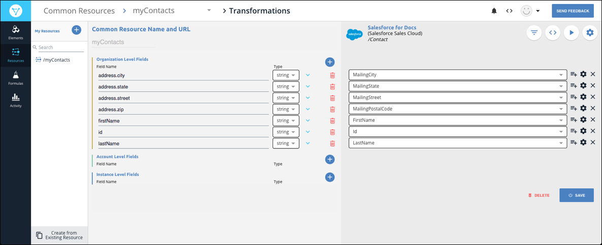

# Overview



With  <a href="#" data-toggle="tooltip" data-original-title="{{site.data.glossary.common_resource}}">common resources</a>, you can <a href="#" data-toggle="tooltip" data-original-title="{{site.data.glossary.transformation}}">transform</a> fields provided by your service providers to a single, normalized resource at Cloud Elements. This allows you to take advantage of our <a href="#" data-toggle="tooltip" data-original-title="{{site.data.glossary.one-to-many}}">one-to-many</a> integration approach where you write to a single common resource to integrate the transformed resources from your various service providers.





## Example
A frequent example is to create a common resource to represent your `/contacts` for various CRMs, and then transform the `/contacts` resources from those CRMs. You know that you want your contacts to look a certain way, regardless of the CRM system. You want `firstName`, `lastName`, and `email`. But some elements call `FirstName` something else, like `FirstName`, `F_Name`, or `properties.firstname`. You need to create a single common resource with fields named `firstName`, `lastName`, and `email`. Then you can map all of the like fields from other elements to the fields in your common resource. We transform those mapped fields,  so you can write to a single API to integrate many services.

This example shows fields in the `/Contact` resource from Salesforce mapped to fields in a common resource called `myContacts`.

You can use common resources to do more than normalize resource names. You can transform data types, so when a resource returns a string and you need a date, Cloud Elements transforms the data. Using our JavaScript Editor, you can create logic to manage complex problems. For example, you can write a simple script to combine fields like `firstName` and `lastName` into a single field called `name`. Or tackle even more complicated issues like transforming a number based priority value (1-10) to a descriptor based value (low, medium, or high).

## Understanding Levels

You define the fields in common resources within a hierarchy that includes three levels: organization, account, and instance. Only users at the organization level can create common resources, while users at other levels can configure the common resources for specific transformations.

* The organization is the highest level. A common resources built at this level represents a template that you can use for all accounts within your organization.
* The account is the next highest level. Accounts typically represent your customers. Transformations at the account level are shared by all users associated with a specific account.
* The instance is the most granular level. Transformations that you or other users create at this level apply only to a specific element instance.

## Definitions

To help you understand common resources, review the definitions in this section.

<dl>

<dt id="Common-resource">common resource</dt>
<dd>{{site.data.glossary.common_resource}}</dd>

<dt id="normalized">normalize</dt>
<dd>{{site.data.glossary.normalize}} In relation to common resources, normalization is the transformation of related fields and objects in multiple element resources to a single definition of the field or object within a common resource.</dd>

<dt id="field">field</dt>
<dd>{{site.data.glossary.field}} Fields mapped bewteen a common resource and an element instance result in a transformation of the element fields.</dd>

<dt id="map">map</dt>
<dd>{{site.data.glossary.map}}</dd>

<dt id="resource">resource</dt>
<dd>{{site.data.glossary.resource}} Similar resources, such as Accounts, Contacts, and Customers appear in multiple APIs. Common resources at cloud elements normalize these varied resources.</dd>

<dt id="transformation">transformation</dt>
<dd>{{site.data.glossary.transformation}}</dd>

<dt id="element-instance-resource">element instance resource</dt>
<dd>{{site.data.glossary.element-instance-resource}} You map the data from the element instance resources to the data in your common resource to create a transformation.</dd>
</dl>
