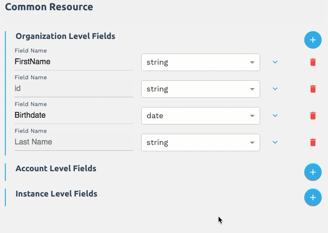

# Creating Common Resources

A common resource is a resource with normalized fields and objects that you can use in place of specific elements to facilitate "one-to-many" integrations. In this section you will learn how to create a common resource at the organization level and map element resource data to it for transformation. You can create a common resource based on an existing resource (template, element resource, or existing common resource) or as an entirely new resource. This guide includes instructions for both methods.

__Important!__ Only users at the organization level can create common resources, but users at any level can create transformations at the instance level. If you are not a user at the organization level, skip to [Map Resources for Transformation](#map-resources-for-transformation).

To create a common resource, go to the steps that match how you plan to create the resource:

* [Create a New Common Resource](#create-a-new-common-resource) for steps to create an entirely new common resource.
* [Create a Common Resource Based on Another Common Resource](#create-a-common-resource-based-on-another-common-resource) for steps to create a resource based on an existing resource. You might create copies of resources to provide different common resources for different accounts.
* [Create a Common Resource Based on an Element Instance Resource](#create-a-common-resource-based-on-an-element-instance-resource) for steps to create a common resource based on an element resource. You might use element instance resources because you want your common resource to be based on a certain element.
* [Create a Common Resource Based on a Cloud Elements Template](#create-a-common-resource-based-on-a-cloud-elements-template) for steps to create a common resource based on a Cloud Elements template. Cloud elements templates represent typical common resources.
* [Map Resources for Transformation](#map-resources-for-transformation) for steps to map your common resource to element instances.

# Create a New Common Resource

Follow the instructions in this section to create an entirely new common resource. When finished, you will have a common resource with a single default field called __id__.

To create a new common resource:

1. On the Common Resources page, click __Create New Common Resource__.
1. Click __Create New Resource__.
1. Enter a name for your resource, and then click __Create__.

    The Transformations page shows your new Common Resource with a default organization-level field of __id__.
    

1. Continue to the next step: [map fields from a resource](#map-resources-for-transformation).

<span style="color:red">Draft API content, still needs some work. </span>

## Create a New Common Resource via API

1. Call `POST /organizations/objects/definitions`.
2. Include fields in the JSON body as described below.

### POST /organizations/objects/definitions

```curl
curl --request POST \
  --url https://staging.cloud-elements.com/elements/api-v2/organizations/objects/definitions \
  --header 'authorization: User <USER_SECRET>, Organization <ORG_SECRET>' \
  --header 'content-type: application/json' \
  --data @resource.json
```

### POST /organizations/objects/definitions Resource JSON

```json
{
  "<object_name>": {
    "fields": [
      {
        "path": "<Field_Name>",
        "type": "<Data_Type>"
      }
    ]
  }
}
```

### POST /organizations/objects/definitions JSON Parameters

| Parameter | Description   |
| :------------- | :------------- |
| object_name |  The name of the new common resource.  |
| fields | An array containing the field names and data types of the common resource. |
| path  | The name of the field. |
| type |  The data type of the field. |

# Create a Common Resource Based on Another Common Resource

You can create a common resource based on other common resources in your organization. You might do this to create variations of a common resource for multiple different accounts.

To set up a common resource based on an existing common resource:

1. On the Common Resources page, click __Create New Common Resource__.
1. Click __Create From Existing Resource__.
1. Select the resource from the __My Resources__ list.
1. Enter a name for your resource, and then click __Create__.

    The Transformations page shows your new common resource with all of the fields that were in your other common resource.

1. Continue to the next step: [map fields from a resource](#map-resources-for-transformation).

## Create a Common Resources Based on Another Common Resource via API

To create a resource based on an existing resource:

1. Call `GET /organizations/objects/{objectName}/definitions`, replacing `{objectName}` with the name of the common resource that you want to copy.
2. Copy the response to the JSON body for `POST /organizations/objects/definitions` (see [Create a New Common Resource via API](#create-a-new-common-resource-via-api)).

### GET /organizations/objects/{objectName}/definitions cURL

```curl
curl --request GET \
  --url https://staging.cloud-elements.com/elements/api-v2/organizations/objects/<COMMON_RESOURCE_NAME>/definitions \
  --header 'authorization: User <USER_SECRET>, Organization <ORG_SECRET' \
  --header 'content-type: application/json' \
  ```

# Create a Common Resource Based on an Element Instance Resource

You can create a new common resource based on an element resource. For example, if you know that you want all of your contacts to match the contacts in the Salesforce `Contact` resource, you would create a new resource based on the Salesforce `Contact` resource.

To set up a common resource based on an existing element instance:

1. On the Common Resources page, click __Create New Common Resource__.
1. Click __Create From Existing Resource__.
1. On the left side, click __Existing Element Instance Resources__.

    

1. From the __Existing Element Instant Resources__ list, select the element instance that contains the resource that you want to use.
1. From the __Element Instance Resources__ list, select the resource.

    

1. Enter a name for your resource, and then click __Create__.

    The Transformations page shows your new common resource with all of the fields in the element instance resource. We've already mapped the source element instance to your common resource.

1. Continue to the next step: [map fields from a resource](#map-resources-for-transformation).

## Create a Common Resources Based on Element Resource via API

To create a resource base on an element resource:

1. Call `GET /instances/{id}` to get the element token (`token`) for the instance.
1. Call `GET /objects/{objectName}/metadata`.

    __Note__: Include the `token` from `GET /instances/{id}` in the header.

2. Copy the response to a new JSON body and rename `vendorPath` to `path`.
3. Remove all other fields.
3. Use the new JSON body for `POST /organizations/objects/definitions` (see [Create a New Common Resource via API](#create-a-new-common-resource-via-api)).

### GET /objects/{objectName}/metadata cURL

```bash
curl --request GET \
  --url https://console.cloud-elements.com/elements/api-v2/hubs/crm/objects/<RESOURCE>/metadata \
  --header 'authorization: User <USER_SECRET>, Organization <ORG_SECRET>, Element <ELEMENT_TOKEN>' \
  --header 'content-type: application/json' \
  ```

# Create a Common Resource Based on a Cloud Elements Template

To set up a common resource based on a Cloud Elements template:

1. On the Common Resources page, click __Create New Common Resource__.
1. Click __Create From Existing Resource__.
1. On the left side, click __Existing Element Instance Resources__.

    

    <span style="color:red">No idea what happens from here on </span>

1. Select the template.
1. Enter a name for your resource, and then click __Create__.

    The Transformations page shows your new common resource with all of the fields that were in your other common resource.

1. Continue to the next step: [map fields from a resource](#map-resources-for-transformation).

# Map Resources for Transformation

Before you can transform fields, you need to map the fields for each element instance to the common resource. The common resource fields are on the left and the element instance fields are on the right. We provide a default __id__ field, which you can choose to map to an element instance ID, delete, or rename to an entirely different field. You can map fields one at a time, or you can add several fields to the common resource at one time and map them later.

This section describes creating a common resource at the organization level. You must be an organization level user to create a common resource. Users within your organization can use this common resource for configuring transformations at the instance level. For more about account and instance level transformations, see [Mapping Account Level Transformations](#mapping-account-level-transformations) or [Mapping Instance Level transformations](#mapping-account-level-transformations)

__Note:__ To map element instances to a common resource, you need to already have element instance ready to map.

These instructions describe mapping a single field at a time. However, you can approach mapping fields in different ways. For example, you can add several fields all at once without mapping them.

To map fields:

1. On the Common Resources > Transformations page, click  __Create New Transformation__.


1. Select the Element Instance, and then select the Element Instance Resource.

    The Resources available to that Element Instance appear in the Element Instance Resources column after you select a resource.
  	

1. Beginning with the default field __id__, select an instance resources on the right to map to the common resource on the left.

    __Note__: If you created a resource based on an existing resource, you will see more fields than just the __id__ field. Start with the first one in your list.

    __Note__: If you want to change the name of the default Organization Level Field (or any field), click the __Field Name__ and overwrite it.

    For example, select an ID field in your instance resource to map to the default __id__ field.
    

1. Click  for the Organization Level Fields to add another field.

    __Note__:You can add fields at the account and instance level also, but these steps focus on creating an organization level common resource. For more information, see [Mapping Fields for Accounts](#mapping-fields-for-accounts) or [Mapping Instance Level transformations](#mapping-account-level-transformations).

1. Enter a name for the field, and then choose the data type.
1. Select the corresponding Instance Resource on the right to map to the new field.

    __Note__: You can type to filter.


1. Continue adding resources until you’re complete, and then click __Save__.
3. To map another instance, click the common resource name in the breadcrumbs at the top of the page.

### Tips

* You don't have to map fields one at a time. You can add multiple fields to the Common Resources side at once, and then map them later. Use  to show only those element instance resource fields that haven't been mapped.
* If you made a mistake and don't want to include a field in a common resource, click . If you still want the field, but want to remove the mapping, click .
* If you need to map a custom field, click , and then type a name. See [Advanced Common Resources: Transforming Custom Resources](advanced.html#transforming-custom-resources) for details.
* We use dot notation to show arrays in the element instance resources. If you need to create arrays in your common resource, use dot notation. Examples include address.city, address.state, and address.street. See [Advanced Common Resources: Working With Arrays](advanced.html#working-with-arrays) for details.

## Mapping Fields for Accounts

Users at the organization level can map fields to organizations or to specific accounts.

To map fields to a specific account:

* Click  for the Account Level Fields.

    or

* Click the arrow next to the fields to demote the field from the organization level to the account level.

    
