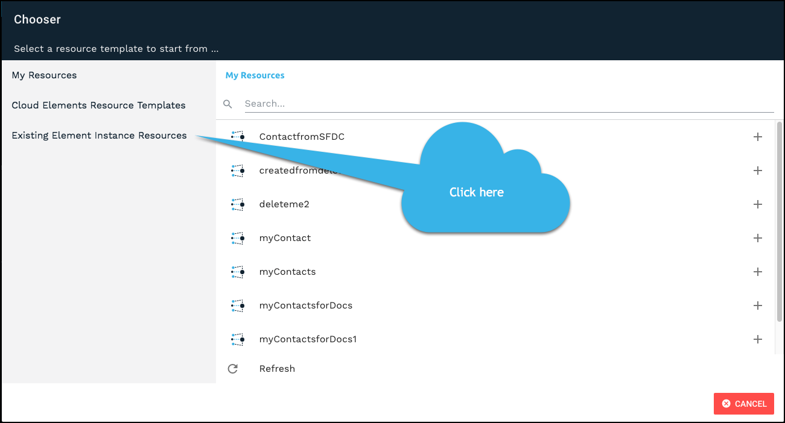
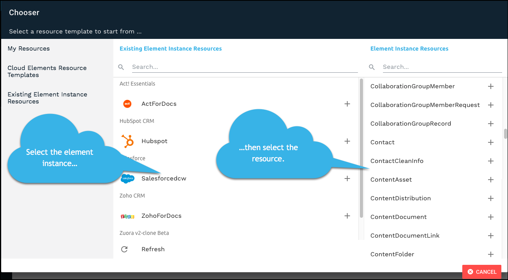
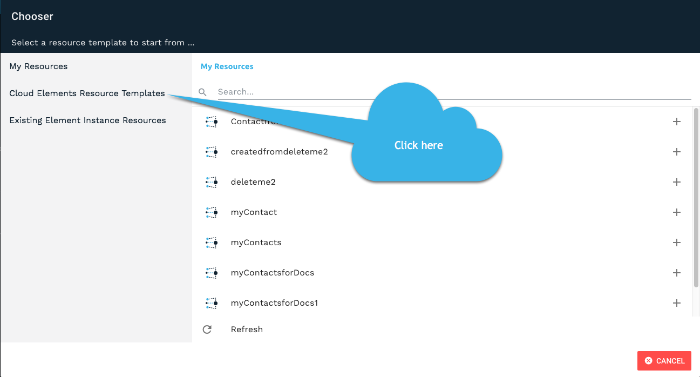
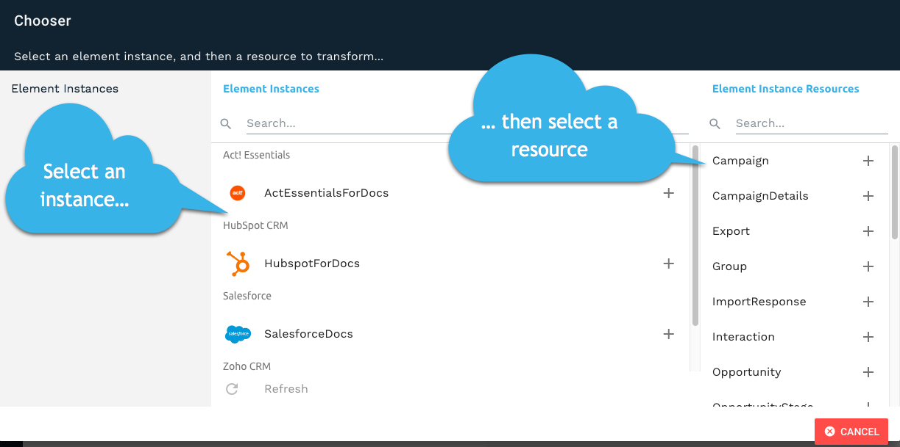
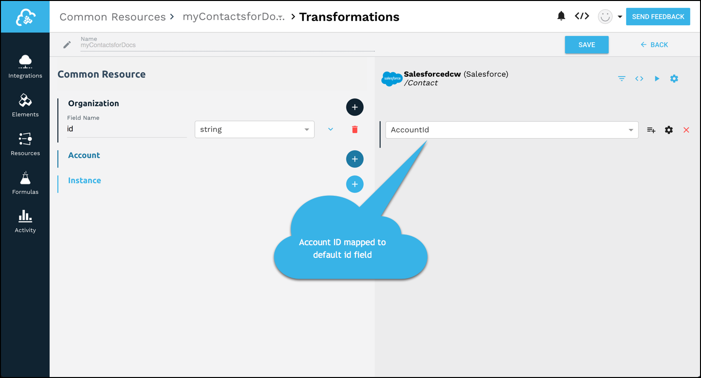
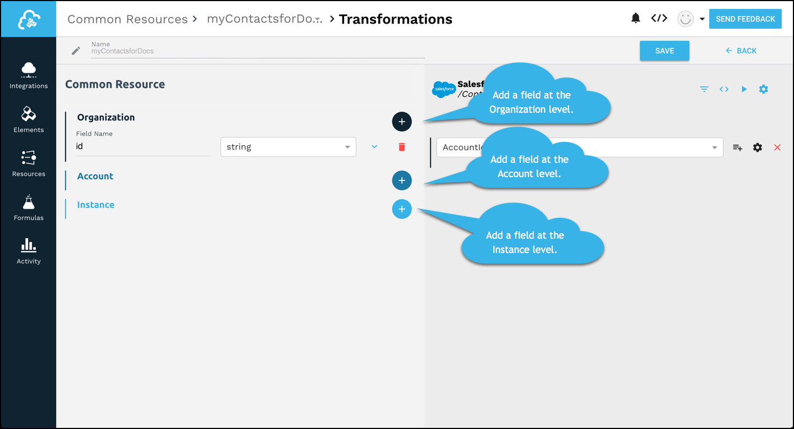
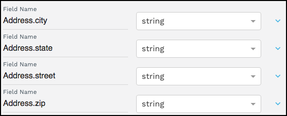

# Working With Common Resources

With Cloud Elements, you can create a common resource from scratch or you can use an existing resource as a template. This guide includes instructions for both methods. We've also included instructions to help you work with your common resources after you create them.

| Creating Common Resources | Working With Common Resources     |
| :------------- | :------------- |
| [Understanding Levels](#understanding-levels) </br>Before you begin, you need to understand the difference between organization, account, and instance levels.  | [Transforming Custom Objects](#transforming-custom-objects)</br>Learn how to map and transform custom objects.        |
| [Create a New Common Resource](#create-a-new-common-resource) </br>Understand how to create a common resource from scratch.      | [Removing Fields During Transformation](#removing-fields-during-transformation) </br>Learn how to remove fields from the request or response.  |
| [Create a Common Resource from an Existing Resource](#create-a-common-resource-from-an-existing-resource) </br>Understand how to create a common resource based on an existing resource. | [Testing Transformations](#testing-transformations) </br>Learn how to test your transformations.  |
|  | [Adding Common Resources to API Docs](#adding-common-resources-to-api-docs) </br>Learn how to add your common resources tho an element's API documentation. |
|  | [Nesting Objects](#nesting-objects)</br>Learn how to nest objects in a common resource. |
|  | [Setting Default Values](#setting-default-values) |

# Understanding Levels

<span style="color:red"> This still needs some work </span>

Common resources are built as part of a hierarchy that includes three levels: organization, account, and instance.

* The organization is the highest level. Transformations at this level are defined the same for all customers and all elements of any users associated with your account.
* The account is the next highest level. Accounts typically represent your customers. Transformations at the account level are shared by all users associated with a specific account.
* The instance is the most granular level. The transformations at the instance level are associated with only the element instance.

If defined at a lower level, that will override a higher level.

Organization level - top level, company level. Organization will include your company and your customers.

Account/ sub-account, one of your customers.
<span style:"color:red"> There seems to be a lot an account user can't do. As an acount user I can't adjust field settings but I can adjust Advanced settings. When I changed the Advanced Settings it didn't take. </span>

Instance level for transformation level. Only for the connection to the element instance.


# Create a New Common Resource

Cloud Elements enables you to create an entirely new common resource or one that is based on an existing resource. Creating an entirely new common resource allows you to start from scratch, while utiizing existing resources allows you to leverage existing ideas.

Only users at the Organization level can create common resources, but users at any level can leverage existing common resources to create transformations at the account or instance level. If you are not a user at the Organization level, skip the first step below and go to [Map Resources for Transformation](#map-resources-for-transformation).

Creating a common resource entails the high-level steps outlined below.

1. [Set up the new common resource](#set-up-the-common-resource). Get started, choose how to create the common resource, and give it a name.
2. [Map the resources that you want to transform to the fields in the common object](#map-resources-for-transformation).
3. [Fine tune the common resource](#advanced-custom-resources). Map custom objects, use javascript to map complex objects, set properties on the instance and on the individual fields, test your transformations, and more.

## Set up the Common Resource

The first step in the process is to choose how you’ll set up your common resource -- completely new or based on an existing resource -- and what to name it.

* [Set up an entirely new common resource](#setting-up-a-new-common-resource) if you want to start from scratch.
* [Set up a copy of an existing common resource](#setting-up-a-common-resource-based-on-another-common-resource) if you have an existing common resource that you want to copy.
* [Set up a new common resource based on a resource in an existing element instance](#setting-up-a-common-resource-based-on-an-element-instance-resource). Choose this option if have an existing element resource that you want to model similar resources after. For example, you want all of your contacts to match Saleforce contacts.
* [Set up a new common resource based on a Cloud Elements template](#setting-up-a-common-resource-based-on-a-cloud-elements-template) if you want to leverage Cloud Elements template.

### Setting up a New Common Resource

To set up a new Common Resource:

1. On the Common Resources page, click __Create New Common Resource__.
1. Click __Create New Resource__.
1. Enter a name for your resource, and then click __Create__.

    The Transformations page shows your new Common Resource with a default organization-level field of __id__.

1. Continue to the next step: [map fields from a resource](#map-resources-for-transformation).

### Setting up a Common Resource Based on Another Common Resource

To set up a common resource based on an existing common resource:

1. On the Common Resources page, click __Create New Common Resource__.
1. Click __Create From Existing Resource__.
1. Select the resource from the __My Resources__ list.
1. Enter a name for your resource, and then click __Create__.

    The Transformations page shows your new common resource with all of the fields that were in your other common resource.

1. Continue to the next step: [map fields from a resource](#map-resources-for-transformation).

### Setting up a Common Resource Based on an Element Instance Resource

To set up a common resource based on an existing element instance:

1. On the Common Resources page, click __Create New Common Resource__.
1. Click __Create From Existing Resource__.
1. On the left side, click __Existing Element Instance Resources__.

    

1. Select the element instance that contains the resource that you want to use.
1. Select the resource from the __Element Instance Resources__ list.

    

1. Enter a name for your resource, and then click __Create__.

    The Transformations page shows your new common resource with all of the fields in the element instance resource. We've already mapped the element instance that you based the common resource on to it.

1. Continue to the next step: [map fields from a resource](#map-resources-for-transformation).


### Setting up a Common Resource Based on a Cloud Elements Template

To set up a common resource based on a Cloud Elements template:

1. On the Common Resources page, click __Create New Common Resource__.
1. Click __Create From Existing Resource__.
1. On the left side, click __Existing Element Instance Resources__.

    

    <span style:"color:red">No idea what happens from here on </span>

1. Select the resource from the __My Resources__ list.
1. Enter a name for your resource, and then click __Create__.

    The Transformations page shows your new common resource with all of the fields that were in your other common resource.

1. Continue to the next step: [map fields from a resource](#map-resources-for-transformation).


## Map Resources for Transformation

Use the Transformations page to map fields in your elements instances to fields in your common resource. This is where you will decided which fields you care about and what to call them.

__Note:__ You must already have element instances.

To map fields:

1. On the Common Resources > Transformations page, click  __Create New Transformation__.

    You see a list of Element Instances available to you. If the list is long, use the Search to narrow it down.
    

1. Select the Element Instance, and then select the Element Instance Resource.

    The Resources available to that Element Instance appear in the Element Instance Resources column after you select a resource.
  	

1. Beginning with the default field __id__, select an instance resources on the right to map to the Common Resource on the left.

    For example, select an ID field in your instance resource to map to the default __id__ field.
    

1. For the next field, decide which level to create the field, and then click the + button. See [Understanding Levels](#understanding-levels).

    

1. Enter a name for the field, and then choose the data type.
1. Select the corresponding Instance Resource on the right to map to the new field.

    __Note__: You can type to filter.
  <span style="Color:red">Link to custom objects.</span>

1. Continue adding resources until you’re complete, and then click __Save__.
1. Click __Back__ to return to transform another instance.

### Tips

* You don't have to map fields one at a time. You can add multiple fields to the Common Resources side at once, and then map them later. Use  to show only those fields that haven't been mapped.
* If you made a mistake and don't want to include a field in a common resource, click . If you still want the field, but want to remove the mapping, click .


# Advanced Custom Resources

In addition to the basic object mapping described in [Create a New Common Resource](#create-a-new-common-resource), you can use the transformations page to fine tune your common resources. This section describes more advanced activities that you can do to fine tune your common resources, deal with more difficult objects, manage what appears in your payloads, and more.

## Use Javascript to Manage Complex objects

You can use custom Javascript when the basic object mapping described in [Create a New Common Resource](#create-a-new-common-resource) does not meet your needs. For example, you might need to break a single address object into its component parts (address.city, address.state, address.street, and address.zip).

To access the custom Javascript functionality:

* Click   .

Common resource functions include the parameters and functions in the following table:

### Common Resources Custom JS Parameters and Functions

| Parameter | Description   |
| :------------- | :------------- |
| transformedObject  |  The transformed object, with any mappings already taking place.  |
| originalObject  | The original object, with no transformations or mappings taking place on it. |
| fromVendor  | Is the transformation being executed coming back from the vendor (on an API response) ? |
| done |   The callback function needed to call at the end of your JS. |

### Examples

* Adding fields to a resource when a certain endpoint does not provide them:

    ```javascript
    function (originalObject, transformedObject, fromVendor, done) {
    transformedObject.isCreatedThisYear = (fromVendor && transformedObject.createdDt > '2016-01-01');
    done(transformedObject);
    }
    ```

* Two endpoints identify priority differently: one users numbers (1 or 2) and the other descriptions (low or high).

    ```javascript
    function (originalObject, transformedObject, fromVendor, done) {
    if (!fromVendor) done(transformedObject); // only care when returning data from the vendor

    transformedObject.priority = transformedObject.priorityNumber === 1 ? 'low' : 'high'; // we prefer our priority to be the string representation, so we convert the endpoints "priorityNumber" field to the appropriate string representation here.

    done(transformedObject);
  }
    ```

## Transforming Custom Resources

If you do not see an object that you expect in the instance resources you can still map it by entering the object name. This sometime happens for custom objects you created at the endpoint. You might not find all objects that you would expect to  you might not find a custom object.

To map a custom object:

1. Click .

    The list becomes a text entry field.

1. In __Field Name__, enter the name of the object.

    


## Removing Fields During Transformation

Cloud Elements passes all fields in the JSON through on both requests and responses. However, you can choose to remove all unmapped fields or specific fields from requests or responses.

To remove unmapped fields:

1. On the Transformations page, click .
1. Switch __Remove Unmapped Fields__ to on.
1. Click __Save__.

To remove fields from requests or responses:

1. On the Transformations page, click .
1. Switch on or off the sliders for the requests or responses.

    For example, in the following configuration, we remove the portal-id field from the response.
    


## Setting Default Values

If no values exist for a specific field, but you do not want to remove it, you can set a default value.

To set a default value:

1. On the Transformations page, click .
1. Click __Default Value__, and then type the value.
1. Click __Save__.

## Testing Your Transformations

After you set up your mapping, you can test your transformations.

To test a transformation:

1. On the Transformations page, click .
1. Review the Transformed response body. This is the response containing only the fields in your common resource.
1. Click __Original__ to see the entire response JSON payload.
1. Test a Put or Patch by selecting the appropriate method, and then entering the JSON request.

    __Tip__: Copy the JSON payload from Transformed.

1. Click __Run__.

## Adding Your Common Resource to the API Docs

You can add the common resource you create to the instances of each affected element.

To add a common resource to API docs:

1. On the Transformations page, click .
1. Switch __Add to API Docs__ on.
1. Click __Save__.

Try it out:
1. Go to an element instance.
1. Hover over the instance card, and the click __API Docs__.
1. Scroll to your common resource.

The list of resources is in alphabetical order, so the example myContact in this guide is after the `leads` resource:


## Working with Arrays

We display object arrays in dot notation. You can also use dot notaton to nest objects in your common resource. For example, you might want to nest address properties like those shown in the example below:



The JSON result of this nested object:

```json
{
  "Address": {
    "city": "Cambridge",
    "state": "MA",
    "street":"1234567 Elm St",
    "zip":"99999"
  }
}
```
