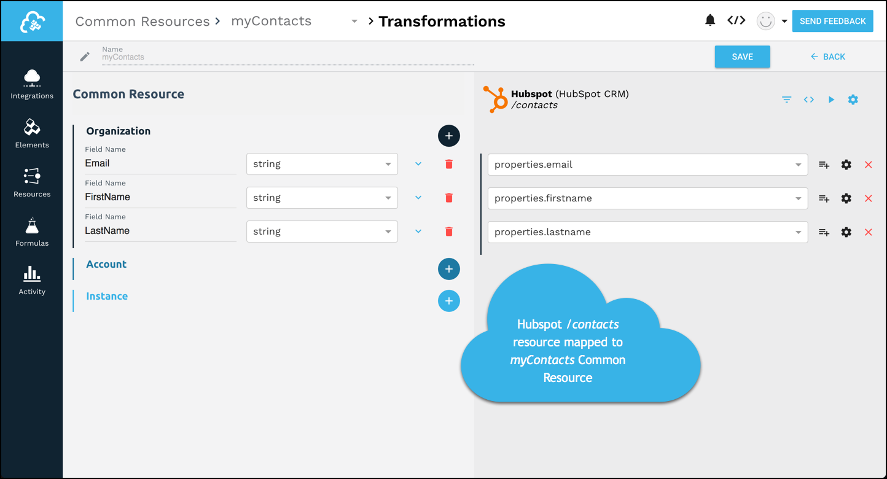

# Overview

With Common Resources, you can map data objects and fields provided by your vendor to a single, canonical resource as Cloud Elements. Common Resources enable you to take advantage of our "one to many" integration approach by creating a single, canonical resource. You then map other element instance resources to your Common Resource. We transform the fields that you map to so that the data in the Common Resource remains the same no matter where it came from.

For example, you know that you want your contacts to look a certain way. You want FirstName, LastName, and Email. But some elements call FirstName something else, like FirstName, F_Name, or properties.firstname. You need to create a single, canonical Common Resource with fields named FirstName, LastName, and Email. Then you can map all of the like fields from other elements to the fields in your Common Resource.

You can use Common Resources to do more than normalize resource names. You can transform data types, so when a resource returns a string and you need a date, Cloud Elements transforms the data.

Using our JavaScript Editor, you can create logic to manage complex problems. For example, you can write a simple script to combine fields into a single field. For example, combine FirstName and LastName as a field in your Common Resource called Name. Or tackle even more complicated issues like transforming a number based priority value (1-10) to a descriptor based value (low, medium, or high).

# Working with Common Resources

You can manage Common Resources through the Integration Platform or via API.
You can create new or start with a resource that you like.
Learn about

# Definitions

## Common Resource

User-defined, standard, and canonical resources that contain only the fields needed for your integration. Leverage “one-to-many” relationships between Common Resources and multiple Elements by mapping fields in different Elements to a single field in the common resource.

## Transformation

The mapping of Element Instance Resources to a Common Resource. Transformation includes the conversion of data from the source resource to the canonical Common Resource
## Element Instance

// Pull from standard def.

## Element Instance Resources

The resources available to the Element Instance through its API. You map the data from the Element Instance Resources to the data in your Common Resource.

> **QUESTIONS/COMMENTS?** Please don't hesitate to [contact us](mailto:support@cloud-elements.com).
