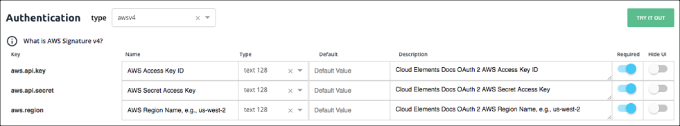
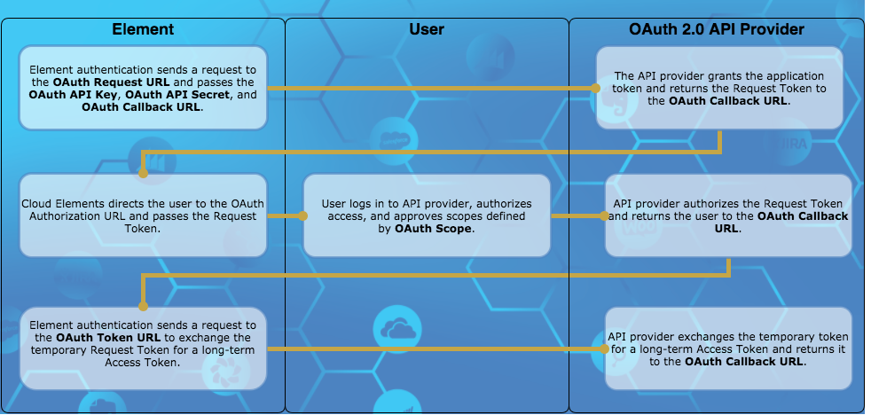

# Element Builder Authentication Setup



The information that you need to enter to set up authentication with the API provider differs depending on the authentication type. If the API provider requires complex authentication you can override the default information with configurations, parameters , and hooks.

Click the authentication type that you selected to see configuration instructions. If you selected Custom, you can skip directly to [Configuration and Parameters](config.html).

{% include callout.html content="<strong>On this page</strong></br><a href=#configure-oauth-2-0>Configure OAuth 2.0</a></br><a href=#configure-oauth-1-0>Configure OAuth 1.0</a></br><a href=#configure-basic-authentication>Configure Basic Authentication</a></br><a href=#configure-custom-authentication>Configure Custom Authentication</a></br><a href=#configure-aws-authentication>Configure AWS Authentication</a></br><a href=#change-the-authentication-type>Change the Authentication Type</a></br><a href=#test-authentication>Test Authentication</a></br><a href=#about-oauth-authentication> About OAuth Authentication</a><br><a href=#override-standard-oauth-2-0-flow>Override Standard OAuth 2.0 Flow</a>" type="info" %}

## Configure OAuth 2.0


Cloud Elements provides the [properties](#oauth-2-0-parameters) needed to support a standard OAuth 2.0 flow. Each API provider implements OAuth 2.0 differently so you might need to supplement the parameters with additional configuration. Before setting up the OAuth 2.0 information, you need to create a Cloud Elements app at the API provider. Use the default information from that app. When users authenticate through Cloud Elements, they will connect with that app.

The [OAuth 2.0](#oauth-2-0) entry in the [About OAuth Authentication](#about-oauth-authentication) section includes more details about the most common OAuth 2.0 authentication flow.



To configure OAuth 2.0 elements:

1. Click **Authentication**.
2. Complete the fields needed to enable users to grant Cloud Elements access to their account on behalf of your application:
  * OAuth API Key
  * OAuth API Secret
  * OAuth Callback URL
  * OAuth Authorization URL
  * OAuth Scope
2. In **OAuth Token URL** enter the URL where Cloud Elements exchanges the grant code from the API provider for an access token.
3. If the API provider expires tokens, complete the following fields:
  * OAuth Refresh Interval (s)
  * OAuth Token Refresh URL
  * OAuth Revoke Token URL
4. Unless you need to perform additional configuration, authenticate a test instance by clicking **Try it Out**.

### OAuth 2.0 Parameters

| Name | Key  | Description   | Required   |
| :------------- | :------------- | :------------- | :------------- |
|  OAuth API Key  | oauth.api.key | {{site.data.glossary.eb-api-key}} |  Y  |
|  OAuth API Secret  | oauth.api.secret  |  {{site.data.glossary.eb-api-secret}}  |  Y  |
|  OAuth Callback URL  | oauth.callback.url  | {{site.data.glossary.eb-callback-url}} For authentication through Cloud Elements, use `https://auth.cloudelements.io/oauth`. |  Y  |
|  OAuth Authorization URL  | oauth.authorization.url  |  {{site.data.glossary.eb-auth-url}}  |  Y  |
|  OAuth Token URL  |  oauth.token.url | {{site.data.glossary.eb-token-url}}  |  Y  |
| OAuth Scope |  oauth.scope	  | {{site.data.glossary.eb-scope}} | N |
|  OAuth Refresh Interval (s)  | oauth.user.refresh_interval  | If the access token expires, the time frame in seconds when Cloud Elements sends a request to the OAuth Token Refresh URL. The default is 3600, which is one hour.  |  N  |
|  OAuth Token Refresh URL  | oauth.token.refresh_url | The URL to send a refresh request.  |  N  |
| OAuth Revoke Token URL | oauth.token.revoke_url  |The URL to send requests to revoke refresh or access tokens. | N |

## Configure OAuth 1.0


Cloud Elements provides the [parameters](#oauth-1-0-parameters) required to support a standard OAuth 1.0 flow. Each API provider implements OAuth 1.0 differently so you might need to supplement the parameters with additional configuration.

The [OAuth 1.0](#oauth-1-0) entry in the [About Authentication](#about-oauth-authentication) section includes more details about the most common OAuth 2.0 authentication flow.

To configure OAuth 1.0 elements:

1. Click **Authentication**.
2. Complete the fields needed to get an OAuth Request Token to request user authorization
  * OAuth API Key
  * OAuth API Secret
  * OAuth Request URL
  * OAuth Callback URL
3. In **OAuth Authorization URL** enter the URL where Cloud Elements redirects the user to authorize access.
4. In **OAuth Token URL** enter the URL where Cloud Elements fetches an access token.
5. In **OAuth Authorization Type (Header or Query)** select how the request passes authorization information to the API provider.
6. In **OAuth Scope** enter a comma separated list of the permissions that the user will authorize your integration to have.
7. In **OAuth User Secret** enter
4. Unless you need to perform additional configuration, authenticate a test instance by clicking **Try it Out**.

### OAuth 1.0 Parameters

| Name | Key  | Description   | Required   |
| :------------- | :------------- | :------------- | :------------- |
|  OAuth Request URL  | oauth.request.url | The URL used to get an unauthorized request token. |  Y  |
|  OAuth Callback URL  | oauth.callback.url  | {{site.data.glossary.eb-callback-url}} |  Y  |
|  OAuth API Key  | oauth.api.key | {{site.data.glossary.eb-api-key}} |  Y  |
|  OAuth API Secret  | oauth.api.secret  | {{site.data.glossary.eb-api-secret}}  |  Y  |
|  OAuth Authorization URL  | oauth.authorization.url | {{site.data.glossary.eb-auth-url}}  |  Y  |
|  OAuth Token URL  | oauth.token.url | {{site.data.glossary.eb-token-url}}  |  Y  |
|  OAuth Authorization Type (Header or Query)  | oauth.request.authorization.type | How the API provider receives authentication information, either in the header or as a query parameter.  |  Y  |
|  OAuth Scope  | oauth.scope | {{site.data.glossary.eb-scope}}  |  N  |
|  OAuth User Secret  | oauth.user.token.secret | The user secret associated with the application authenticating with the API provider.   |  N  |

## Configure Basic Authentication


In Basic access authentication, you typically provide a user name and password. In some cases you also provide an API Key. When setting up an element with Basic authentication we start you off with **Username** (key:`username`) and **Password**(key:`password`) configurations. If you need to add any other configurations like an API Key, do so in the Configuration step. API providers typically do not vary from the standard Basic authentication, so you should keep the default properties. If you do need to make changes, you can update the properties or delete unneeded configurations.

### Basic Authentication Parameters



## Configure Custom Authentication

To configure custom authentication information, use the [Configuration](config.html#set-up-element-configuration), [Parameters](config.html#set-up-element-parameters), and, if necessary, [Hooks](hooks.html) sections to construct the authentication information required by the API provider.

## Configure AWS Authentication


Cloud Elements provides default authentication fields for API providers that use [Amazon Web Services Signature Version 4](http://docs.aws.amazon.com/general/latest/gr/signature-version-4.html) and [Version 2](http://docs.aws.amazon.com/general/latest/gr/signature-version-2.html). API providers typically do not vary from the standard AWS authentications, so you should keep the default properties. If you do need to make changes, you can update the properties or delete unneeded configurations.

### AWS Authentication Parameters

| Name | Description   | Required   |
| :------------- | :------------- | :------------- |
|  AWS Access Key ID  | The ID associated with your AWS access key.   |  Y  |
|  AWS Secret Access Key  | The secret key used in the Signature Version 2 signing process |  Yes for version 2 only |
| AWS Region Name, e.g., us-west-2   | The [Amazon API Gateway](http://docs.aws.amazon.com/general/latest/gr/rande.html#apigateway_region) region name.  |  Yes for version 4 only |

## Change the Authentication Type

If you selected the incorrect authentication type, or find that you need to change the authentication, select another authentication type from the **type** list in the Authentication heading.

Continue to the next step, [Custom Configuration and Parameters](config.html).



## Test Authentication

After you set up authentication you can authenticate an element instance to see if you can create a connection. If you chose Custom authentication or need to add additional configurations and parameters, you should set those up before testing authentication.

To test your authentication:

1. Navigate to **Configuration**, and then click **Try it Out**.
2. On the authentication page, enter a name, and then complete any required configuration fields. These are the fields that you chose to appear on the UI.
3. Click **Create Instance**.

If the authentication succeeds, Cloud Elements creates an authenticated instance which you can use to test your authentication. You can also use it later when you test resources.

## About OAuth Authentication

OAuth is a common authentication protocol for REST APIs and Cloud Elements supports both [OAuth 2.0](#oauth-2-0) and [OAuth 1.0](#oauth-1-0). You need to set up more information for OAuth elements than other authentication types. This section provides more details about how these authentication types work and how Cloud Elements uses the information you provide when building custom elements.

### OAuth 2.0

The OAuth 2.0 protocol lets external applications &mdash; your application or Cloud Elements &mdash; request authorization to access and update a users data without asking users for sensitive user names and passwords. OAuth 2.0 is flexible, but that also means that each API provider implements it differently.

This section describes how Cloud Elements supports the [Authorization Code Grant workflow](https://tools.ietf.org/html/draft-ietf-oauth-v2-31#section-4.1) authentication flow. Other flows such as [Implicit Grant](https://tools.ietf.org/html/rfc6749#section-4.2) and [Client Credentials Grant](https://tools.ietf.org/html/rfc6749#section-4.4) offer variations that we also support. The Authorization Code Grant flow is sometimes called a three-legged authentication process:

1. Cloud Elements requests an API provider to have a user log in and grant access.
2. After the user logs in and grants permission, the API provider returns an authorization grant code.
3. Cloud Elements exchanges the authorization grant code for an access token.

#### Cloud Elements Authorization Code Grant OAuth 2.0 Flow


The typical Authorization Code Grant flow as supported by Cloud Elements includes the following steps:

1. Cloud Elements requests authorization on behalf of your app by redirecting a user to the API provider's **Authorization URL**. Cloud Elements includes the following parameters as part of the request:
  * **OAuth API Key**
  * **OAuth API Secret**
  * **OAuth Callback URL**
  * **OAuth Scope** if required
2. The user logs in and grants access. If the request included **OAuth Scope**, the user must grant access to all scopes or none.
3. The API provider redirects the user back to the **OAuth Callback URL** with the following parameters:
  * A time-limited authorization grant <code>code</code>.
  * A <code>state</code> parameter that is typically the element key.

        

4. Cloud Elements makes a backchannel request to redeem the authorization grant code for an access token.
5. The API provider authenticates the element instance and issues an access token. Some API providers also provide a refresh token and information about when the token expires.
6. Cloud Elements associates an element instance token with the access token. You will use that element instance token in future requests.
7. If the tokens expire, Cloud Elements sends the refresh token to the **OAuth Token Refresh URL** at the specified **OAuth Refresh Interval (s)**.
8. The API provider responds with a new access token and refresh token to be used at the next refresh.

#### OAuth 2.0 Prerequisites

Before you can authenticate an element instance, you must register your application with the API provider. Each registration is assigned some form of an API key (client id, client key, etc.) and secret. In Cloud Elements, these are the **OAuth API Key** and **OAuth API Secret**. You also usually need to provide a redirect URI which should match what you include in the **OAuth Callback URL**. If you want users to authenticate through Cloud Elements as opposed to programmatically through APIs in your application, use `https://auth.cloudelements.io/oauth`.

Some API provider require scopes let you limit the authorization to a subset of the data. When users grant authorization, they are shown the scopes and acknowledge that they grant access to them. The user must allow access to all or to none. The scopes that you set up in the application should match the **OAuth Scope**.

#### OAuth 2.0 Authentication JSON

The JSON used to authenticate an element instance looks like this:

```json
{
  "element": {
    "key": "<The Element Key>"
  },
  "providerData": {
    "code": "<AUTHORIZATION_GRANT_CODE>"
  },
  "configuration": {
    "oauth.callback.url": "<CALLBACK_URL>",
    "oauth.api.key": "<CONSUMER_KEY>",
    "oauth.api.secret": "<CONSUMER_SECRET>",
    "oauth.scope": "<COMMA_SEPARATED_LIST>"
  },
  "tags": [
    "<Add_Your_Tag>"
  ],
  "name": "<INSTANCE_NAME>"
}
```

### OAuth 1.0

OAuth 1.0 is an older version of the OAuth protocol. Like OAuth 2.0, the OAuth 1.0 protocol lets external applications &mdash; your application or Cloud Elements &mdash; request authorization to access and update a users data without asking users for sensitive user names and passwords. OAuth 1.0 is also flexible with multiple different ways to implement it.

This section describes how Cloud Elements supports the [OAuth Core 1.0 Revision A](https://oauth.net/core/1.0a/) authentication flow. The typical OAuth 1.0 authorization flow is a three-legged authentication process:

1. Request temporary credentials. Cloud Elements requests temporary credentials in the form of a Request Token from the API provider.
2. Authorize. The user logs in to the API provider and grants the temporary Request Token access.
3. Token exchange. Cloud Elements exchanges the temporary Request Token for a more long-term access token.

#### Cloud Elements OAuth 1.0 Flow



The typical OAuth 1.0 flow as supported by Cloud Elements includes the following steps:

1. Cloud Elements sends a request to the API provider's **OAuth Request URL** for a Request Token. Cloud Elements includes the following parameters as part of the request:
  * **OAuth API Key**
  * **OAuth API Secret**
  * **OAuth Callback URL**
2. The API provider returns the temporary Request Token and a secret associated with the token.
2. Cloud Elements directs the user to the **OAuth Authorization URL** where they log in and grant access. If the request included **OAuth Scope**, the user must grant access to all scopes or none.
3. The API provider authorizes the temporary Request Token and redirects the user back to the **OAuth Callback URL** with the authorized Request Token and an OAuth verifier.
4. Cloud Elements sends a request to the **OAuth Token URL** and exchanges the authorized Request Token for a long-term Access Token.
6. Cloud Elements associates an element instance token with the Access Token. You will use that element instance token in future requests.

#### OAuth 1.0 Prerequisites

Before you can authenticate an element instance, you must register your application with the API provider. Each registration is assigned some form of an API key (client id, client key, etc.) and secret. In Cloud Elements, these are the **OAuth API Key** and **OAuth API Secret**. You also usually need to provide a redirect URI which should match what you include in the **OAuth Callback URL**. If you want users to authenticate through Cloud Elements as opposed to programmatically through APIs in your application, use `https://auth.cloudelements.io/oauth`.

#### OAuth 1.0 Authentication JSON

The JSON used to authenticate an element instance looks like:

```json
{
  "element": {
    "key": "twitter"
  },
  "providerData": {
    "oauth_token": "<OAUTH_TOKEN_RETURNED_IN_OAUTH_EXCHANGE>",
    "oauth_verifier": "<OAUTH_VERIFIER_RETURNED_IN_OAUTH_EXCHANGE>",
    "secret": "<SECRET_RETURNED_IN_OAUTH_EXCHANGE>"
  },
  "configuration": {
    "oauth.api.key": "<INSERT_QUICKBOOKS_API_KEY>",
    "oauth.api.secret": "<INSERT_QUICKBOOKS_API_SECRET>",
    "oauth.callback.url": "<SAME CALLBACK URL USED IN STEP 2>"
  },
  "tags": [
    "<INSERT_TAGS>"
  ],
  "name": "<INSERT_INSTANCE_NAME>"
}
```

## Override Standard OAuth 2.0 Flow

Many API providers implement OAuth 2.0 in unique ways. When you create an element and need to deviate from the standard [Cloud Elements OAuth 2.0 Flow](#cloud-elements-authorization-code-grant-oauth-2-0-flow), you can use specific endpoints to override each step in the flow. In each endpoint, use a combination of configurations, parameters, and hooks to override the standard OAuth 2.0 flow.

The resources available to override OAuth 2.0 flows are:

* `GET/oauth-authorize` &mdash; Overrides the first step in the OAuth 2.0 flow where Cloud Elements requests authorization on behalf of your app by redirecting a user to the API provider's Authorization URL.
* `POST/oauth-token-exchange` &mdash; Overrides the second step in the flow where Cloud Elements exchanges the code returned from the API provider for an access token.
* `POST/oauth-token-refresh` &mdash; Overrides the refresh step where Cloud Elements exchanges a refresh token for an updated access token.

Overriding the OAuth 2.0 flow is a complex task and the number of ways to perform the overrides are limited only to your imagination and ability to write JavaScript code. The steps below do not provide details of how to override specific steps, but serve as a guide to get you started. See [Custom Resources](resources.html#add-resources-to-an-existing-element) for general steps to add a resource to an element.

To add the `GET/oauth-authorize` resource:

1. Click **Add a new resource** at the top of the page.
2. In **Cloud Elements Resource Name** enter `/oauth-authorize`.
3. Do not enter anything in **Vendor Resource Name**.
4. Select only the **GET** method.

    Your new resource should like:
    

5. Click **Go**.
6. Find the endpoint, and then click .
7. Change the description to something like: "Overriding the OAuth 2.0 authorization".
8. From **Resource Type**, select **OAUTH ON AUTHORIZE URL**.
9. Some common configurations that you can use in the parameters of the endpoint or in the hooks to manipulate the request include:
  - OAuth API Key (`oauth.api.key`)
  - OAuth API Secret (`oauth.api.secret`)
  - OAuth Callback URL (`oauth.callback.url`)
  - OAuth Authorization URL (`oauth.authorization.url`)
  - OAuth Scope (`oauth.scope`)

  To add the `POST/oauth-token-exchange` resource:

  1. Click **Add a new resource** at the top of the page.
  2. In **Cloud Elements Resource Name** enter `/oauth-authorize`.
  3. Do not enter anything in **Vendor Resource Name**.
  4. Select only the **POST** method.

      Your new resource should like:
      

  5. Click **Go**.
  6. Find the endpoint, and then click .
  7. Change the description to something like: "Overriding the OAuth 2.0 token exchange".
  8. From **Resource Type**, select **OAUTH ON TOKEN EXCHANGE**.
  9. Some common configurations that you can use in the parameters of the endpoint or in the hooks to manipulate the request and response include:
    - OAuth Callback URL (`oauth.callback.url`)
    - `oauth.user.refresh_token` (from the response)
    - `oauth.user.token` (from the response)
    - OAuth Refresh Interval (s) (`oauth.user.refresh_interval`)
    - The authorization code from the response

To add the `POST/oauth-token-refresh` resource:

1. Click **Add a new resource** at the top of the page.
2. In **Cloud Elements Resource Name** enter `/oauth-authorize`.
3. Do not enter anything in **Vendor Resource Name**.
4. Select only the **POST** method.

    Your new resource should like:
    

5. Click **Go**.
6. Find the endpoint, and then click .
7. Change the description to something like: "Overriding the OAuth 2.0 token refresh".
8. From **Resource Type**, select **OAUTH ON TOKEN REFRESH**.
9. Some common configurations that you can use in the parameters of the endpoint or in the hooks to manipulate the request and response include:
  - OAuth Token Refresh URL (`oauth.token.refresh_url`)
  - OAuth Revoke Token URL (`oauth.token.revoke_url`)
  - OAuth Refresh Interval (s) (`oauth.user.refresh_interval`)
  - OAuth Token URL (`oauth.token.url`)
  - The refresh token code from the response
  - `oauth.user.token` (from the response)
