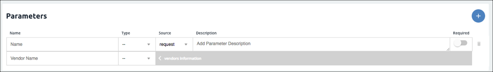
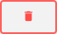

# Element Builder Configuration and Parameters



Element configuration and parameters work together solve various scenarios presented by API providers. When you set up your element configuration, you define the information that you want to store with the element. The information can include data that you collect from the user when they authenticate an instance of an element. You can also store variables in the configuration that you can act on with parameters and hooks. You can also store information that you need to pass with each request to the API provider.

Parameters enable you to configure information that you need to send to an API provider with each request and how they expect to receive it. You can pass variables that you added to the configuration, information provided by the user, specific values, and more.





## Reserved Configurations

Each parameter that you set up when [defining the authentication information](auth.html) is available as an element configuration. The element configuration also includes the properties of the element: pagination information and base URL. The configuration Keys associated with the authorization and pagination parameters are reserved. You will receive an error if you try to create a configuration with a reserved configuration Key. The following table shows reserved configuration Keys.

| OAuth Keys   | Basic Keys    | Properties Keys | Events and Bulk | AWS Keys |
| :------------- | :------------- | :------------- | :------------- | :------------- |
|  oauth.basic.header  |  username  | base.url  | Any keys beginning bulk. | aws.api.key |
|  oauth.user.refresh_time  |  password  | pagination.type | Any keys beginning event. | aws.api.secret |
|  oauth.user.refresh_token  |    |  pagination.max  | event.notification.instance.finder | aws.region |
|  oauth.user.refresh_interval  |    |  pagination.page.startindex  | event.vendor.type | expires |
|  oauth.user.token  |    |  | event.poller.refresh_interval |  expires_in |
|  oauth.api.key  |    |  | event.notification.enabled |  |
|  oauth.scope  |    |  | event.notification.callback.url |  |
|  oauth.token.url  |    |  | event.poller.configuration |  |
|  oauth.api.secret  |    |  | event.notification.subscription.id |  |
|  oauth.authorization.url  |    |  | event.metadata |  |
|  oauth.token.refresh_url  |    |  | event.helper.key |  |
|  oauth.callback.url  |    |  |  |  |
|  oauth.request.authorization.type  |    |  |  |  |
|  oauth.request.url  |    |  |  |  |
| oauth.token.revoke_url   |   |   |   |  |
| oauth.user.token.secret   |   |   |   |  |

## Set Up Element Configuration

The element configuration is the storage place for any data that you need to operate on with parameters and hooks. For example, if the API provider requires something specific with each request, you can add that to the configuration and then define a parameter that passes the data with each request. You can expose the configuration to the user so that they can supply the information when they authenticate. Or, if it is not user specific information, you can store a default value in the configuration to act on later.

Before you set up configurations, review the [Element Conventions](custom-elements.html#element-conventions) so your element will align with others in the Elements Catalog.

To set up a configuration:

1. Navigate to **Configuration**, and then click .
3. In **Key** you can choose to update the value automatically created from the configuration name or leave it. The configuration Key identifies the configuration property in the element configuration. You also use the configuration Key to refer to the configuration in parameters and hooks.
2. Enter the name of the configuration. If you choose to show this on the UI, Cloud Elements will show the configuration name as you define it here.
5. In **Type** select the type of configuration. Configurations can be text strings, boolean, or passwords.
4. In **Default** enter any default value for the configuration. If shown on the UI, a user can overwrite the default value.
5. In **Description** enter a brief description of the configuration. If the configuration appears in Cloud Elements, the description is available as hover help.
10. To make the configuration a required part of authentication, switch **Required** on.
7. Switch **Hide UI** to on to prevent the configuration from appearing on the UI when the user authenticates. By default, the configuration appears on the UI.
8. Click **Save**.

### Element Configuration Parameters



## Set Up Element Parameters

Element parameters allow you to pass various properties with each request. You can create parameters that require user input or parameters that get their values from other sources. Use the element parameters to configure required query parameters, searches, pagination, ids, and required fields. You can configure most required and optional parameters for most APIs using parameters and configurations. Map parameters that you send as part of the request from Cloud Elements on the top row to parameters available to the resource at the API provider on the bottom row.

Before you set up parameters, review the [Element Conventions](custom-elements.html#element-conventions) so your element will align with others in the Elements Catalog. Each parameter includes information about how the parameter is used at Cloud Elements and how the API provider expects to receive the parameter.

To define a parameter :

1. Navigate to **Configuration**, and then click .
2. Complete the top row of Cloud Elements parameter information:
  - In **Name** enter the name of the parameter. The name appears in the API documentation and should match any existing values. For example, if you choose a type of "configuration", the name must match the configuration key it refers to. a type of "configuration", the name must match the configuration key it refers to.
  - In **Type** select the source of the parameter. Refer to Cloud Elements Parameter Type in the [Element Parameter Fields](#element-parameter-fields) table.
  - If you want to switch the standard workflow where the parameters in the top row are part of the request from Cloud Elements, and want the parameters on the top row to represent the response from the API provider, click **Source**, and then select **Response**.
  - In **Description** enter a brief description of the parameter. If the parameter appears in the API documentation, this description also appears.
2. Complete the bottom row of API provider parameter information:
  - In **Name** enter the name of the API provider's name for the parameter to map to.
  - In **Type** select select how the API provider receives the parameter. Refer to API Provider Parameter Type in the [Element Parameter Fields](#element-parameter-fields) table.
8. Click **Save**.

#### Element Parameter Fields

| Parameter | Description   | Required   |
| :------------- | :------------- | :------------- |
|  Cloud Elements Parameter Name  |  The parameter name acts as a key and provides values to the Parameter Types.   | Required  |
|  Cloud Elements Parameter Type  |  The source of the parameter value on the Cloud Elements side.   |  Y  |
|    |  configuration &mdash; The value of the parameter is the value of the configuration identified by the configuration Key specified in the Parameter Name. The Parameter Name must match a configuration Key in the element configuration. |   |
|    |  header &mdash; The value is the request header parameter that matches the Parameter Name. |    |
|    |  path &mdash; The value is the part of the request path that matches the Parameter Name. |    |
|    |  body &mdash; The value is the part of the request body that matches the Parameter Name. |    |
|    |  query &mdash;  The value is the query parameter that matches the Parameter Name. |    |
|    |  form  &mdash; The value is the value of the key that matches the Parameter Name in the x-www-form-urlencoded body of a request. If a file, then use "file" as the Parameter Name. |  |
|    |  multipart &mdash; The value is the value of the key that matches the Parameter Name in the x-www-form-urlencoded body of a request. If a file, then use "file" as the Parameter Name. |    |
|    |  value  &mdash; The value is the Parameter Name.  |  |
|    |  bodyField &mdash;  The value is the value of the field in a request body that matches the Parameter Name.   | |
|    |  prevBody - Cloud Elements parameter type only. If chaining requests, the value is the part of the request body of the previous request in the chain that matches the Parameter Name.   |    |
|    |  prevBodyField  - Cloud Elements parameter type only. If chaining requests, the value is the field in the request body of the previous request in the chain that matches the Parameter Name |  |
|  Source  |  Identifies the side that represents the source, or left side of the parameter. The default request identifies Cloud Elements as the source. If you choose response, you effectively flip the Cloud Elements and API provider sides.  |  Y  |
|  Description  |  A free text area to describe the parameter.   |  N  |
|  API Provider Parameter Name  |  The parameter at the API provider that equals the parameter that you are defining.  | Required  |
|  API Provider Parameter Type  | The destination of the parameter value on the API provider side.:  |  Y  |
|    |  configuration &mdash; Requests to the API provider pass the parameter value as part of the configuration. |   |
|    |  header &mdash; Requests to the API provider pass the parameter value in the header. |    |
|    |  path &mdash; Requests to the API provider pass the parameter value in the path. |    |
|    |  body &mdash; Requests to the API provider pass the parameter value in the body. |    |
|    |  query &mdash;  Requests to the API provider pass the parameter value as a query parameter. |    |
|    |  form  &mdash; Requests to the API provider pass the parameter value as part of the x-www-form-urlencoded body of a request.  |  |
|    |  multipart &mdash; Requests to the API provider pass the parameter value as part of the x-www-form-urlencoded body of a request.  |    |
|    |  value  &mdash; Requests to the API provider pass the parameter value as a value.   |  |
|    |  bodyField &mdash; Requests to the API provider pass the parameter value as a body field.    |  |
|    |  bodyToken &mdash; Requests to the API provider pass the parameter value as a body token. |    |
|    |  no-op &mdash;  Indicates that the API provider does not need to operate on the parameter. Use no-op if you use the parameter in hooks.  |    |

## Delete Configurations and Parameters

You can delete an element configuration or parameter. When you delete the configuration or parameter, Cloud Elements does not check for references in hooks or to other element configurations.

To delete a configuration or parameter, click **Delete** .

Continue to the next step, [Custom Hooks](hooks.html).


