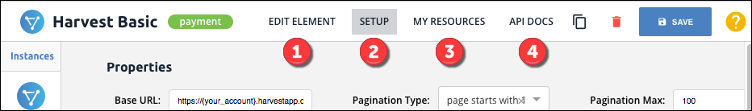

# Build Custom Elements

You can use Element Builder to build your own  <a href="#" data-toggle="tooltip" data-original-title="{{site.data.glossary.element}}">elements</a> to create custom integrations to API providers. You can build elements for Rest APIs, SOAP APIs, or even database applications. Publish finished elements to the Elements Catalog while automatically generating interactive API Documentation. You can combine services by creating a  <a href="#" data-toggle="tooltip" data-original-title="{{site.data.glossary.hub}}">hub</a> or mapping your new element to an existing hub. You can also use the normalized resources that we have already organized into hubs, and leverage the same resources across any other element that you build.

Users of this guide should be familiar with APIs, JavaScript, and JSON. To create an element we recommend that you have a thorough understanding of:

* API authorization concepts
* Any setup required with the API provider
* JavaScript
* The API of the API provider that you are connecting to
* The API provider's API documentation
* The Cloud Elements Hub APIs



## The Workflow

While you can work on different parts of an element throughout the entire creation process, in general you will follow the high-level workflow shown below.



 Define the basic element information (name, key, description, authentication type, API type, documentation URL, API version, and image).

 Configure the element properties (base URL, pagination, and header information).

 Set up authentication information based on authentication types.

 Define the configurations and related parameters needed to authenticate.

 Write custom pre-request and post-request hooks.

 Set up polling or webhook events.

 Define the API provider resources to connect to.

## Before You Begin

Before you begin, here is a sampling of questions you need to know the answers to. You can find most of the information needed in the API provider's documentation

* Where is the API documentation?
* What kind of API? REST, SOAP, database?
* What kind of authentication? OAuth 1.0 or 2.0? Basic? AWS V2 or V4?
* Do you need to create a connected app?
* Does the endpoint support events or bulk?
* Do OAuth 2.0 tokens expire?
* What resources do you want to connect? Accounts, contacts, lists, leads?
* In which Hub should you categorize the element?
* Have you set up an application to integrate with the API provider? Do you have the authentication information for it?

## Manage Custom Elements

If you have already built or imported a custom element, you can manage the configuration to keep up with changes at the API provider, add or remove resources, or fine-tune the element. You can identify a custom element by the **private** label that appears on the element card.

To manage an existing custom element, hover over the element card, and then click **Configuration**.

## Navigate Element Builder

Use the Element Builder toolbar to move through the various pages in Element Builder where you configure an element and it resources, clone an element, and delete an element.

 **Information** navigates to the custom element start page where you configure [information like the name, description, and hub](define-info.html).

 **Setup** navigates to the custom element Setup page where you configure the [properties](define-info.html), [authentication](auth.html), [configuration](config.html), [parameters](config.html#set-up-element-parameters), [hooks](hooks.html), and [events](events.html).

 **Resources** navigates to the custom element Resources page where you [create and manage the custom resources of the element](resources.html).

 **Revisions** navigates to the audit log.

 **API Docs** navigates to the [read-only API Docs](instances.html#test-an-element-instance) for the element where you review the docs and use an authenticated element instance to test requests.

 **Clone Element** begins the element cloning process.

## Clone and Delete Custom Elements

Use the custom element toolbar to make a copy &mdash; or clone &mdash; a custom element or to delete a custom element.

To clone or delete a custom element:

1. Open the element configuration.

2. Click  to clone the element.
3. Click  to delete the element.

## Custom Element Checklist

After you build an element, we recommend that you review the checklist below:

 Each GET resources includes CEQL (the where clause) and pagination.

 The element includes an informative description.

 If building an OAuth 2.0 element in different Cloud Elements environments, confirm that the API providers supports all environments.

 Check pagination &mdash; pageSize and Pagination type &mdash; to ensure correct information.

 POST and PATCH resource bodies include the correct object data type and models.

 Map an authenticated element instance to a common resource.

 For polling events, confirm the correct configuration of dates, using the same format as the API provider. Also ensure that the time zone format matches.

 For bulk, confirm the dates are configured using the same format as the API provider.

## Element Conventions

To align your custom elements with those created by Cloud Elements, we recommend that you follow our conventions:

* Resource names: Lowercase the name and use the plural form.
  * Correct: /contacts
  * Incorrect: /contact
* Spaces in paths: Replace spaces with dashes.
  * Correct: /hubs/finance/sales-receipts
  * Incorrect: /hubs/finance/sales_receipts
* Spaces in configuration or parameter names: Use camelCase.
  * Correct: /hubs/finance/sales-receipts/{salesReceiptId}/details
  * Correct: /hubs/crm/contacts/{contactId}/notes
  * Incorrect: /hubs/finance/sales-receipts/{salesreceiptId}/details
  * Incorrect: /hubs/crm/contacts/{contact-Id}/notes
* Descriptions by method:
  * GET &mdash; "Search for resources."  Or, if no CEQL query was configured for the endpoint, use "List all resources".
  * GET/{id} &mdash; "Retrieve a(n) resource".
  * POST &mdash; "Create a(n) resource".
  * PATCH &mdash; "Update a(n) resource".
  * DELETE &mdash;"Delete a(n) resource"
* `where` parameter descriptions: Following the default "The CEQL search expression." add an example for the specific element.
  * Example: The CEQL search expression, or the where clause, without the WHERE keyword, in a typical SQL query. For example, to search for contacts last modified on or after ‘Jan 15, 2014’, the search expression is where=LastModifiedDate>=’2014-01-15T00:00:00.000Z’. When this parameter is omitted, all contacts are returned in a paginated fashion.
