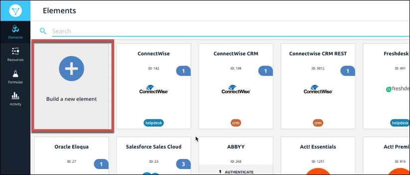
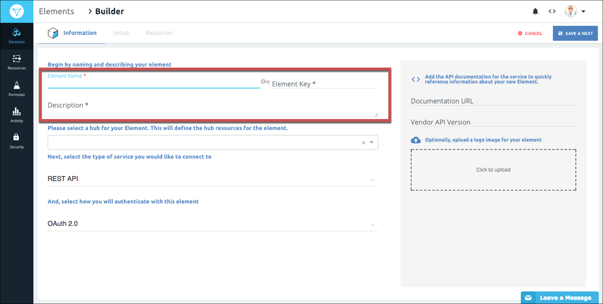

# Element Builder Information



When you create an element using Element Builder, the first step is to provide some basic information about the element. To build the element, we need to know how you identify the element, the hub it belongs to, the type of service to connect to, the authentication type of the element, and information about the API provider.



## Basic Element Information Setup

To start building an element:

1. On the Elements page, click **Build a New Element**.

1. Review the information on the Builder page, and then click **Create**.
1. Name and describe the element:

  * **Element Name** &mdash; The name appears on the element card and should identify the API provider associated with it.
  * **Element Key** &mdash; Generated from the Element Name by default, but you can enter any text. API requests use the element key, so make sure that it identifies the element.
  * **Description** &mdash; The description helps to clarify the purpose of the element. The description appears in the response when you authenticate an instance of the element.
1. Choose the hub associated with the new element &mdash;or enter a name for a new hub, and then click **Create Option {Hub Name}**. Make sure that you choose an accurate hub because the you can leverage existing hub resources when you [add resources to the element](resources.html).

2. Select the API type used by the API provider. You can find the API type in an _Overview_ or _Introduction_ section of the API documentation.

 * **REST API** &mdash; Select if the API is a REST or RESTful API.
 * **SOAP API** &mdash; Select if the API is a SOAP API.
 * **Database** &mdash; Select of the API is for a database application.
2. Select the type of authentication needed to connect with the API provider. You can typically find this information in an _Authorization_ or _Authentication_ section of the provider's API documentation.

    

3. Add reference information that you will need while building the element:

  * **Documentation URL** &mdash; Add a link to the API documentation. You will reference this throughout the element building process.
  * **Vendor API Version** &mdash; Add a version number here if available so you always know what version of the API the element was built for.
4. Optionally upload an image to associate with the element.

    

6. Click **Save and Next**.

Continue to the next step, [Element Builder Properties](properties.html).



## Element Information Parameters

| Parameter | Description    | Required |
| :------------- | :------------- | :------------- |
| Element Name | The name of the Element. This helps form the default Element Key. | Y |
| Element Key | A unique identifier for the element. The Element Key must be alphanumeric and lower case. The default comes from the Element Name. The Element Key is used in `/elements `endpoints that require `{keyOrId}`. | Y |
| Hub  | The hub to which the element belongs.  {{site.data.glossary.hub}} | N |
| Service type | Identifies the kind of element that you are building, either REST, SOAP, or database| Y |
|   | JSON REST API &mdash; for REST or RESTful APIS |  |
|   | SOAP/XML &mdash; for SOAP APIs  |  |
|   | Database &mdash; for APIs provided by database applications.|  |
| Authentication Type | The authorization type used by the API provider. Find this in the API docs under _Authorization_ or _Authentication_.  | Y |
|  | Basic &mdash; Integrations authenticate with the API provider via user name and password.   |
|  | OAuth 1.0 &mdash; Integrations authenticate with the API provider via OAuth 1.0. OAuth 1.0 does not require users to expose their credentials. OAuth 1.0 is a three step authentication process. The OAuth 1.0 protocol involves signing the payload on every request and thus is used by many financial services.   While OAuth 1.0 provides a standard way to authenticate, many cloud services implement it in unique ways. Cloud Elements implements OAuth 1.0 to the specification defined at  [OAuth 1.0 specification](https://tools.ietf.org/html/rfc5849). |  |
|  | OAuth 2.0 &mdash; The OAuth 2.0 protocol lets external applications &mdash; your application or Cloud Elements &mdash; request authorization to access and update a users data without asking users for sensitive user names and passwords. OAuth 2.0 is not strongly specified and many API providers implement it differently,  so make sure that you read the API provider's documentation. Cloud Elements implements OAuth 2.0 to the specification defined at [OAuth 2.0 specification](https://oauth.net/2/). |  |
|  | AWS V2 &mdash; Amazon Web Services Signature Version 2 for older AWS resources. |  |
|  | AWS V4 &mdash; Amazon Web Services Signature Version 4 for the latest AWS resources. |  |
|  | Custom &mdash; For user-defined authentications, such as passing an API key in the header or login requests made during authentication where tokens are passed. Because OAuth 1.0 and 2.0 are implemented differently at different cloud services, you might need to choose Custom. |  |
| Documentation URL | The URL to the API provider's API documentation. | N |
| Vendor API version | Some vendors offer multiple versions of their API. Enter the version that you are building the element for here. | N |
|  Base URL  |  Endpoints are appended to the base URL. So, with an endpoint like `https://api.example.com/v1/users?role=admin&status=active`, the base URL is `https://api.example.com/v1/`.  Many API providers explicitly state the base URL, but in some cases you can find it by looking at examples in the API documentation. |  Y  |
|  Pagination Max  |  The maximum number of records the API provider returns in a response.   |  Y  |
|  Pagination Type  | How the API provider provides pages of data. Find the pagination types in a Pagination section of the API documentation.   |  Y  |
|    | Page starts with n &mdash; Pagination begins with either 1 or 0.  |    |
|    | Offset &mdash; A numeric offset identifies the first page.  |    |
|    |  Cursor &mdash; A unique key element identifies the first page entry   |    |
