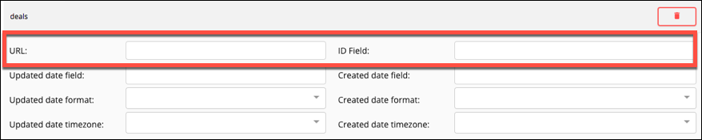
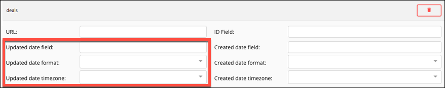
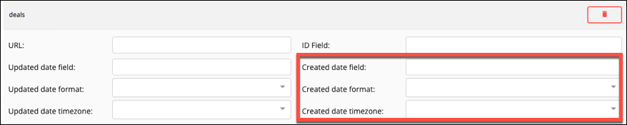

# Element Builder Events



In many cases you want your element to be updated when an event occurs at an API provider. For example, when a user uploads a file to a Dropbox account or when a new contact is added to a CRM element. Cloud Elements supports two types of events: polling and webhooks. With polling, Cloud Elements pings the API provider at configurable intervals to see if a change has occurred. With webhooks, the API provider notifies Cloud Elements when changes occur. You can set up an element to support polling events or webhooks. If your use case requires both event types, contact Cloud Elements for help.



## Configure Webhook Events

To see if the API provider provides webhooks, review the API documentation. Webhooks often require specific setup steps at the API provider. We receive the webhooks from an API provider and must translate the response to the normalized format that we expect. To do so, you must use JavaScript in an [event hook](hooks.html) to manipulate an API provider's response in an event hook. See an example in [Custom Hooks](hooks.html#reading-event-webhooks).

To set up webhooks:

1. On the Setup page, open **Events**.
2. Switch **Enable Events** on.
3. From **Event Types**, select **Webhooks**.
4. Click **Add an Event Hook** and use JavaScript to write an event hook to make sure that the information we receive from the webhook is in the format that we expect, as shown in the function reference.
4. Click **Save**.

## Configure Polling Events

Even if the API provider does not explicitly support events, you can set up polling on any resource that include `created` and `updated` data. With polling, Cloud Elements checks for updates to a resource at specified intervals. Set up polling for one resource at a time by defining a GET request that filters out records that have not changed. Define what makes each record unique and how the API provider formats dates for updated and created records.

The information that you include about the updated and created date fields helps Cloud Elements make decisions about records. For example, if the times in the **Updated date field** and **Created date field** are the same, we know the record was created, not updated. If the time in the **Created date field** is earlier than the  **Updated date field**, we know the record changed since it was created. If the **Updated date field** is not later than the last polling time, we ignore the record.

When users authenticate an element instance, they can customize the polling configuration. Changing polling resource configuration is recommended only for the most technical users, but updating a polling interval can be done by anyone.

The steps outlined below assume that the resource meets two prerequisites. First, the resource supports filtering through a where clause in the request. Second, the resource metadata includes an identifier field (such as `id`, `internalID`, or `resourceId`) and date fields that distinguish between updated and created dates (such as `modifiedDate`, `updatedDate`, or `createdDate`). You can still poll resources that do not meet the prerequisites, but you need to set up additional configurations. See [Advanced Polling](#advanced-polling) and [Polling Tips](#polling-tips).

To set up polling:

1. On the Setup page, open **Events**.
2. Switch **Enable Events** on.
3. From **Event Types**, select **Polling**.
4. Use the **Default Interval Polling Time (in minutes)** slider or enter a number in minutes to specify how often Cloud Elements should poll for changes.
5. In **resource name**, enter the name of a resource that contains acceptable polling data (`created` and `updated` data).
6. Click **Add Polling Resource**.
7. Complete the resource properties (see [Polling Parameters](#polling-parameters) for details):

  * **URL** &mdash; Enter the hub url with any query parameters needed to identify that the resource is updated. For example: `/hubs/finance/customers?where=lastModifiedDate>='${date:yyyy-MM-dd'T'HH:mm:ss'Z'}' `. See [Resource URL Date Format](#resource-url-date-format) for details about how to format the date portion of the where clause.
  * **ID Field** &mdash; Enter the unique identifier of the resource that you want to monitor.
7. Complete the updated date properties (see [Polling Parameters](#polling-parameters) for details):

  - **Updated date field** &mdash; Enter the name of the parameter in the resource that identifies when a record was updated.
  - **Updated date format** &mdash; Select the date and time format of the **Updated date field**. See [Polling Date Formats](#polling-date-formats) for more information. If the date format used by the API provider is not available, you can type it and we'll save it for future use.
  - **Updated date timezone** &mdash; Select the time zone associated with the updated date field.
7. Complete the created date properties (see [Polling Parameters](#polling-parameters) for details):

  - **Created date field** &mdash; Enter the name of the parameter in the resource that identifies when a record was created.
  * **Created date format** &mdash; Select the date and time format of the **Created date field**. See [Polling Date Formats](#polling-date-formats) for more information. If the date format used by the API provider is not available, you can type it and we'll save it for future use.
  * **Created date timezone** &mdash; Select the time zone associated with the updated date field.
7. Add more resources as needed: Enter a resource name, click **Add Polling Resource**, and then complete the resource properties.
4. Click **Save**.

## Advanced Polling

While you can configure polling for most cases in Cloud Elements, you need to get into the element's configuration code and use to solve advanced polling problems. You can access the element configuration using the Element Builder API.

To access the element configuration:

```
GET /elements/{keyOrId}/configuration
```

where `{keyOrId}` is your element key or element ID.

Within the element configuration, look for the Event Poller Resources Configuration, or `event.poller.configuration`.

```json
{
  "id": 66749,
  "name": "Event Poller Resources Configuration",
  "key": "event.poller.configuration",
  "description": "ActiveCampaign2 Event Poller Resources Configuration",
  "defaultValue": "{\"deals\":{\"url\":\"/hubs/marketing/deals?where=mdate>=2017-02-28T16:11:29-06:00\",\"idField\":\"id\",\"datesConfiguration\":{\"updatedDateField\":\"mdate\",\"updatedDateFormat\":\"yyyy-MM-dd'T'HH:mm:ssXXX\",\"createdDateField\":\"cdate\",\"createdDateFormat\":\"yyyy-MM-dd'T'HH:mm:ssXXX\",\"createdDateTimezone\":\"\"}}}",
  "resellerConfig": false,
  "companyConfig": false,
  "active": true,
  "internal": false,
  "groupControl": false,
  "displayOrder": 104,
  "type": "TEXTAREA",
  "hideFromConsole": false,
  "required": false
}
```

In `defaultValue`, you see the entries you made in Cloud Elements. However, the default value section &mdash; also known as polling configuration &mdash; can include additional parameters. Here is a cleaned up version of the JSON with all possible polling configuration parameters. You can use this JSON body to authenticate an element instance with events:

```json
{
  "deals":{
    "url":"/hubs/marketing/deals?where=mdate>=2017-02-28T16:11:29-06:00",
    "idField":"id",
    "filterByUpdatedDate": true,
    "datesConfiguration":{
      "updatedDateField":"mdate",
      "updatedDateFormat":"yyyy-MM-dd'T'HH:mm:ssXXX",
      "updatedDateTimezone":"GMT",
      "createdDateField":"cdate",
      "createdDateFormat":"yyyy-MM-dd'T'HH:mm:ssXXX'",
      "createdDateTimezone":"GMT"
    },
    "createdCheckTolerance": 60,
    "pageSize": 20,
    "pollDelay": 60
  }
}
```

You can use the additional configuration parameters to solve various challenges that the API provider presents in their code. For example, if you set `filterByUpdatedDate` to `false`, you can manage a situation where the API provider does not distinguish between updated and created dates. Or, if the API provider's data shows a minor variation between the times of created and updated date fields on created records, you can account for that by setting `createdCheckTolerance`. See [Polling Parameters](#polling-parameters) for definitions and details.

## Polling Parameters

| Parameter | Description    | Required | Code Only |
| :------------- | :------------- | :------------- |  :------------- |
| Default Interval Polling Time </br>`event.poller.refresh_interval` | {{site.data.glossary.event-polling-refresh-interval}} | Y | N |
| Resource Name </br>`name` | {{site.data.glossary.event-resource-name}} | Y | N |
| URL </br> `url` | The URL used to fetch records for the resource. Include a where clause to fetch the records since the last time that Cloud Elements checked for changes. Specify the date format within `${dateFieldDescriptor:dateFieldFormat}` to ensure that we correctly compare the updated date and time to the last polled date time. For example: `/hubs/finance/customers?where=lastModifiedDate>='${gmtDate:yyyy-MM-dd'T'HH:mm:ss'Z'}' `. </br>See [Resource URL Date Format](#resource-url-date-format) for details about how to format the date portion of the where clause. | Y | N |
| ID Field </br>`idField` | The unique identifier of the resource that you want to monitor. | Y |N |
| `filterByUpdatedDate`   | Identifies the parameter used to determine if a record is updated. <br>**Default:** `true`  |  N |  Y  |
| Updated date field </br>`updatedDateField`  | The parameter in the resource that identifies when a record was updated.  | Y  |N |
| Updated date format </br>`updatedDateFormat` | The date and time format of the **Updated date field**. See [Polling Date Formats](#polling-date-formats) for more information.  | Y  | N |
| Updated date timezone </br>`updatedDateTimezone`  | The time zone associated with the updated date field. Match the time zone to the one used by the API provider. | N  |
| Created date field </br>`createdDateField`  |  The parameter in the resource that identifies when a record was created. | Y  | N |
| Created date format </br>`createdDateFormat`  | The date and time format of the **Created date field**. See [Polling Date Formats](#polling-date-formats) for more information.  |  Y | N |
| Created date timezone </br>`createdDateTimezone`   | The time zone associated with the created date field. Match the time zone to the one used by the API provider.  | N  | N |
| `createdCheckTolerance`  | An integer indicating the number of seconds to use as a tolerance for the comparison between created and updated date to determine if the record was created or updated.  | N  |  Y |
| `pageSize`  | The number of records to retrieve per page. If you don't specify, we use the default page size.  | N  | Y  |
| `pollDelay`  | The number of seconds to subtract from the last poll date to ensure that records created, but not yet available for search, are also included in the poller search run. </br>**Default:** `0`  | N  | Y  |


See below for details about date formats in polling and tips to handle various situations, or continue to the next step, [Custom Resources](resources.html).



## Dates in Polling

When configuring polling you enter dates as part of the where clause in the URL that filters the information returned by the resource. You also use dates to set up the date formats for the updated and created date fields. In [Resource URL Date Format](#resource-url-date-format) see how to configure the date portion of the where clause in the resource URL. In [Polling Date Formats](#polling-date-formats) see how to select or enter date formats for created and updated date fields.

### Resource URL Date Format

Use the following pattern to specify a date format in the URL:` '${dateFieldDescriptor:dateFieldFormat}'`.

For example:

```
/hubs/finance/customers?where=lastModifiedDate>='${gmtDate:yyyy-MM-dd'T'HH:mm:ssXXX}'
```

The `dateFieldDescriptor` helps to describe the `dateFieldFormat` to ensure that Cloud Elements knows what time zone is associated with the dates in the API vendor's response. Our servers run on GMT so specifying that an API provider's date format is also GMT is easy &mdash; no need to specify any time zones. However, some API providers send their data in a specific time zone or use UNIX epochs. When this is the case, use the `dateFieldDescriptor` to get specific.

Cloud Elements supports the following `dateFieldDescriptor`s:

* `gmtDate` &mdash; Specifies that the time of each polling request is sent at GMT time and that `dateFieldFormat` is a simple
* `date` &mdash; Specifies that the time of each polling request is sent at the time zone of the server hosting Cloud Elements and that `dateFieldFormat` is a simple date.

{% include tip.html content="<strong>Should I use <code>gmtDate</code> or <code>date</code>?</strong>We recommend that you use <code>gmtDate</code> because it will avoid time zone issues more often than <code>date</code>. Because <code>date</code> refers to the time zone of the machine where it is running, and it is almost always running on the Cloud Elements servers, it is usually the equivalent of gmtDate. But if you have Cloud Elements debug an element, we might run it locally where time zone errors could occur.  " %}

* `dateTimeZone:{zone}` Specifies that the time of each polling request is sent in the specified time zone and that  `dateFieldFormat` is a simple date.  You can use [common abbreviations or offsets](https://www.timeanddate.com/time/zones/)  like MST, EST, -6:00, or +6:00. For example, `dateTimeZone:PST` and `dateTimeZone:-8:00` identify the time zone as Pacific Standard time.
* `epoch` &mdash; Specifies that the API provider returns the date in a UNIX time format. If using epochs, do not enter a `dateFieldFormat`. Enter only `${epoch}`, which describes the time to the millisecond (such as 1506544512258). If the API provider calculates epochs to the second use `epoch:s`, or if calculated to the microsecond use `epoch:us`.

### Polling Date Formats

Cloud Elements can handle almost any date format used by API providers. Use the date formats in the URL, Updated date format (`updatedDateFormat`), and Created date format (`createdDateFormat`). Use the following table to help understand some of the date formats that you can use.

| Format | Example   |
| :------------- | :------------- |
| yyyy-MM-dd'T'HH:mm:ssXXX  |  2017-08-30 13:19:29-6:00  |
| yyyy-MM-dd'T'HH:mm:ssZ   | 2017-08-30 13:19:29+0:00  |
| yyyy-MM-dd'T'HH:mm:ss'Z'  | 2017-08-30 13:19:29'Z'  |
| yyyy-MM-dd | 2017-08-30  |
| yyyy/MM/dd HH:mm:ss   | 2017-08-30 13:19:29  |
| MM/dd/yyyy'T'HH:mm:ssXXX  | 08-30-2017 13:19:29-6:00  |
| MM/dd/yyyy   | 08-30-2017  |
| dd/MM/yyyy'T'HH:mm:ssXXX   | 30-08-2017 13:19:29-6:00  |
| dd/MM/yyyy   |  30-08-2017 |
| EEE, dd MMM yyyy HH:mm:ss Z   | Saturday, 30-08-2017 13:19:29+0 |

* 'T' separates date and time. If you include 'T', we expect a literal 'T' in the API provider's format. Some API providers use a space between date and time instead.
* Z indicates a time zone in any accepted format. If you use 'Z', we expect a literal 'Z' in the API Provider's format
* XXX defines a specific time zone, where each X represents a part of the offset. For example, `XXX` would by EST, or `XXXXXX` would be +06:00.
  - Time zone can be a text string like EDT, MST, or UTC.
  - If using offset, the format should be `(+or-)hour:minutes` or `(+or-)hourminutes`.
  - Hour can be one or two digits if separating hour and minutes with a colon. If you do not se a colon, hours must be two digit. Hours can only be between 0 (or 00) and 23.
  - Minutes can be only two digits between 00 and 59.

## Polling Tips

* The resource does not support querying for dates.
  - Enter the URL without a where clause. Cloud Elements will check the response 20 records at a time, and look for records updated after the last polling time.
* The resource does not distinguish between created and modified dates.
  - Enter the same date field as both the created and updated dates and change `filterByUpdatedDate` to `false`. Cloud Elements will filter by the Created Date and compare that to the last polling date.
* The API provider does not support greater than or less than symbols.
  - See the API provider's modified fields in the response and use build a query with keywords like `since modifiedField` to imply greater than, or `before modifiedField` to imply less than.
  - To optimize the query, look for a sort order and try to get the latest modified fields first. Cloud Elements pages through the response until it reaches the last polling date instead of getting all data.
