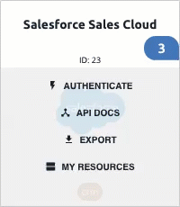

# Extend Elements

Element Builder gives you the integration tools to extend the current feature set of any of our Elements by adding a resource or method. If your use case requires a resource our Element doesn’t currently support, you can easily add it in yourself using Element Builder.

Each Element starts with a standard set of features, including authentication, paging, errors, events and search. Use Element Builder to add:

* Additional Resources: With an HTTP verb like POST, GET, PATCH, PUT, or DELETE.
* Events: Cloud Elements currently supports building integrations with polling or webhooks capability.
* Bulk Functionality: Cloud Elements supports bulk download of objects in JSON format if the endpoint supports filter by date.
* Docs: API documentation is automatically generated for your updated Element.

## Add Resources to an Existing Element

You can extend an element by adding resources. To add a resource, hover over an element card, and then click **My Resources**. After you arrive on the editable Resources page, follow the instructions in [Define New Resources](#define-new-resources).


