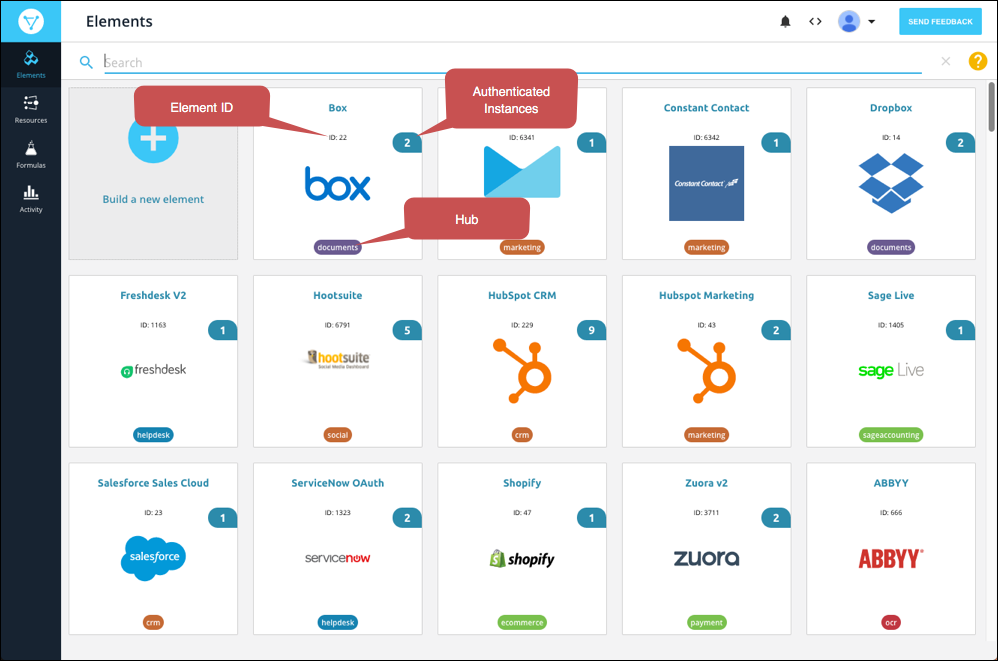
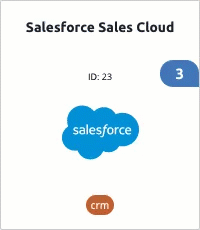
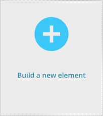



# Overview

Elements are enhanced connectors that provide a unified developer experience into a specific cloud application endpoint (e.g., Salesforce, Quickbooks, or Marketo). The [Elements Catalog](#elements-catalog) includes a list of all publicly available elements as well as any custom elements that you create. Use these elements to [create authenticated connections](instances.html) &mdash; called element instances &mdash; to your API providers.

I addition to the Elements Catalog, we offer Element Builder to extend the capabilities of existing Cloud Elements integrations or build a new Element from scratch. If we don't have the element you're looking for, or if you want to extend any of the elements in the catalog, you can use Element Builder to extend and create elements.



## Elements Catalog

The Elements Catalog shows a list of  <a href="#" data-toggle="tooltip" data-original-title="{{site.data.glossary.gloss_entry}}">element cards</a> that represent all of the elements available to you. Elements with your existing authenticated <a href="#" data-toggle="tooltip" data-original-title="{{site.data.glossary.element-instance}}">element instances</a> appear at the top of the catalog. Each card shows the name and id of the element, the number of authenticated element instances, and the  <a href="#" data-toggle="tooltip" data-original-title="{{site.data.glossary.hub}}">hub</a> associated with the element.

To work with an element, hover over the element card.  You can [authenticate an element instance](instances.html), [see the API docs](#view-element-api-docs) associated with the element, [export the element](#import-and-export) in JSON format, and [add your own resources](resources.html) to the element.

You can also [build your own custom elements](custom-elements.html). These include a **private** label because they are available only to users in your organization.

## View Element API Docs

The API docs available for each element help you see what API request are available for each element. You can see descriptions of each request, descriptions of each field available for the requests, and which fields are required. The API docs are available in two different views: the default API docs and API docs associated with a specific instance. If you select an authenticated instance, you can interact with the docs to test your API requests or make actual requests.

To view API docs hover over the element card, and then click **API Docs**.

To make requests using the API docs:

1. Select an authenticated instance on the left.
2. Expand the endpoint that you want to make a request to.
3. Click **Try it Out**.
4. Supply any additional or required information.
5. Click **Execute**.

## Import and Export

You can export elements from the elements catalog in JSON format. This allows you to move elements that you build to different environments or make copies of public elements.

You can import elements from JSON, Swagger, or When you import an element, you can make changes to it, add resources, and configure advanced features like events and bulk.

To export an element:

1. Hover over an element card, and then click **Export**.

2. Save the JSON file to your computer.

To import an element:

1. On the Elements page, click **Build a New Element**.

1. Review the information on the Builder page, and then click **Import**.
2. Select the type of file to import:
  * Element &mdash; A JSON file reated by exporting an element.
  * Swagger &mdash; A swagger specification file for an API.
  * SOAP &mdash; An XML file that describes a SOAP API.
  * OData &mdash; An Open Data Protocol file that describes a REST API.
3. Select a file stored on your computer or enter the URL of the file.
4. Click **Next**.
5. Select the resources that you want to import.
6. Click **Import**.
7. Complete the [element setup](custom-elements.html).
