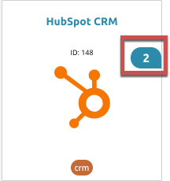

# Authenticated Element Instances

An authenticated element instance represents a connection between a single user and an API provider where they have an account. When you authenticate with an API Provider you create an element instance in Cloud Elements. Use the authenticated element instance to apply logic to the element instance with formulas, map your element instance to a common resources, and test your instance in the API docs.

When you authenticate through Cloud Elements 2.0, you authorize Cloud Elements to access your data at the API provider. If you need to authorize your own application to access an API provider use the `/instances` API.



## Authenticate an Element Instance

Each API provider is different. You can authenticate an element instance through Cloud Elements 2.0, or via the `/instances` API. Because of the differences between each element, Cloud Elements provides [detailed documentation for each element](../../elements.html). The element documentation includes steps to prepare for authentication, how to authenticate through Cloud Elements or the `instances` API, and additional information about bulk, querying, and events.

## View Element Instance Information

Each authenticated element instance is identifiable by it's unique element instance ID and element instance token. Use the element instance ID to refer to the instance in formulas and scripts. Cloud Elements uses the element instance token to authenticate with an API provider. You must pass the element instance token in the header of any API requests to the element.

To locate your element instance ID and element instance token:

1. Click the instances banner on an element card.

2. Note the element instance ID at the top of the card.
3. Hover over the element instance card, and then click **View Token**.

## Test an Element Instance

After you authenticate an element instance, you can test it with the API docs. So long as you have an authenticated element instance, you can test any of the requests in the API docs. For more information about the element API docs, see the [Overview](index.html#view-element-api-docs).

To test your element instance:

1. Click the instances banner on an element card.
3. Hover over the element instance card, and then click **API Docs**.
4. Expand the endpoint that you want to make a request to.
3. Click **Try it Out**.
4. Supply any additional or required information.
5. Click **Execute**.

## Update an Element Instance

You can edit your element instance or re-authenticate with an API provider. If you just need to change basic information about the element, you can update without re-authenticating. However, if you need to add events or update some configuration value, you must re-authenticate.



To update an authenticated element instance:

1. Click the instances banner on an element card.
3. Hover over the element instance card, and then click **Edit**.
4. Make your changes, and then click **Update**.

To re-authenticate an authenticated element instance:

1. Click the instances banner on an element card.
3. Hover over the element instance card, and then click **Edit**.
4. Make your changes, and then click **Re-Authenticate**.

## Delete

You can delete an element instance, which permanently deletes the instance and it's element instance token from Cloud Elements.

To delete an element instance:

1. Click the instances banner on an element card.
3. Hover over the element instance card, and then click **Delete**.
4. Confirm the deletion.
