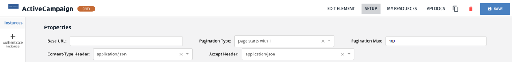

# Element Builder Properties



After completing the basic element information, configure the Properties on the Element Builder Setup page. Properties include the Base URL, pagination information, and header formats.

To complete the Properties section:

1. In **Base URL** enter the URL where all API Requests will be sent. When you [add resources](resources.html), they are relative to the Base URL. Most API providers identify the Base URL in an _Introduction_, _Getting Started_,  or _Overview_ section.
3. In **Pagination Type** select the approach to pagination supported by the API provider.
2. In **Pagination Max** enter the maximum number of returned records supported by the API provider. Some API providers describe Pagination Max as limit. Find pagination information in the API documentation in a _Pagination_ or _Paging_ section.
3. In **Content-Type Header** select the media type that the API provider expects when they receive a request.
4. In **Accept Header** to configure the response body media type that you expect to receive from the API provider.

    

7. Click **Save**.
7. [Define authentication information](auth.html).

### Properties Parameters

| Parameter | Description    | Required |
| :------------- | :------------- | :------------- |
|  Base URL  |  Endpoints are appended to the base URL. So, with an endpoint like `https://api.example.com/v1/users?role=admin&status=active`, the base URL is `https://api.example.com/v1/`.  Many API providers explicitly state the base URL, but in some cases you can find it by looking at examples in the API documentation. |  Y  |
|  Pagination Max  |  The maximum number of records the API provider returns in a response.   |  Y  |
|  Pagination Type  | How the API provider provides pages of data. Find the pagination types in a Pagination section of the API documentation.   |  Y  |
|    | Page starts with n &mdash; Pagination begins with either 1 or 0.  |    |
|    | Offset &mdash; A numeric offset identifies the first page.  |    |
|    |  Cursor &mdash; A unique key element identifies the first page entry   |    |
|  Content-Type Header  | The supported request media type.   |  Y  |
|  Accept Header  | The supported response media type.   |  Y  |

Continue to the next step, [Element Builder Authentication Setup](auth.html).


