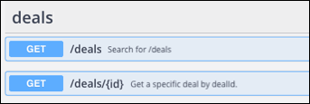
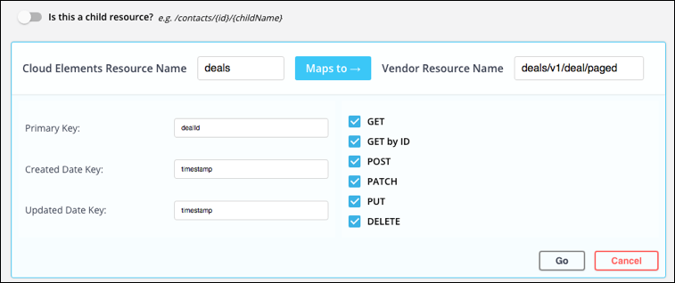
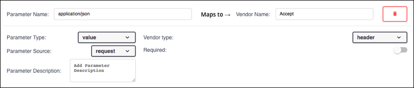
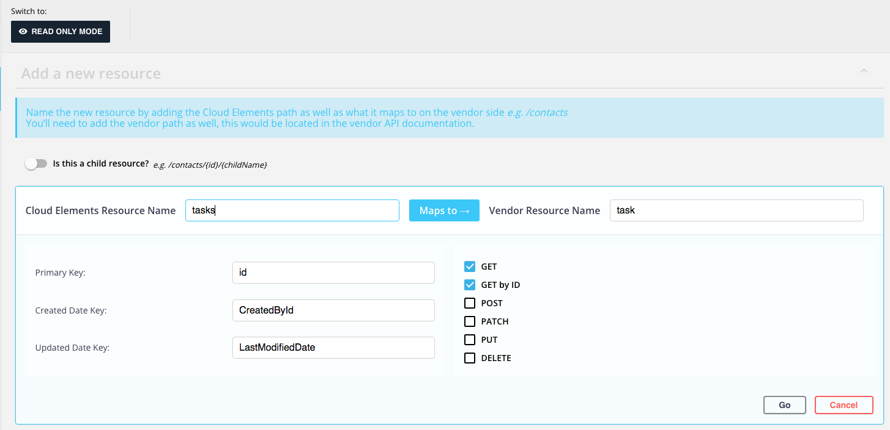

# Custom Resources

Add resources to existing elements or define resources for a custom element all within a familiar API documentation format. As you create new resources, keep the API documentation of the API provider close. You will refer to it often.

## Add Resources

Add resources as part of the element building workflow or as part of extending an element.

Throughout this section, we provide several examples. To keep them consistent, we are using the use case of adding a `/deals` resource to a CRM element.

To add a resource:

### Provide Basic Resource Info

1. Click **Add a new resource**.
2. Identify if the resource is a child resource, such as `/users/{id}/tasks` or `/contacts/{id}/tasks`.
3. In **Cloud Elements Resource Name** add the name of the resource as you want to see it in Cloud Elements. For example, enter `deals` to add a `/deals` resource to a CRM element. The name you choose is what appears in the API documentation and also creates an endpoint in the hub. For example, the new `GET /deals` endpoint appears as **GET /deals** in the docs and is accessible via the `hubs/crm/deals` endpoint.

4. In **Vendor Resource Name** add the path to the resource at the API provider. No slash `/` is required before the initial resource name. In this example, the API documentation states that the path is `deals/v1/deal/paged`.
5. In **Primary Key** enter the property that uniquely identifies the resource. Primary keys are typically ID fields associated with the resource. In this example, a primary key could be `dealID`.
6. In **Created Date Key** and **Updated Date Key** enter the properties that identify the created and updated dates. Created and updated date keys vary widely, but can be `created`, `createdate`, or `timecreated` and  `updated`, `lastModified`, or `dateModified`.
7. Select the methods to add. You will define the methods that you select when you [set up the endpoints](#set-up-endpoints). Make sure that the methods that you select are supported by the API provider.

    For a new deals resource with all methods, our basic resource information looks like this:
    

8. Click **Go**.

### Set Up Endpoints

After you provide the basic information to create a resource, Cloud Elements shows the resource in an editable API documentation format. Use the Endpoints tab to configure each of the endpoints created from the combination of the resource and the methods that you selected in the previous step. If you did not select the correct methods in the previous step, you can add or remove endpoints on the Endpoints tab.

If you have any authenticated element instances for the element, they appear on the left. Select an element instance to test the endpoints as you build them.

To set up endpoints:

1. Select an endpoint, and then click **Go** or .

    

2. Enter a description. This appears in the API documentation and should help a user understand what the request is for and what to expect in the response. A description of the `GET /deals` endpoint could be: "Retrieves a list of deals. Use CEQL to filter by related fields like company and contact."

    

3. After you complete your description, click or tab out of the description.
4. Depending on the method, different default parameters appear.
5. Add a Root Key to limit what you send or receive.
6. In Pagination Type selected.
7. In **Next Resource**.

### Adding Parameters to Endpoints

Endpoint parameters allow you to pass various parameters to the endpoint. Use the endpoint parameters to configure searches, pagination, and required fields. You can configure most required and optional parameters for most endpoints. Cloud Elements provides some default common parameters for each method, except DELETE.

#### Default Parameters for each Method

| GET | GET {id} | POST, PATCH & PUT| DELETE |
| :------------- | :------------- | :------------- | :------------- |
|  **where**: CEQL search expression.  |  **id**: The id of a specific object. | **body**: The object payload to create or update.  | No default, but the id of the deleted object is a common parameter. |
|  **page**: The next token or link to get additional results.   |  |   |  |
|  **pageSize**: The number of records to return.  |   |  |   |

#### Add Parameters

Map parameters that you send as part of the request from Cloud Elements on the left side of the page to parameters available to the resource at the API provider on the right side. The right and left side division is presented as **Cloud Elements Receives As** and **Vendor Receives as** in the example below.

To add a parameter :

1. Select an endpoint, and then click **Go** or .
2. Click **Add New Parameter**.
3. In the **parameter name** box, enter the name of the parameter. The name appears in the API documentation in some cases or can be a value passed to the API provider.
4. In **Parameter Description** enter a brief description of the parameter. If the parameter appears in the API documentation, this description also appears.
5. In **Vendor Name** enter the name of the parameter to map to. For example, if you are adding an id parameter, **Vendor Name** should be the unique id field for the resource.
6. In **Parameter Type** and **Vendor Type** select how Cloud Elements and the API provider pass the parameter.
8. In **Parameter Datatype** and **Vendor Datatype** select the data type of the parameter.
  * integer - 32 bit binary signed integer
  * long - 32 bit binary signed integer
  * float - a knid of number
  * double -  a kind of number
  * string
  * byte - 	base64 encoded characters
  * binary - any sequence of octets
  * boolean - true/false
  * date - As defined by full-date - RFC3339
  * dateTime - 	As defined by date-time - RFC3339
  * password - A hint to UIs to obscure input.
9. If you ant to switch the standard workflow where the parameters on the left are part of the request, click **Parameter Source**, and then select **Request**.
10. To make the parmater a required partt of the request, switch **Required** on.

#### Parameter Types

| Parameter | Description   |
| :------------- | :------------- |
|  configuration  |  passed as a header parameter. Example, X-MyHeader: Value  |
|  header  |  passed as a path parameter. Example, separate resource for object by id  |
|  path  |  Passed as a request body parameter. Example, body. Is this part of the body or everything in the body? can you apss more than one bodies?  |
|  body  |  Passed as a query string parameter. Example /deals?properties=dealName  |
|  query  |    |
|  form  |  passed as form-data |
|  multipart  |  passed as multipart content   |
|  value  |  the value is the value of the parameter name  |
|  bodyField  |  Body  |
|  prevBody  |  Body  |
|  prevBodyField  | CE Only Body  |
|  value  |  Body  |
| bodyToken |Vendor Only |
| no-op | Vendor Only |

#### Update Default Parameters

In the example use case of building a `/deals` resource, each method provided a default parameter. The following table describes how each was set up.

| Method | Parameter   | Description |
| :------------- | :------------- | :------------- |
|  GET  |  where   |  The **where** parameter implements a CEQL search expression parameter in the endpoint.   To configure, check the API documentation to confirm that the endpoint supports searches. If it does, next identify the parameter used to search and enter it as the **Vendor Name**.  Now, identify how the query is passed (in the header, as a query paramter, etc.) and in what format. Select the **Vendor Type** and **Vendor Datatype** to match. |
|  GET  |  page   |  The **page** parameter identifies the link or token to identify a set of paginated records.   To configure, check the API documentation for pagination information. If it supports pagination, next identify the parameter used to identify page numbers as the **Vendor Name**.  Now, identify how the parameter is passed (in the header, as a query paramter, etc.) and in what format. Select the **Vendor Type** and **Vendor Datatype** to match. |
|  GET  |  pageSize  |  The **pageSize** parameter identifies the number of records to return.   To configure, check the API documentation for pagination information. If it supports pagination, next identify the parameter used to limit results as the **Vendor Name**.  Now, identify how the parameter is passed (in the header, as a query parameter, etc.) and in what format. Select the **Vendor Type** and **Vendor Datatype** to match. |
| POST | body |

## Endpoint Descriptions

The descriptions that you enter for each endpoint should help a user understand what the endpoint does. In general, we recommend a short description of no more than three sentences. Starting with a verb &mdash; like gets, retrieves, checks, creates, returns, updates, or deletes &mdash; and then describe what resource is being manipulated.

| Method | Suggested Description   |
| :------------- | :------------- |
|  GET  |  Gets a list of RESOURCE_NAMEs. Retrieves a list of RESOURCE_NAMEs. Use the CEQL expression to filter the list of RESOURCE_NAMEs  |
| POST | Create a RESOURCE_NAMEs.

### Element Builder Workflow

If you are coming from Element Builder, you're at the last step of the workflow:



## Step 1: define the resource

To add a resources:

1. Switch to Edit Mode.
2. Click Add Resources.
3. If the resource is a child resource to another resource, switch **Is this a child resource?** on.
3. Create your resource name and map it: <do we need to add that you do or don't need the slash?>
  * In **Cloud Elements Resource Name** enter the name of the resource as you want it to appear in the API docs and in requests.
  * In **Vendor Resource Name** enter the name of the resource at the API provider.
3. Enter the following fields needed to ???
  * Primary Key
  * Created Date Key
  * Updated Date Key
4. Select the methods to use to interact with the resource.
5. Click **Go**.

You move to the endpoint step

## Configure the endpoint

Endpoints are configured with some defaults:

* GET
  * where
  * page
  * pageSize
  *

To configure the endpoint:

1. On the endpoints tab, select the endpoint to configure, and then click **Go**.
2. Each parameter include as Cloud Elements side and a vendor side

## Delete

## Extend
