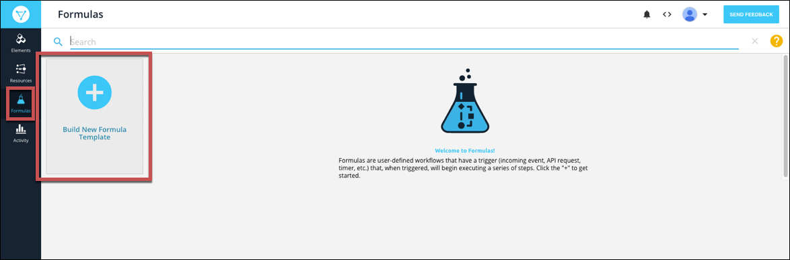
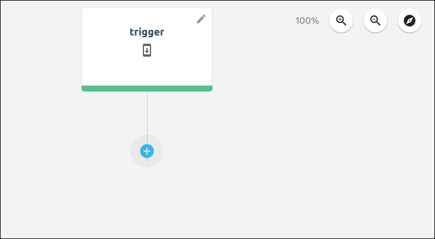
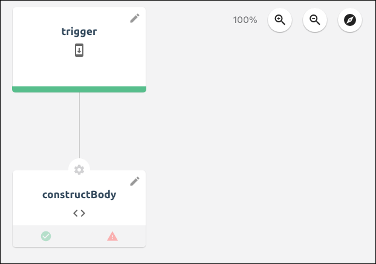
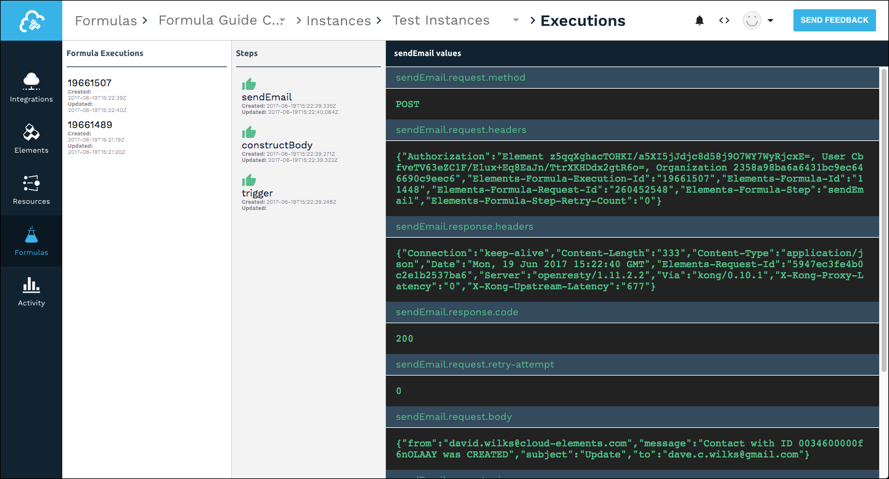
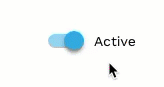

# Formula Templates

Formula templates enable you to build a single template for a formula that you can reuse with different elements and values. After you build a formula template, you can then create a formula instance where you replace the formula variable with actual element instances and values. This approach helps you build efficient and reusable formulas.

{% include callout.html content="<strong>On this page</strong></br><a href=#build-a-formula-template>Build a Formula Template</a></br><a href=#test-formula-templates>Test Formula Templates</a></br><a href=#create-variables>Create Variables</a></br><a href=#edit-and-delete-variables>Edit and Delete Variables</a></br><a href=#review-executions>Review Executions</a></br><a href=#copy-a-formula-template>Copy a Formula Template</a></br><a href=#import-and-export-formula-templates>Import and Export Formula Templates</a></br><a href=#parallel-executions>Parallel Executions</a></br><a href=#rename-a-formula-template>Rename a Formula Template</a></br><a href=#add-a-description-to-a-formula-template>Add a Description to a Formula Template</a></br><a href=#delete-a-formula-template>Delete a Formula Template</a></br><a href=#deactivate-a-formula-template>Deactivate a Formula Template</br><a href=#access-formula-information>Access Formula Information</a>" type="info" %}

## Build a Formula Template

Formula templates include a trigger that kicks off the formula, steps that execute as a result of the trigger, and variables to represent input required to run an instance of the formula. You can build formulas that use triggers that kick off when something happens to an element instance, you can schedule triggers, or you can manually kick off a trigger. See [Triggers, Steps, and Variables](reference.html) for more information about each component.

As you build a formula, you also build context consisting of triggers, variables, steps, and values created by steps. You can refer to that context in later steps in the formula. Consider each part as a building block that has a name and information that you can refer to. For example, in a formula that sends an email notification for a new contact, you build the body of the email in one step. In a later step when you actually send the message, refer to the step where you built the body.



To build a new formula template:

1. Click **Formulas**, and then on the Formulas page, click **Build New Formula Template**.

3. Click **Build New Formula**.
4. Enter a name for your formula, and then click **Create**.

    {{site.console}} provides you a list of triggers. For details about each trigger, see [Triggers, Steps, and Variables](reference.html).
    

5. Select your trigger.
    * Choose **Event** for a formula triggered by an event configured on an element instance.
    * Choose **Element Request** for a formula triggered when a specific request is made to an element instance.
    * Choose **Scheduled** for a formula to occur at a specific time or regular interval.
    * Chose **Manual** to trigger the formula with an API call to `POST /formulas/instances/:id/executions`.

    

6. Complete the trigger properties, which vary based on the selected trigger.
    * For **Event** provide an [Element Instance Variable](reference.html#formula-variables).
    * For **Element Request** provide an [Element Instance Variable](reference.html#formula-variables), an API method, and API endpoint.
    * For **Scheduled** provide a [Cron schedule](reference.html/#scheduled).
    * For **Manual** you do not need to provide any more properties.
7. Click **Save**.

    {{site.console}} shows the first trigger node in the formula visualization.
    

6. Add any variables that you will need to run the formula instance.
  5. Click **Variables**.
  
  6. Select the type of variable, and then enter a name.

        Takes note of the Formula Step Variable Name, which is how you will refer to the variable throughout the formula.

  8. Click **Save**.

5. Add your first step. In the formula visualization, click .
6. Select the type of step that you want to add.
7. Complete the step properties, and then click **Save**. For details on each step, see [Element Instance Variable](reference.html#formula-variables).

    

    {{site.console}} shows the first trigger node and the step that you just created in the formula visualization. The path from the trigger to the step defaults to On Success, but you can add failure steps later.
    

7. To add another step, click the step, and then select one of the following:
  * **Insert Above** adds a new step prior to the current step with an On Success path connecting the two.
  * **Add On Success** adds a step for the formula to continue to if the current step succeeds.
  * **Add On Failure** adds a step for the formula to continue to if the current step fails.
8. Continue adding steps until you complete the formula template.
9. Add a description by clicking **Edit**. See [Add a Description to a Formula Template](#add-a-description-to-a-formula-template).
8. After you complete the formula, [test it](#test-formula-templates).



## Test Formula Templates

You can test a formula template as you build it. When you test a formula template, you can either use an existing formula instance or build a new formula instance.



To test a formula template:

1. At the top of the formula visualization, click **Setup Test**.

2. Click **Select Instance**.
3. Either choose an existing formula instance (and skip down to the Select Trigger step) or click **Add New Instance**.
  4. Enter a name for the new formula instance.
  5. For each variable, click the variable and add an element instance or enter a value.
  6. Click **Create Instance**.
  7. Select the instance that you just built.
8. Click **Select Trigger**.
9. Provide trigger information, depending on the type of trigger.

## Create Variables

You can create two types of variables: **Element Instance** variables &mdash; replaced by element instances in the formula instance &mdash; and **Value** variables &mdash; replaced by values entered in the formula instance. When you create a variable, note the Formula Step Variable Name which is how you refer to the variable in the formula context. See [Formula Variables](reference.html#formula-variables) for more about variables in the formula context.

To create a formula variable:

1. Open the formula template. On the Formulas page, hover over the Formula Card, and then click **Open**.
5. Click **Variables**.

2. Select the type of variable to create.
3. Enter a name for the variable. You can include spaces, but we remove the spaces to create the **Formula Step Variable Name** (identified as `key` in the JSON), which is how you refer to the variable in the formula context.
4. Click **Save**.

## Edit and Delete Variables

You can edit the name of a variable or remove a variable from a formula template.



To edit or delete a formula variable:

1. Open the formula template. On the Formulas page, hover over the Formula Card, and then click Open.
5. Click **Variables**.

2. Click **Edit Variable**.
3. Select the variable to edit or delete, and then:
  * Edit the name, and then click **Save**. Or,
  * Click **Delete**.

## Review Executions

You can troubleshoot formulas by reviewing executions. The executions appear in three columns from left to right:

* Formula Executions &mdash; the list of executions of the selected formula template. We identify failed executions in red.
* Steps &mdash;The steps in the formula and an icon showing their success  or failure .
* Execution Values &mdash;the request and response details associated with the selected step.




To review executions

1. Open the formula template. On the Formulas page, hover over the Formula Card, and then click **Open**.
2. Click **Executions**.

3. Click the execution to review.
4. Click the step to review.

## Copy a Formula Template

You can build a formula template based on an existing template or from a Cloud Elements sample formula, resulting in a copy of the template.

To build a copy of a formula template:

1. Click **Formulas**, and then on the Formulas page, click **Build New Formula**.

3. Click **Build From Existing Formula**.
  * To use one of your existing formula templates, select the template.
  * To use a Cloud Elements formula template, click CE Sample Formulas, and then select the formula.
4. Enter a name for your formula, and then click **Create**.

## Import and Export Formula Templates

You can export a formula template as a JSON file and import other templates from their JSON source file.

To import a formula template:

1. Click **Formulas**, and then on the Formulas page, click **Build New Formula**.

3. Click **Import**.
4. Select the JSON file to import.
5. Optionally rename the file, and then click **Create**.

To export a formula:

1. Navigate to the Formulas page.
2. Hover over the element card, and then click **Export**.
3. Save the file.

## Parallel Executions

To help formula instances execute as efficiently as possible, they take advantage of multithreaded executions. That is, multiple executions of the same formula instance can make requests at the same time. Some API providers prevent multiple requests from the same account at the same time. If this happens, you can change a formula template or an individual formula instance to execute one step at a time. This makes the formula less efficient and results in an increase in the execution time.

To change a formula from the default multithreaded execution to single threaded:

1. Open the formula template. On the Formulas page, hover over the Formula Card, and then click **Open**.
2. Click **Edit**.

3. Click **Show Advanced**.
4. Switch **Single Threaded Execution** on.
5. Click **Save**.

Alternatively, in the formula template or formula instance JSON, update `singleThreaded` to `true`:

```json
{
"singleThreaded": true
}
```

## Rename a Formula Template

To rename a formula template:

1. Open the formula template. On the Formulas page, hover over the Formula Card, and then click **Open**.
2. Click **Edit**.

3. Rename the formula template.
5. Click **Save**.

## Add a Description to a Formula Template

Descriptions provide more information about a formula template. Use the information to describe the formula template use case and anything another user might need when creating a formula instance.

To add a description to a formula template:

1. Open the formula template. On the Formulas page, hover over the Formula Card, and then click **Open**.
2. Click **Edit**.

3. Describe the formula template in **Description**.
5. Click **Save**.


## Delete a Formula Template

You can delete a formula template if the template has no instances associated with it. If the formula template includes instances, [delete those first](formula-instance.html#delete-a-formula-instance).

To delete a formula template:

1. Navigate to the Formulas page.
2. Hover over the Formula Template card, and then click **Delete**.
3. Confirm the deletion.

## Deactivate a Formula Template

You can deactivate a formula template to prevent any executions of formula instances of the template.



To deactivate a formula:

1. Open the formula template. From the Formulas page, hover over the Formula Template card, and then click **Open**.
2. Click **Edit**.

2. Switch the **Active** slider off.

3. Click **Save**.

## Access Formula Information

Each formula template and formula instance exposes information about itself through the `info` object.

```json
{
  "info":{
   "formulaId":"123",
   "formulaName":"name",
   "formulaInstanceId":"123",
   "formulaInstanceName":"name",
   "formulaExecutionId":"1234"
  }
}
```

Formula information contributes to the formula context. You can access the information with `info.property`, such as `info.formulaInstanceId` or `info.formulaName`.
